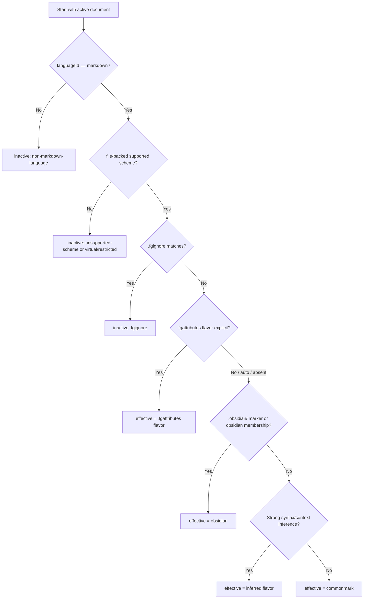

# Markdown Flavor Auto-Detection Algorithm

This technical spec defines the unified logic flow for resolving an active
Markdown document to an `EffectiveMarkdownContext`: one base
`EffectiveMarkdownFlavor` plus zero or more structured profile flags.

The selector value `auto` is a request to run this algorithm. It is never itself
an effective flavor. The base-flavor output is either an explicit
`MarkdownFlavorId` or `inactive` when Flavor Grenade must not apply Markdown
flavor behavior to the document. Structured profile flags are resolved only for
active Markdown documents.

Structured document profiles such as Keep a Changelog, Common Changelog, and
MADR are resolved separately as profile flags. They can be layered over any
effective Markdown flavor and must not expand the `MarkdownFlavorId` list. See
[[docs/design/markdown-structured-profile-flags]].

## Goals

- Keep `.md` documents in VS Code's built-in `markdown` language mode.
- Let users override flavor explicitly without using the VS Code language
  picker.
- Resolve Obsidian vault notes to `obsidian` without configuration.
- Resolve generic Markdown conservatively to `commonmark`.
- Support file and directory flavor configuration through `.fgattributes`.
- Support file and directory exclusion through `.fgignore`.
- Allow multiple `.fgignore` and `.fgattributes` files from vault root through
  nested directories, with Git-style pattern precedence and negation.
- Preserve Auto Detect as the default for every file in a directory tree when
  no `.fgignore` or `.fgattributes` file exists.
- When `.fgattributes` flavor assignment is absent, infer a likely flavor from strong,
  local document syntax and workspace context without treating weak shared
  Markdown features as decisive.
- Preserve user-selected non-Markdown language modes.
- Produce resource-specific effective flavor state for multi-root workspaces,
  standalone files, and multiple open documents.

## Vocabulary

| Term | Meaning |
|---|---|
| `MarkdownFlavorSelection` | Selector/config value: `auto` or a supported explicit `MarkdownFlavorId`. |
| `MarkdownFlavorId` | Explicit flavor id: `original`, `commonmark`, `obsidian`, `gfm`, `glfm`, `pandoc`, `multimarkdown`, `mdx`, `kramdown`, `markdown-extra`, `r-markdown`, `reddit`, or `stack-overflow`. |
| `EffectiveMarkdownFlavor` | The explicit flavor currently applied to a document. It is never `auto`. |
| `StructuredMarkdownProfileId` | Independent structured-document profile flag, such as `keep-a-changelog`, `common-changelog`, or `madr`. It is not a `MarkdownFlavorId`. |
| `EffectiveMarkdownContext` | One `EffectiveMarkdownFlavor` plus zero or more structured profile flags. |
| `inactive` | No Markdown flavor behavior applies because the document is outside Flavor Grenade's active Markdown scope. |
| `folder-backed document` | A file-backed Markdown document owned by a VS Code workspace folder. |
| `standalone document` | A file-backed Markdown document with no owning VS Code workspace folder. |

## Ownership

| Owner | Responsibility |
|---|---|
| BC6 Editor Client | Displays the selector, writes scoped `.fgattributes` rules, preserves manual language choices, and sends refresh signals to the server. |
| BC4 Vault / Workspace | Owns vault membership, `.fgignore` visibility, `.fgattributes` evidence, and authoritative `EffectiveMarkdownContext` state for server analysis. |
| Config | Validates flavor ids and parses Git-style Flavor Grenade config files. It does not resolve document-specific effective state alone. |
| BC5 LSP Protocol | Validates incoming flavor payloads and transports resource-specific state. It does not reinterpret flavor syntax. |
| BC2 Document Lifecycle | Consumes `EffectiveMarkdownContext` through `ParseContext`: one base flavor plus zero or more structured profile flags. |

## Inputs

The resolver takes a document resource, editor state, and available workspace
evidence:

```typescript
type ResolveFlavorInput = {
  uri: string;
  languageId: string;
  scheme: string;
  owningWorkspaceFolder?: string;
  searchBoundary?: string;
  fgignore?: {
    ignored: boolean;
    matchedPattern?: string;
    sourceFile?: string;
  };
  fgattributes?: {
    flavor?: MarkdownFlavorSelection;
    structuredProfiles?: StructuredProfileSelection;
    matchedPattern?: string;
    sourceFile?: string;
  };
  markers: {
    hasObsidianDirectory: boolean;
    hasFlavorGrenadeConfigFiles: boolean;
  };
  syntaxInference?: {
    candidates: Array<{
      flavor: MarkdownFlavorId;
      confidence: 'strong' | 'medium' | 'weak';
      evidence: string[];
    }>;
  };
  structuredProfileInference?: {
    candidates: Array<{
      profile: StructuredMarkdownProfileId;
      confidence: 'strong' | 'medium' | 'weak';
      evidence: string[];
    }>;
  };
  serverMembership?: {
    indexed: boolean;
    vaultRoot?: string;
    reason: 'obsidian-vault' | 'flavor-config-vault' | 'single-file' | 'not-indexed';
  };
};
```

Invalid selector or `.fgattributes` values are not part of
`MarkdownFlavorSelection`. The validation layer rejects them before resolution
and treats that layer as absent.

Security invariants:

- `.fgignore` and `.fgattributes` files are read only after workspace/vault realpath confinement
  passes.
- Config size, pattern syntax, value types, and dangerous object keys are validated before
  merge.
- Invalid `.fgattributes` data is treated as absent configuration and logs status
  without logging file contents.
- Resource keys in server propagation are validated as supported `file://`
  resources owned by the workspace/vault or standalone document context.
- Marker and context search stops at the active workspace/vault boundary unless
  a higher-level vault root was explicitly selected as the workspace root.
- Unsupported schemes, virtual documents, restricted contexts, and untrusted
  contexts return `inactive` before server analysis or propagation.

## Output

```typescript
type ActiveFlavorSource =
  | 'fgattributes'
  | 'obsidian-marker'
  | 'syntax-inference'
  | 'server-membership'
  | 'commonmark-fallback';

type ResolveFlavorResult =
  | {
      kind: 'active';
      selected: MarkdownFlavorSelection;
      effective: MarkdownFlavorId;
      structuredProfiles: StructuredMarkdownProfileId[];
      source: ActiveFlavorSource;
      workspaceFolder?: string;
      vaultRoot?: string;
    }
  | {
      kind: 'inactive';
      reason:
        | 'non-markdown-language'
        | 'unsupported-scheme'
        | 'fgignore'
        | 'virtual-or-restricted-context';
    };
```

The `effective` field is the base Markdown flavor only. Structured profiles are
separate flags in `structuredProfiles`; they never replace the base flavor.

## Decision Flow



## Precedence Rules

| Priority | Applies when | Value used |
|---|---|---|
| 0 | `languageId` is not `markdown` | `inactive`; do not resolve flavor. |
| 0 | URI scheme/context cannot be served safely | `inactive`; do not start flavor analysis. |
| 1 | `.fgignore` matches the document | `inactive`; do not process or index the file. |
| 2 | `.fgattributes` resolves an explicit `flavor` attribute | That document-specific flavor value. |
| 3 | `.obsidian/` marker or server membership reason `obsidian-vault` exists | `obsidian`. |
| 4 | No `.fgattributes` flavor or Obsidian marker exists and syntax/context inference has one strong winner | The inferred flavor. |
| 5 | No valid positive signal remains | `commonmark`. |

Tie-breakers:

- `auto` delegates to the next lower-priority source.
- `auto` never propagates to analysis as the effective flavor.
- `.fgignore` rules are evaluated before `.fgattributes`; ignored files never
  receive flavor analysis.
- `.fgattributes` rules are evaluated from vault root to the file's directory.
  Later rules and deeper files override earlier and ancestor rules for each
  attribute.
- VS Code settings are not an active source for file or directory flavor
  selection.
- `.obsidian/` resolves to `obsidian` unless a higher-priority explicit
  selector/config value overrides it.
- Syntax inference runs only after `.fgattributes` and
  Obsidian marker evidence are absent. It must never override a configured
  attribute.
- Syntax inference must prefer false negatives over false positives. Weak shared
  constructs such as pipe tables, task lists, fenced code blocks, headings,
  frontmatter, and strikethrough do not decide a flavor by themselves.
- If two or more flavors have equally strong evidence, resolution falls through
  to `commonmark` unless a deterministic host/workspace context breaks the tie.
- Original Markdown is not inferred from "only old Markdown syntax"; that input
  is ambiguous with CommonMark and resolves to `commonmark` unless explicitly
  selected or configured.
- Invalid values are ignored at their layer and resolution continues.
- Unknown future flavor ids must be rejected until they are added to the shared
  flavor contract.

## Auto Mode Workflow

Auto Detect remains the default workflow. `.fgignore` and `.fgattributes`
constrain it; they do not replace it.

Auto mode is active in three cases:

| Case | Meaning |
|---|---|
| Defaulted auto | No `.fgattributes` `flavor` applies to the file. This includes the case where no `.fgignore` or `.fgattributes` file exists anywhere in the directory tree. |
| Selected auto | The user chooses Auto Detect in the selector. The extension removes or resets the matching `.fgattributes` `flavor` assignment at the chosen selected-file or directory scope. |
| Configured auto | A matching `.fgattributes` rule sets `flavor=auto`. This is an explicit request for this path to run Auto Detect, overriding any earlier explicit flavor assignment in the attributes cascade. |

When auto mode is active for a visible file, resolution continues through the
same detection stages:

1. `.obsidian/` marker or Obsidian vault membership resolves to `obsidian`.
2. Strong syntax/context inference may resolve to an explicit flavor.
3. Ambiguous or generic Markdown resolves to `commonmark`.

`.fgignore` still runs before auto mode. An ignored file is inactive and is not
Auto Detected.

`!flavor` and `flavor=auto` both return a matched path to Auto Detect. Use
`!flavor` when the intent is "remove the inherited attribute"; use
`flavor=auto` when the intent is "this path is explicitly auto-detected."

## Flavor Grenade Config Files

The server recognizes `.fgignore` and `.fgattributes` in a vault root and in any
subdirectory under that root. Discovery walks from the vault root to the
candidate file's parent directory and applies matching files in that order.

`.fgignore` uses Git ignore style wildmatch patterns:

```gitignore
dist/**/*.md
!dist/release-notes.md
private/
```

`.fgattributes` uses the same selector matching model with attribute tokens:

```gitattributes
*.md flavor=commonmark
docs/**/*.md flavor=gfm structured_profiles=keep-a-changelog
notes/**/*.md flavor=obsidian
drafts/**/*.md !flavor !structured_profiles
```

The implementation must support blank lines, comments, escaped leading comment
or negation characters, `/` anchoring, trailing `/` directory matches, `*`,
`?`, character classes, `**`, later-rule precedence, and negation as specified
in [[docs/features/markdown-flavor-config-files]].

Invalid flavor ids, invalid structured profile ids, duplicate structured
profile ids, and incompatible changelog profile pairs are ignored at their
layer. Invalid pattern syntax does not crash the server; the invalid line is
reported without logging document content.

## Syntax And Context Inference

Inference is a best-effort classifier for the no-project-config,
no-Obsidian-marker path.
It produces candidates with evidence and confidence, then applies the tie-break
rules above.

Strong evidence is syntax that is uncommon outside one flavor or requires a
specific renderer/host context:

| Flavor | Strong inference evidence |
|---|---|
| `mdx` | Top-level ESM import/export plus JSX elements or MDX expressions in a Markdown document; workspace files such as `mdx-components.*` or MDX tooling can strengthen the candidate. |
| `r-markdown` | R Markdown chunk fences with info strings such as `{r setup}` or inline R expressions such as `` `r expr` ``; `.Rmd` file names strengthen the candidate when VS Code still reports `markdown`. |
| `stack-overflow` | Stack Exchange tag links (`[tag:name]`, `[meta-tag:name]`), `<!-- language-all: ... -->`, `<!-- language: ... -->`, Stack Overflow spoiler blocks, or `lang-*` fence info strings. |
| `reddit` | Reddit host references (`r/name`, `u/name`) plus Reddit spoiler or superscript syntax. |
| `glfm` | GitLab host references (`#123`, `!456`, `&789`, `group/project#42`), `[[_TOC_]]`, or `[~]` inapplicable task items. |
| `pandoc` | Pandoc title blocks, citations (`@key`, `[@key]`), fenced divs, or bracketed attributes on headings/images. |
| `multimarkdown` | MultiMarkdown metadata blocks, `[label]` heading labels, caption labels, citation definitions (`[#key]:`), or empty reference cross-references. |
| `kramdown` | kramdown inline/block attribute lists (`{: .class}`), kramdown math blocks, or kramdown-style definition-list and attribute combinations. |
| `markdown-extra` | Markdown Extra abbreviation definitions, attribute blocks, fenced-code attributes, footnotes, and definition lists together. |
| `gfm` | GitHub-specific autolinks or task/table/strikethrough clusters may produce only medium evidence because these constructs are widely copied by other flavors. |
| `obsidian` | Wiki links, embeds, block anchors, callouts, and tags are strong only when paired with vault-like local context. `.obsidian/` remains the preferred signal. |
| `commonmark` | Chosen as the conservative fallback when no stronger flavor wins. |
| `original` | Not inferred from syntax; requires explicit `.fgattributes` selection. |

Inference must inspect only bounded local text and metadata already available to
the editor/server. It must not execute code, load remote resources, install
packages, run renderers, or follow host links.

### Inference Decision Rules

1. Collect local syntax evidence from the open document.
2. Add bounded workspace context evidence such as file extension, nearby config
   filenames, and known workspace folder, without crossing the active
   workspace/vault boundary.
3. Discard weak candidates when no strong candidate exists.
4. If exactly one strong candidate remains, use that flavor with source
   `syntax-inference`.
5. If multiple strong candidates remain, use deterministic context tie-breakers
   only when they are unambiguous. Example: `.Rmd` can break a tie toward
   `r-markdown`; `package.json` MDX dependencies can break a tie toward `mdx`.
6. If no winner remains, fall through to `commonmark`.

The classifier should expose its evidence for status/tooling diagnostics. The
server-facing base flavor remains a single selected id, with structured
profiles carried separately in `EffectiveMarkdownContext`.

## Pseudocode

```typescript
function resolveEffectiveMarkdownFlavor(input: ResolveFlavorInput): ResolveFlavorResult {
  if (input.languageId !== 'markdown') {
    return { kind: 'inactive', reason: 'non-markdown-language' };
  }

  if (input.scheme !== 'file') {
    return { kind: 'inactive', reason: 'unsupported-scheme' };
  }

  if (input.fgignore?.ignored) {
    return { kind: 'inactive', reason: 'fgignore' };
  }

  const explicit = (value?: MarkdownFlavorSelection): MarkdownFlavorId | undefined =>
    value && value !== 'auto' ? value : undefined;

  const attributed = explicit(input.fgattributes?.flavor);
  if (attributed) {
    return active(attributed, 'fgattributes', input, attributed);
  }

  if (
    input.markers.hasObsidianDirectory ||
    input.serverMembership?.reason === 'obsidian-vault'
  ) {
    return active('obsidian', 'obsidian-marker', input);
  }

  const inferred = strongestSyntaxInference(input.syntaxInference);
  if (inferred) {
    return active(inferred, 'syntax-inference', input);
  }

  return active('commonmark', 'commonmark-fallback', input);
}

function active(
  effective: MarkdownFlavorId,
  source: ActiveFlavorSource,
  input: ResolveFlavorInput,
  selected: MarkdownFlavorSelection = 'auto',
): ResolveFlavorResult {
  return {
    kind: 'active',
    selected,
    effective,
    structuredProfiles: resolveStructuredProfiles(input),
    source,
    workspaceFolder: input.owningWorkspaceFolder,
    vaultRoot: input.serverMembership?.vaultRoot,
  };
}

function resolveStructuredProfiles(input: ResolveFlavorInput): StructuredMarkdownProfileId[] {
  const attributed = normalizeStructuredProfileSelection(input.fgattributes?.structuredProfiles);
  if (attributed.kind === 'explicit') {
    return attributed.profiles;
  }

  if (attributed.kind === 'none') {
    return [];
  }

  return inferStructuredProfiles(input.structuredProfileInference);
}
```

`active(...)` attaches the selected source, workspace folder, and vault root
metadata needed for UI display and server propagation. It also attaches valid
structured profile flags resolved by
[[docs/design/markdown-structured-profile-flags]].

## Structured Profile Flag Resolution

After this algorithm resolves the base `EffectiveMarkdownFlavor`, a second
resolver determines structured profile flags. These flags can be mixed with any
base flavor:

- `commonmark + keep-a-changelog`
- `gfm + common-changelog`
- `obsidian + madr`
- `pandoc + keep-a-changelog`

The supported structured profile ids are:

- `keep-a-changelog`
- `common-changelog`
- `madr`

These ids are intentionally excluded from `MarkdownFlavorId` and from the
Markdown flavor selector list. They are configured through `structured_profiles`
attributes in `.fgattributes` with the same pattern cascade as the base flavor.
They can also be auto-detected from filename, folder placement, front matter,
headings, and bounded local document structure.

## Resource-Specific Propagation

The extension must propagate effective flavor as resource-specific state, not as
a single global value. This matters when:

- a multi-root workspace contains folders with different `.fgattributes` rules;
- two open Markdown files are in different vaults;
- a standalone file has a local `.fgattributes` rule while a workspace file
  uses a different rule;
- an Obsidian vault and a generic Markdown folder are open at the same time.

The server-facing payload must let BC4 derive or receive the effective flavor
for the specific document being parsed. A valid design can use either:

1. a document-URI keyed effective flavor map in `workspace/didChangeConfiguration`;
2. `.fgattributes` plus server-side document membership lookup;
3. initialization options plus configuration change notifications; or
4. a documented custom request.

Whatever mechanism is implemented, tests must prove that one document's
override does not leak into another document's effective flavor.

The propagation payload must also satisfy
[[docs/requirements/technical/security-input-validation#Security.Input.FlavorPropagationPayload]]:
bounded map size, enum validation, supported URI schemes, resource ownership
checks, stale-resource eviction, and dangerous-key rejection.

## Selector Display

Selector display uses both selected and effective state:

| Selected value | Effective value | Display |
|---|---|---|
| `auto` | `obsidian` | `Markdown Flavor: Auto Detect (Obsidian)` |
| `auto` | `commonmark` | `Markdown Flavor: Auto Detect (CommonMark)` |
| explicit id | same explicit id | `Markdown Flavor: <label>` |
| inactive | none | Selector hidden, disabled, or marked inactive for the document. |

The selector must not call `vscode.languages.setTextDocumentLanguage`.

## Refresh Triggers

The resolver must rerun for affected open documents when any of these inputs
change:

- selector choice changes;
- workspace folder is added, removed, or renamed;
- active/visible editor changes;
- Markdown file opens;
- server readiness or membership result changes;
- `.obsidian/` marker appears or disappears;
- `.fgignore` or `.fgattributes` appears, disappears, or changes;
- document text changes enough to alter syntax-inference evidence;
- document text changes enough to alter structured-profile evidence;
- workspace context files used by syntax inference appear, disappear, or change;
- restricted/virtual workspace state changes.
- workspace trust state changes.

If the effective flavor or structured profile flags change, BC4 schedules
parse, diagnostics, completion, semantic token, hover, navigation, and rename
refresh for affected documents. Refresh decisions compare the full
`EffectiveMarkdownContext`, not only `EffectiveMarkdownFlavor`.

## Test Obligations

Minimum test coverage:

- Unit truth table for every precedence row and tie-breaker.
- Invalid-value cases in `.fgignore` and `.fgattributes` layers.
- Multi-root cases with different effective flavors per folder.
- Standalone `.fgattributes` case.
- `.fgignore` exclusion, negation, and re-include cases.
- Obsidian marker case.
- Syntax-inference cases for every inferable non-CommonMark flavor.
- Ambiguous syntax cases proving weak/shared features fall back to CommonMark.
- Original Markdown non-inference case.
- Generic Markdown fallback case.
- Manual `plaintext` and `mdx` language-id safety cases.
- Server propagation case proving resource-specific effective flavor and
  ignored-file inactivity.
- BDD acceptance case for Auto Detect reset and recompute.

## Fixture Boundary Note

Fixture roots used as negative controls must not inherit markers from ancestor
directories outside the fixture workspace. For example,
`extension/test-fixtures/workspaces/smoketest/README.md` is a root-level
fixture note and should not detect as OFM or inherit flavor attributes merely
because the repository root has Flavor Grenade config files.

Manual smoke tests should open an isolated copy of the fixture workspace, or the
resolver must receive an explicit workspace boundary and stop marker/context
search at that boundary. Child fixture workspaces under `smoketest/` may carry
their own `.fgignore` or `.fgattributes` files; those descendant files must not
make the root `smoketest/README.md` a Flavor Grenade vault document.

## Cross-References

- [[docs/requirements/functional/ofmarkdown-language-mode]]
- [[docs/features/ofmarkdown-language-mode]]
- [[docs/ddd/config/domain-model]]
- [[docs/ddd/editor-client/domain-model]]
- [[docs/ddd/vault/domain-model]]
- [[docs/design/api-layer]]
- [[docs/test/markdown-flavor-unit-spec]]
- [[docs/test/markdown-flavor-integration-spec]]
- [[docs/plans/phase-E15-markdown-flavor-selector-settings]]
