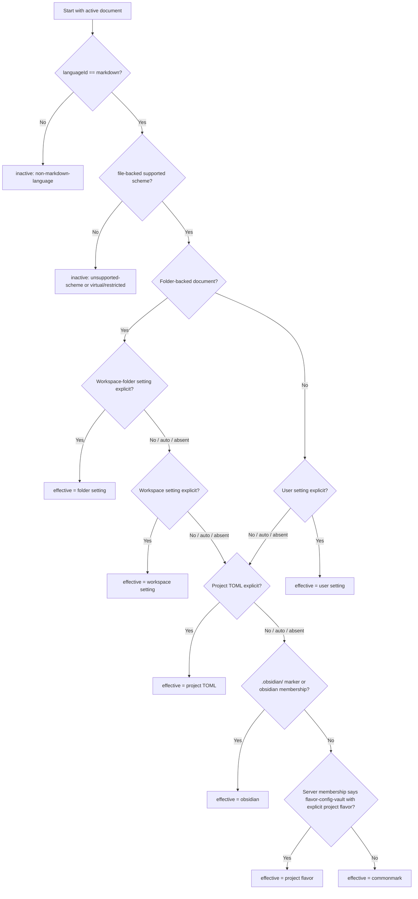

# Markdown Flavor Auto-Detection Algorithm

This technical spec defines the unified logic flow for resolving an active
Markdown document to an `EffectiveMarkdownFlavor`.

The selector value `auto` is a request to run this algorithm. It is never itself
an effective flavor. The output is either an explicit `MarkdownFlavorId` or
`inactive` when Flavor Grenade must not apply Markdown flavor behavior to the
document.

## Goals

- Keep `.md` documents in VS Code's built-in `markdown` language mode.
- Let users override flavor explicitly without using the VS Code language
  picker.
- Resolve Obsidian vault notes to `obsidian` without configuration.
- Resolve generic Markdown conservatively to `commonmark`.
- Support project flavor configuration through `.flavor-grenade.toml`.
- Preserve user-selected non-Markdown language modes.
- Produce resource-specific effective flavor state for multi-root workspaces,
  standalone files, and multiple open documents.

## Vocabulary

| Term | Meaning |
|---|---|
| `MarkdownFlavorSelection` | Selector/config value: `auto` or a supported explicit `MarkdownFlavorId`. |
| `MarkdownFlavorId` | Explicit flavor id: `original`, `commonmark`, `obsidian`, `gfm`, `glfm`, `pandoc`, `multimarkdown`, `mdx`, `kramdown`, `markdown-extra`, `r-markdown`, `reddit`, or `stack-overflow`. |
| `EffectiveMarkdownFlavor` | The explicit flavor currently applied to a document. It is never `auto`. |
| `inactive` | No Markdown flavor behavior applies because the document is outside Flavor Grenade's active Markdown scope. |
| `folder-backed document` | A file-backed Markdown document owned by a VS Code workspace folder. |
| `standalone document` | A file-backed Markdown document with no owning VS Code workspace folder. |

## Ownership

| Owner | Responsibility |
|---|---|
| BC6 Editor Client | Displays the selector, persists user choices to the right VS Code configuration scope, preserves manual language choices, and sends flavor state to the server. |
| BC4 Vault / Workspace | Owns vault membership, project config evidence, and authoritative `EffectiveMarkdownFlavor` state for server analysis. |
| Config | Validates flavor ids and merges TOML/default configuration. It does not resolve document-specific effective state alone. |
| BC5 LSP Protocol | Validates incoming flavor payloads and transports resource-specific state. It does not reinterpret flavor syntax. |
| BC2 Document Lifecycle | Consumes `EffectiveMarkdownFlavor` through `ParseContext` and profile flags. |

## Inputs

The resolver takes a document resource, editor state, and available workspace
evidence:

```typescript
type ResolveFlavorInput = {
  uri: string;
  languageId: string;
  scheme: string;
  owningWorkspaceFolder?: string;
  inspectedVSCodeSetting: {
    folder?: MarkdownFlavorSelection;
    workspace?: MarkdownFlavorSelection;
    user?: MarkdownFlavorSelection;
  };
  projectTomlFlavor?: MarkdownFlavorSelection;
  markers: {
    hasObsidianDirectory: boolean;
    hasFlavorGrenadeToml: boolean;
  };
  serverMembership?: {
    indexed: boolean;
    vaultRoot?: string;
    reason: 'obsidian-vault' | 'flavor-config-vault' | 'single-file' | 'not-indexed';
  };
};
```

Invalid selector or TOML values are not part of `MarkdownFlavorSelection`. The
validation layer rejects them before resolution and treats that layer as absent.

Security invariants:

- `.flavor-grenade.toml` is read only after workspace/vault realpath
  confinement passes.
- TOML size, value types, and dangerous object keys are validated before merge.
- Invalid TOML is treated as absent configuration and logs status without
  logging file contents.
- Resource keys in server propagation are validated as supported `file://`
  resources owned by the workspace/vault or standalone document context.
- Unsupported schemes, virtual documents, restricted contexts, and untrusted
  contexts return `inactive` before server analysis or propagation.

## Output

```typescript
type ResolveFlavorResult =
  | {
      kind: 'active';
      selected: MarkdownFlavorSelection;
      effective: MarkdownFlavorId;
      source:
        | 'workspace-folder-setting'
        | 'workspace-setting'
        | 'standalone-user-setting'
        | 'project-toml'
        | 'obsidian-marker'
        | 'server-membership'
        | 'commonmark-fallback';
      workspaceFolder?: string;
      vaultRoot?: string;
    }
  | {
      kind: 'inactive';
      reason:
        | 'non-markdown-language'
        | 'unsupported-scheme'
        | 'virtual-or-restricted-context';
    };
```

## Decision Flow



## Precedence Rules

| Priority | Applies when | Value used |
|---|---|---|
| 0 | `languageId` is not `markdown` | `inactive`; do not resolve flavor. |
| 0 | URI scheme/context cannot be served safely | `inactive`; do not start flavor analysis. |
| 1 | Folder-backed document has explicit workspace-folder setting | Workspace-folder `flavorGrenade.markdownFlavor`. |
| 2 | Folder-backed document has explicit workspace setting | Workspace `flavorGrenade.markdownFlavor`. |
| 3 | Standalone document has explicit user setting | User `flavorGrenade.markdownFlavor`. |
| 4 | Owning vault/project has explicit `.flavor-grenade.toml` flavor | `[core].markdown.flavor` from project TOML. |
| 5 | `.obsidian/` marker or server membership reason `obsidian-vault` exists | `obsidian`. |
| 6 | Server membership reports a Flavor Grenade vault with explicit project flavor evidence | That explicit project flavor. |
| 7 | No valid positive signal remains | `commonmark`. |

Tie-breakers:

- `auto` delegates to the next lower-priority source.
- `auto` never propagates to analysis as the effective flavor.
- Workspace-folder settings outrank workspace settings for documents inside
  that folder.
- User settings are explicit selection sources only for standalone documents.
  Folder-backed documents use folder/workspace settings or project/vault
  evidence, so a personal standalone preference does not silently override a
  team project.
- `.flavor-grenade.toml` marks a Flavor Grenade vault, but by itself does not
  imply Obsidian behavior. It resolves to its explicit configured flavor or
  falls through to `commonmark`.
- `.obsidian/` resolves to `obsidian` unless a higher-priority explicit
  selector/config value overrides it.
- Invalid values are ignored at their layer and resolution continues.
- Unknown future flavor ids must be rejected until they are added to the shared
  flavor contract.

## Pseudocode

```typescript
function resolveEffectiveMarkdownFlavor(input: ResolveFlavorInput): ResolveFlavorResult {
  if (input.languageId !== 'markdown') {
    return { kind: 'inactive', reason: 'non-markdown-language' };
  }

  if (input.scheme !== 'file') {
    return { kind: 'inactive', reason: 'unsupported-scheme' };
  }

  const explicit = (value?: MarkdownFlavorSelection): MarkdownFlavorId | undefined =>
    value && value !== 'auto' ? value : undefined;

  if (input.owningWorkspaceFolder) {
    const folder = explicit(input.inspectedVSCodeSetting.folder);
    if (folder) {
      return active(folder, 'workspace-folder-setting', input);
    }

    const workspace = explicit(input.inspectedVSCodeSetting.workspace);
    if (workspace) {
      return active(workspace, 'workspace-setting', input);
    }
  } else {
    const user = explicit(input.inspectedVSCodeSetting.user);
    if (user) {
      return active(user, 'standalone-user-setting', input);
    }
  }

  const project = explicit(input.projectTomlFlavor);
  if (project) {
    return active(project, 'project-toml', input);
  }

  if (
    input.markers.hasObsidianDirectory ||
    input.serverMembership?.reason === 'obsidian-vault'
  ) {
    return active('obsidian', 'obsidian-marker', input);
  }

  return active('commonmark', 'commonmark-fallback', input);
}
```

`active(...)` attaches the selected source, workspace folder, and vault root
metadata needed for UI display and server propagation.

## Resource-Specific Propagation

The extension must propagate effective flavor as resource-specific state, not as
a single global value. This matters when:

- a multi-root workspace contains folders with different flavor settings;
- two open Markdown files are in different vaults;
- a standalone file has a user-level explicit flavor while a workspace file
  uses project configuration;
- an Obsidian vault and a generic Markdown folder are open at the same time.

The server-facing payload must let BC4 derive or receive the effective flavor
for the specific document being parsed. A valid design can use either:

1. a document-URI keyed effective flavor map in `workspace/didChangeConfiguration`;
2. workspace-folder keyed settings plus server-side document membership lookup;
3. initialization options plus configuration change notifications; or
4. a documented custom request.

Whatever mechanism is implemented, tests must prove that one document's
override does not leak into another document's effective flavor.

The propagation payload must also satisfy
[[docs/requirements/security/input-validation#Security.Input.FlavorPropagationPayload]]:
bounded map size, enum validation, supported URI schemes, resource ownership
checks, stale-resource eviction, and dangerous-key rejection.

## Selector Display

Selector display uses both selected and effective state:

| Selected value | Effective value | Display |
|---|---|---|
| `auto` | `obsidian` | `Markdown Flavor: Auto Detect (Obsidian)` |
| `auto` | `commonmark` | `Markdown Flavor: Auto Detect (CommonMark)` |
| explicit id | same explicit id | `Markdown Flavor: <label>` |
| inactive | none | Selector hidden, disabled, or marked inactive for the document. |

The selector must not call `vscode.languages.setTextDocumentLanguage`.

## Refresh Triggers

The resolver must rerun for affected open documents when any of these inputs
change:

- selector choice changes;
- workspace folder is added, removed, or renamed;
- active/visible editor changes;
- Markdown file opens;
- server readiness or membership result changes;
- `.obsidian/` marker appears or disappears;
- `.flavor-grenade.toml` appears, disappears, or changes;
- `flavorGrenade.markdownFlavor` changes at folder, workspace, or user scope;
- restricted/virtual workspace state changes.
- workspace trust state changes.

If the effective flavor changes, BC4 schedules parse, diagnostics, completion,
semantic token, hover, navigation, and rename refresh for affected documents.

## Test Obligations

Minimum test coverage:

- Unit truth table for every precedence row and tie-breaker.
- Invalid-value cases at VS Code setting and TOML layers.
- Multi-root cases with different effective flavors per folder.
- Standalone user setting case.
- Obsidian marker case.
- Generic Markdown fallback case.
- Manual `plaintext` and `mdx` language-id safety cases.
- Server propagation case proving resource-specific effective flavor.
- BDD acceptance case for Auto Detect reset and recompute.

## Cross-References

- [[docs/requirements/ofmarkdown-language-mode]]
- [[docs/features/ofmarkdown-language-mode]]
- [[docs/ddd/config/domain-model]]
- [[docs/ddd/editor-client/domain-model]]
- [[docs/ddd/vault/domain-model]]
- [[docs/design/api-layer]]
- [[docs/test/markdown-flavor-unit-spec]]
- [[docs/test/markdown-flavor-integration-spec]]
- [[docs/plans/phase-E15-markdown-flavor-selector-settings]]
