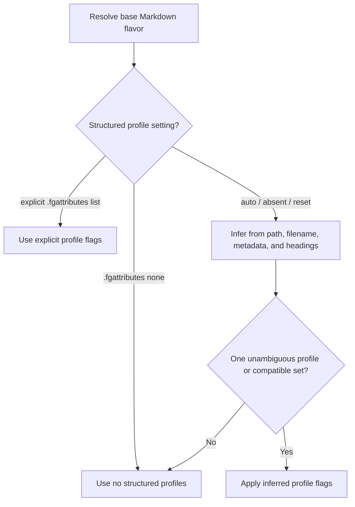

# Markdown Structured Profile Flags

This spec defines document-structure profiles that can be layered onto any
larger Markdown flavor. These profiles are not new `MarkdownFlavorId` values and
must not be added to the Markdown flavor selector list.

## Goals

- Treat Keep a Changelog, Common Changelog, and MADR as independent profile
  flags over the active base Markdown flavor.
- Allow a document to be `commonmark + keep-a-changelog`, `gfm + madr`,
  `obsidian + common-changelog`, or any other valid base-flavor/profile
  combination.
- Support low-friction automatic detection through filename, folder placement,
  headings, front matter, and local structure.
- Support explicit configuration in `.fgattributes` while preserving automatic
  profile detection when the attribute is absent, reset, or set to `auto`.
- Preserve the current explicit Markdown flavor list.
- Keep base Markdown parsing separate from structured-document validation.

## Vocabulary

| Term | Meaning |
|---|---|
| `MarkdownFlavorId` | The existing base Markdown flavor id, such as `commonmark`, `gfm`, `obsidian`, or `pandoc`. |
| `EffectiveMarkdownFlavor` | The resolved base `MarkdownFlavorId` applied to a document. |
| `StructuredMarkdownProfileId` | Independent structured-document flag: `keep-a-changelog`, `common-changelog`, or `madr`. |
| `StructuredProfileSelection` | Configuration value controlling profile flags: `auto`, `none`, or a list of explicit `StructuredMarkdownProfileId` values. |
| `EffectiveMarkdownContext` | The complete parse context: one `EffectiveMarkdownFlavor` plus zero or more structured profile flags. |

## Contract

```typescript
type StructuredMarkdownProfileId =
  | 'keep-a-changelog'
  | 'common-changelog'
  | 'madr'

type StructuredProfileSelection =
  | 'auto'
  | 'none'
  | readonly StructuredMarkdownProfileId[]

interface EffectiveMarkdownContext {
  effectiveMarkdownFlavor: MarkdownFlavorId
  profile: MarkdownFlavorProfile
  structuredProfiles: readonly StructuredMarkdownProfileId[]
}
```

Rules:

- `StructuredMarkdownProfileId` values are never valid `MarkdownFlavorId`
  values.
- The Markdown flavor selector still offers only `auto` plus existing base
  Markdown flavors.
- Structured profiles may have a separate selector or settings UI, but must not
  appear as base flavor choices.
- Multiple structured profiles may be configured only when they are compatible.
  A configured list must be unique and must not contain both changelog profile
  ids. In practice, only one changelog profile can be effective for a single
  document.
- A structured profile never changes low-level Markdown tokenization. It adds
  validation, completions, symbols, folds, hovers, and diagnostics for document
  structure after the base flavor parser runs.

## Profile Inventory

| Profile id | Applies to | Strong automatic triggers | Mutually exclusive with |
|---|---|---|---|
| `keep-a-changelog` | Keep a Changelog 1.1.0 `CHANGELOG.md` files | `CHANGELOG.md`, `# Changelog`, `## [Unreleased]`, bracketed SemVer/date release headings, `Added`/`Changed`/`Deprecated`/`Removed`/`Fixed`/`Security` sections | `common-changelog` |
| `common-changelog` | Common Changelog `CHANGELOG.md` files | `CHANGELOG.md`, `# Changelog`, SemVer/date release headings, four-category `Changed`/`Added`/`Removed`/`Fixed` order, linked change references, `**Breaking:**` prefixes | `keep-a-changelog` |
| `madr` | Markdown Architectural Decision Records | path under `docs/decisions/` or `decisions/`, filename `NNNN-title-with-dashes.md`, MADR front matter, `Context and Problem Statement`, `Considered Options`, `Decision Outcome` | none |

## Configuration

### `.fgattributes`

`.fgattributes` may set structured profiles independently of the base Markdown
flavor:

```gitattributes
*.md flavor=gfm structured_profiles=keep-a-changelog
```

Valid values:

```gitattributes
# Run automatic filename/folder/content inference.
CHANGELOG.md structured_profiles=auto

# Disable all structured profile behavior in this project.
docs/legacy/*.md structured_profiles=none

# Force one or more compatible flags.
docs/decisions/*.md structured_profiles=madr
```

Directory-scoped rules may set `structured_profiles` independently from
`flavor`. Legacy `.flavor-grenade.*` files, `.editorconfig` directives, and VS
Code settings are not structured-profile assignment sources.

## Resolution

Structured profile resolution runs after the base Markdown flavor is resolved:



Precedence:

1. Matching `.fgattributes` structured-profile setting.
2. Automatic inference from bounded local context.
3. No structured profile.

The structured-profile result is propagated alongside the base effective flavor.
It must not replace the effective flavor.

Invalid explicit structured-profile lists are rejected at the configuration
layer. Invalid arrays include unknown ids, duplicate ids, and arrays containing
both `keep-a-changelog` and `common-changelog`.

## Automatic Detection

Automatic detection is intentionally conservative. It may use:

- file basename;
- workspace-relative path;
- YAML front matter keys;
- heading text and hierarchy;
- release heading patterns;
- list-entry shape;
- bounded local document text.

It must not:

- cross the active workspace/vault boundary;
- read unrelated sibling repositories;
- execute code;
- call external renderers;
- fetch remote links;
- infer a profile from a single weak heading.

### Keep a Changelog

Infer `keep-a-changelog` when multiple signals agree:

- file basename is `CHANGELOG.md`;
- first heading is `# Changelog`;
- `## [Unreleased]` is present;
- release headings match `## [VERSION] - YYYY-MM-DD`;
- at least two recognized category headings appear under releases;
- `Deprecated` or `Security` appears as a category.

### Common Changelog

Infer `common-changelog` when stricter signals agree:

- file basename is `CHANGELOG.md`;
- first heading is `# Changelog`;
- release headings match `## VERSION - YYYY-MM-DD` or
  `## [VERSION] - YYYY-MM-DD`;
- release sections use the four categories `Changed`, `Added`, `Removed`, and
  `Fixed`;
- change entries include Markdown links in parenthesized references;
- entries use `**Breaking:**` or subsystem prefixes.

If `Unreleased` appears as a release heading, or `Deprecated` or `Security`
appears as a category heading, prefer `keep-a-changelog` unless explicit
configuration says otherwise.

### MADR

Infer `madr` when ADR-specific path or filename evidence combines with MADR
headings:

- path contains `docs/decisions/` or `decisions/`;
- filename matches `NNNN-title-with-dashes.md`;
- YAML front matter includes decision metadata such as `status`, `date`,
  `decision-makers`, `consulted`, or `informed`;
- H2 headings include at least two of `Context and Problem Statement`,
  `Considered Options`, and `Decision Outcome`;
- option sections contain `Good, because`, `Neutral, because`, or
  `Bad, because` list entries.

Do not infer MADR from generic ADR headings alone, because other ADR formats use
different conventions.

## LSP Behavior

Structured profiles may add:

- diagnostics for missing or invalid required sections;
- document symbols and folds for releases, change groups, ADR sections, and
  options;
- hovers that explain profile rules;
- completions/snippets for category headings and ADR sections;
- navigation for profile-local links, release links, ADR references, and
  supersession relationships.

Structured profiles must not:

- enable syntax forbidden by the base Markdown flavor;
- turn host references into local vault targets;
- alter base parser opaque-region behavior;
- execute R, MDX, or any external tooling;
- make network requests for changelog or ADR references.

## Test Obligations

- Unit tests validate `.fgattributes` values for `auto`, `none`, explicit
  lists, unknown ids, duplicate ids, and incompatible changelog pairs.
- Auto-detection tests cover `CHANGELOG.md`, Keep a Changelog, Common
  Changelog, MADR path/filename/heading evidence, weak-signal fallback, and
  workspace-boundary confinement.
- Integration tests prove structured flags propagate with each document's base
  effective flavor and do not leak across multi-root workspaces.
- Parser/LSP tests prove a base flavor can be combined with each structured
  profile without expanding `MARKDOWN_FLAVOR_IDS`.

## Cross-References

- [[docs/design/markdown-flavor-auto-detection]]
- [[docs/research/keep-a-changelog-analysis]]
- [[docs/research/common-changelog-analysis]]
- [[docs/research/madr-analysis]]
- [[docs/ddd/config/domain-model]]
- [[docs/requirements/functional/markdown-flavor-lsp]]
