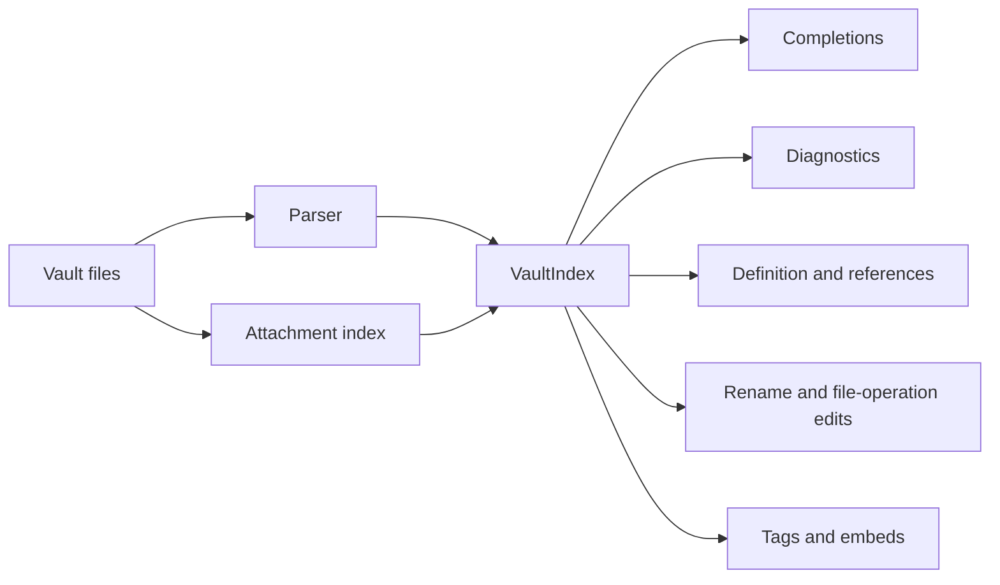

# Concept Article: Vault Index

> [!INFO] `TASK-251` · Task · Phase W7 · Parent: [[FEAT-040]] · Status: `in-review`

## Text Scope

- Explain that the vault index is the shared model for parsed documents,
  headings, wiki-links, attachments, embeds, and tags.
- Describe why indexing a vault graph enables completion, references,
  diagnostics, navigation, and safe rename.
- Include guidance for LLM maintainers: avoid inventing side caches when the
  index is the source of truth.

## Asset Scope

- Include an ASCII or Mermaid diagram showing vault files flowing into index
  data and then into editor features.
- Include a small vault tree example.

## Draft Article Copy

### Why does the server build a vault index?

Flavor Grenade LSP builds a vault index because editor features need the same answer to the same graph question. Completion, diagnostics, references, definition navigation, hovers, tags, embeds, and rename all need to know which notes, headings, blocks, tags, links, and attachments exist in the current Obsidian Vault.

Compact definition: the vault index is the in-memory source of truth for parsed Markdown documents and non-Markdown attachments known to the server. Parsed documents are stored by DocId. Attachments are stored by vault-relative path with file metadata.

Small vault example:

```text
Vault/
  .obsidian/
  notes/Daily.md
  notes/Project Plan.md
  people/Ada Lovelace.md
  assets/architecture.png
```

Indexed shape:

```text
notes/Daily
  headings: Daily
  wikiLinks: [[Project Plan]], [[people/Ada Lovelace#Notes]]
  embeds: ![[assets/architecture.png]]
  tags: #project/flavor-grenade

assets/architecture.png
  attachment path: assets/architecture.png
  kind: image
```

Flow:



The index matters because OFM is not document-local. `[[Project Plan]]` in `Daily.md` can only be resolved after the server knows which notes exist. `[[Project Plan#Open Questions]]` needs the target document's headings. `![[architecture.png]]` needs attachment lookup. `#project/flavor-grenade` becomes more useful when every occurrence can be found across the vault.

For maintainers: do not add side caches for parsed OFM documents. `VaultIndex` is the single source of truth for `OFMDoc` objects. New handlers should read from the index or from services rebuilt from it, such as the reference graph or tag registry. If a feature needs new parsed data, add it to the parser/index path first so diagnostics, completion, navigation, and rename can agree.

Related-link intent: link this page from setup pages that explain vault detection, from Completions and Diagnostics because both depend on indexed candidates, from DocId and Vault-Relative Paths because DocId is the index key, and from References, Navigation, Tags, and Embeds because those features consume the shared graph.

## Definition of Done

- [ ] Article route exists and is linked from Concepts hub and dropdown.
- [ ] Article describes index inputs and downstream editor features.
- [ ] Diagram or tree asset is present.
- [ ] Route metadata, sitemap, and tests include the article.
