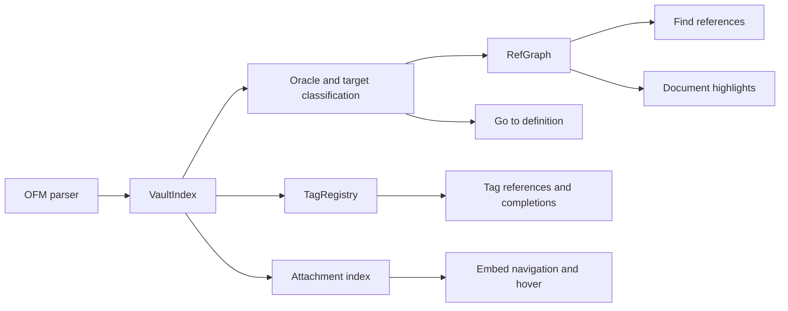

# Concept Article: References, Navigation, Tags, And Embeds

> [!INFO] `TASK-258` · Task · Phase W7 · Parent: [[FEAT-040]] · Status: `done`

## Text Scope

- Explain how references, definition navigation, tag lookup, document
  highlights, and embeds share the same vault graph.
- Show how this shared model keeps editor features consistent.
- Include LLM maintainer guidance for adding features through shared resolution
  and index behavior.

## Asset Scope

- Reuse existing reference or tag completion screenshots where available.
- Include a diagram showing one vault graph powering multiple editor features.

## Draft Article Copy

### How do references, navigation, tags, and embeds stay consistent?

They share the same vault graph. The parser records OFM tokens, the vault index stores parsed documents and attachments, the resolver classifies targets, and the reference graph connects source locations to definitions. Editor features then ask that shared model different questions.

Compact definition: references, definition navigation, document highlights, tag lookup, and embed behavior are separate LSP features powered by the same indexed OFM graph.

Concrete OFM example:

```markdown
# Project Plan

## Risks

Decision summary lives here. ^decision-1

See [[Daily#Today]].
Backlink target: [[Project Plan#Risks]]
Block target: [[Project Plan#^decision-1]]
Embedded diagram: ![[assets/architecture.png]]
Inline tag: #project/flavor-grenade
Markdown link: [risk section](#risks)
```

One graph, many features:



Feature behavior:

| Feature | Shared data it uses | Example |
| --- | --- | --- |
| Go to definition | Parsed entity plus resolver | Cursor on `[[Project Plan#Risks]]` opens the heading |
| Find references | RefGraph and TagRegistry | Cursor on `#project/flavor-grenade` finds tag occurrences |
| Document highlights | Current parsed document | Cursor on `[[#Today]]` highlights same-document heading refs |
| Embed navigation | Embed resolver and attachment index | Cursor on `![[assets/architecture.png]]` opens the attachment |
| Tags | Inline tags plus frontmatter tags | `tags: [project/flavor-grenade]` joins `#project/flavor-grenade` |
| Markdown labels | Parsed label refs and definitions | `[name][ref]` navigates to `[ref]: target` |

Consistency matters most when features overlap. If `[[Project Plan#Risks]]` navigates successfully but references cannot find it, the editor feels unreliable. If completion suggests an attachment that diagnostics later says is missing, the index and resolver disagree. The shared graph is how Flavor Grenade avoids those splits.

For maintainers: route new features through existing parser, VaultIndex, Oracle, RefGraph, TagRegistry, and attachment-index behavior where possible. Do not create a feature-local interpretation of wiki-links, tags, or embeds. If a new feature needs extra graph data, add it where other features can reuse it.

Related-link intent: link this page from feature overview pages and from the individual concepts for Vault Index, Wiki-link Resolution, Completions, Diagnostics, and Rename Safety. Use it as the bridge between "what is indexed" and "what the editor can do."

## Definition of Done

- [ ] Article route exists and is linked from Concepts hub and dropdown.
- [ ] Article connects graph behavior to multiple editor features.
- [ ] Screenshot, diagram, or example table is present.
- [ ] Route metadata, sitemap, and tests include the article.
