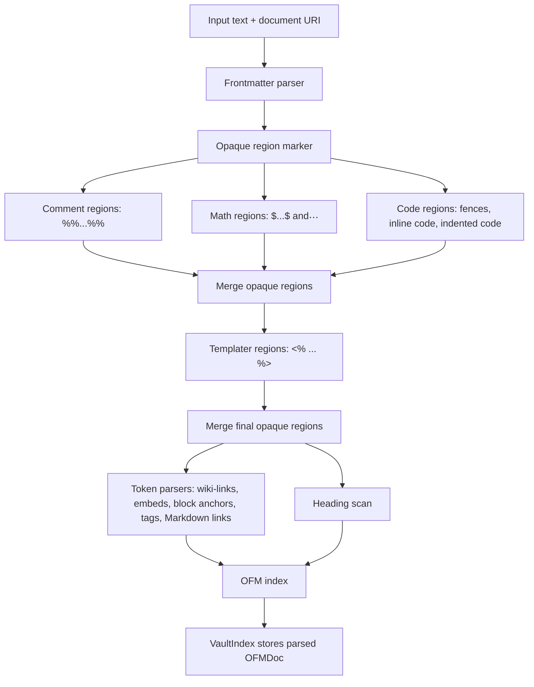

# Advanced Article: Parser Boundaries And Opaque Regions

> [!INFO] `TASK-263` · Task · Phase W7 · Parent: [[FEAT-040]] · Status: `in-review`

## Text Scope

- Explain parser order, opaque region marking, token parsing, and downstream
  feature use at a deeper technical level than the public concept article.
- Cover edge cases for nested syntax, comments, math, code fences, and
  Templater-like content.
- Clarify what is guaranteed and what remains intentionally conservative.

## Asset Scope

- Include a parser pipeline diagram or Mermaid flowchart.
- Include edge-case snippets showing parsed and skipped tokens.

## Draft Article Copy

# Parser Boundaries and Opaque Regions

Flavor Grenade parses Obsidian Flavored Markdown in stages. The important rule
is that opaque regions are marked before most token parsers run. Links, embeds,
tags, block anchors, and headings inside code, math, comments, or Templater
spans are treated as examples or program text, not vault references.

This article describes parser behavior for advanced users who write generated
docs, examples, templates, or mixed Markdown/code content.

## Parser Pipeline



The parser returns an `OFMDoc`. The vault index stores that parsed document and
serves it to downstream features.

## What Counts As Opaque

| Region kind | Example | Why skipped |
|---|---|---|
| Obsidian comment | `%% [[Draft Link]] %%` | Comments should not create diagnostics or references. |
| Inline math | `$x_[[i]]$` | Math syntax may contain Markdown-like characters. |
| Display math | `$$\n# not a heading\n$$` | Math blocks are content, not Markdown structure. |
| Fenced code | <code>```md<br>[[Example]]<br>```</code> | Examples should not become vault links. |
| Inline code | `` `#not-a-tag` `` | Code spans are literal text. |
| Indented code | Four-space indented blocks | Code examples should stay inert. |
| Templater span | `<% tp.file.title %>` | Template commands are not vault links. |

Opaque ranges are start-inclusive and end-exclusive. After the marker finds
regions, overlapping ranges are merged so token parsers can use one list.

## Parsed Versus Skipped Examples

Parsed wiki-link:

```markdown
See [[Project Plan]].
```

`[[Project Plan]]` is outside an opaque region, so it becomes a wiki-link token.

Skipped wiki-link in code:

````markdown
```markdown
See [[Example Only]].
```
````

`[[Example Only]]` is inside a fenced code block, so it is skipped.

Skipped tag in inline code:

```markdown
Run `# not a tag` in your shell example.
```

The `#` text is inside inline code, so it does not become a tag occurrence.

Parsed tag outside code:

```markdown
Status: #project/flavor-grenade
```

The tag is plain document text, so it is indexed.

Skipped Markdown link in a comment:

```markdown
%% [draft](Missing.md) %%
```

The link is inside an Obsidian comment, so broken-link diagnostics should not
use it.

Skipped embed in Templater:

```markdown
<%* const sample = "![[Generated.png]]"; %>
```

The embed-like text is inside a Templater region, so it is skipped.

## Frontmatter Boundary

Frontmatter is parsed first. The opaque-region pass starts from the document
body offset after frontmatter. That keeps YAML-like syntax from being treated as
normal body tokens.

Frontmatter parsing is intentionally bounded and conservative. Invalid or
oversized frontmatter should not crash parsing; downstream features should
treat unavailable metadata as absent rather than guessed.

## Headings and Opaque Regions

ATX headings are scanned after opaque regions are known:

````markdown
# Real Heading

```markdown
# Example Heading
```
````

`# Real Heading` is indexed. `# Example Heading` is skipped because it is inside
the fence.

## Nested and Overlapping Syntax

Opaque parsing is conservative. When regions overlap, the merged range stays
opaque. This favors avoiding false diagnostics over extracting every possible
token from complex nested syntax.

Example:

```markdown
`code with $math and [[link]] inside`
```

The whole inline code span is opaque. The math-looking and link-looking text
inside it is skipped.

Templater regions are detected after comments, math, and code. If a Templater
opener appears inside an existing opaque region, it does not create a second
active template range.

## What Is Guaranteed

Flavor Grenade guarantees the sequencing rule: opaque regions are marked before
the main OFM token parsers consume document text. Tokens inside opaque regions
are skipped for vault indexing.

The parser is also designed to be conservative with incomplete syntax. An
unclosed fence, unclosed math span, or malformed template may reduce what is
recognized rather than invent a target. This avoids turning partial examples
into rename edits or diagnostics.

Current nuance: callout parsing is handled separately from the main
opaque-aware token parsers. Callout behavior should be documented from observed
current behavior if an article needs callout-specific guarantees.

## Why It Matters

The parser boundary protects common advanced workflows:

- Documentation pages can show example links without creating broken-link
  warnings.
- Templates can contain commands that generate links later.
- Math and code-heavy notes avoid false tags and references.
- Rename and references operate on real vault tokens, not examples.

When you want text to be ignored by vault features, put it in an appropriate
opaque region. For examples, fenced code blocks are the clearest choice.

## Definition of Done

- [ ] Article route exists and is linked from Advanced Usage hub and dropdown.
- [ ] Article explains parser sequencing and conservative behavior.
- [ ] Diagram and edge-case snippets are present.
- [ ] Route metadata, sitemap, and tests include the article.
