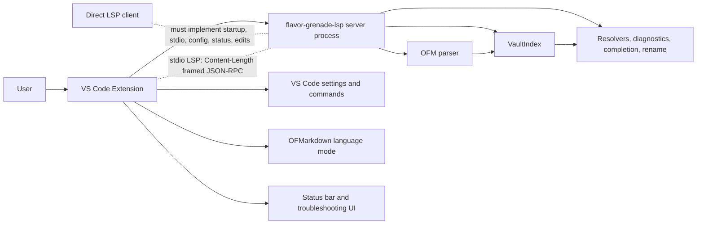

# Advanced Article: Compatibility And Direct LSP Integration

> [!INFO] `TASK-264` · Task · Phase W7 · Parent: [[FEAT-040]] · Status: `open`

## Text Scope

- Explain the supported VS Code extension path first.
- Describe direct language-server usage carefully as advanced integration, with
  clear limits around transport, configuration, and client responsibility.
- Include compatibility notes for Markdown clients without overpromising support.

## Asset Scope

- Include a server and VS Code extension boundary diagram.
- Include command or configuration snippets only if verified against current
  implementation.

## Draft Article Copy

# Compatibility and Direct LSP Integration

Flavor Grenade is a language server, but the supported user path is the VS Code
extension. The extension packages the server, starts it with the right
transport, passes supported settings, guards unsupported workspace modes, and
exposes status and commands.

Direct LSP integration is possible for advanced users and editor authors. It is
not the same support surface as the VS Code extension. A direct client must
own startup, stdio framing, initialization, file roots, configuration, status
display, rebuild commands, and workspace-edit application.

## Recommended Path: VS Code Extension

Use the VS Code extension when you want Flavor Grenade to manage:

- Bundled server binary selection.
- Activation for `.obsidian/` and `.flavor-grenade.toml` workspaces.
- OFMarkdown language mode.
- Public `flavorGrenade.*` settings.
- Server status in the editor UI.
- Rebuild, restart, troubleshooting, reference, backlink, outlink, and vault
  reveal commands.
- Workspace trust and virtual-workspace guardrails.

The extension runs as a workspace extension. Local file-system workspaces and
supported remote file-system extension hosts can start the server. Restricted
Mode and fully virtual workspaces are disabled before the server process is
created.

## Boundary Diagram



The server owns parsing and vault intelligence. The client owns process
management and editor integration.

## Direct LSP Transport

Current direct integration should assume stdio transport with standard LSP
`Content-Length` framed JSON-RPC messages. The server process reads from stdin
and writes responses/notifications to stdout.

The transport has framing limits. Very large malformed messages are rejected by
the stdio reader instead of being buffered without bound.

Direct clients should not assume an HTTP, WebSocket, TCP, or named-pipe server
unless that transport is added and documented later.

## Initialization Requirements

A direct client must send `initialize`, then `initialized`. To get vault mode,
the client must provide a `file://` root through `rootUri` or the first
`workspaceFolders` entry.

Example `initialize` parameters:

```json
{
  "processId": 12345,
  "rootUri": "file:///Users/alex/NotesVault",
  "workspaceFolders": [
    {
      "uri": "file:///Users/alex/NotesVault",
      "name": "NotesVault"
    }
  ],
  "capabilities": {},
  "initializationOptions": {
    "linkStyle": "file-stem",
    "completionCandidates": 50,
    "diagnosticsSuppress": []
  }
}
```

If no root URI or workspace folder is available, the server has no vault root to
scan. Vault-wide completion, diagnostics, references, and rename should not be
expected.

## Configuration Names

VS Code users configure public settings:

```json
{
  "flavorGrenade.linkStyle": "file-stem",
  "flavorGrenade.completion.candidates": 50,
  "flavorGrenade.diagnostics.suppress": []
}
```

Direct LSP clients send server options:

```json
{
  "linkStyle": "file-stem",
  "completionCandidates": 50,
  "diagnosticsSuppress": []
}
```

These are related, but not identical names. Do not send VS Code setting keys
inside `initializationOptions` and expect the server to read them.

## Client Responsibilities

A direct integration must handle:

| Responsibility | Why it matters |
|---|---|
| Process startup | The server does not start itself. |
| Stdio framing | LSP messages require `Content-Length` headers. |
| `file://` root selection | Vault detection and scanning depend on a local filesystem root. |
| Settings translation | Direct options use server names, not VS Code setting names. |
| Status notifications | Direct clients must decide how to show `flavorGrenade/status`. |
| Rebuild command surface | Users need a way to request `flavorGrenade/rebuildIndex` after large changes. |
| Workspace edits | Rename and code actions return edits for the client to apply. |
| Trust model | Non-VS Code clients must provide their own workspace safety policy. |

## Compatibility Notes for Markdown Clients

Flavor Grenade works best when the client supports standard LSP features used
by Markdown editing:

- Text document sync.
- Completion.
- Diagnostics.
- Definition and references.
- Rename and prepare-rename.
- Code actions.
- Document links, symbols, highlights, semantic tokens, and CodeLens when
  desired.
- Workspace commands or custom requests for rebuild/status features.

Markdown clients that only support a small LSP subset may still get partial
behavior. For example, a client with completion but no rename support can use
wiki-link completion but cannot apply vault-wide rename edits.

## Conservative Support Statement

The VS Code extension is the supported packaged product. Direct LSP use is an
advanced integration surface for users who are comfortable debugging client
configuration and protocol traffic.

When reporting issues from direct clients, include:

- Client/editor name and version.
- Server version.
- How the server process is started.
- Full `initialize` root and `initializationOptions` shape, with private paths
  reduced if needed.
- Whether the same vault works in the VS Code extension.
- The feature being tested: completion, diagnostics, navigation, references, or
  rename.

This keeps compatibility claims honest. The server can be useful outside VS
Code, but the extension remains the reference integration.

## Definition of Done

- [ ] Article route exists and is linked from Advanced Usage hub and dropdown.
- [ ] Article separates supported extension usage from advanced direct use.
- [ ] Boundary diagram or verified snippet is present.
- [ ] Route metadata, sitemap, and tests include the article.
