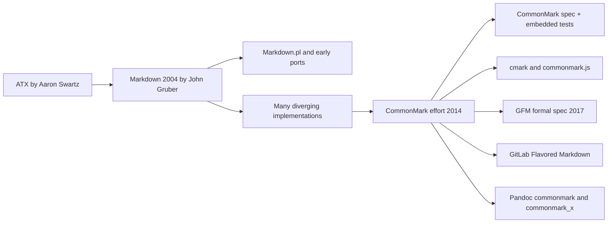

# CommonMark and Original Markdown

> [!INFO] Related research
> - [[github-flavored-markdown-analysis|GitHub Flavored Markdown Analysis]]
> - [[gitlab-flavored-markdown-analysis|GitLab Flavored Markdown Analysis]]
> - [[mdx-analysis|MDX Analysis]]
> - [[multimarkdown-analysis|MultiMarkdown Analysis]]
> - [[pandoc-markdown-deep-research-report|Pandoc Markdown Deep Research Report]]


## Executive summary

“Original Markdown” means the 2004 format as defined by John Gruber’s project page and syntax description, plus the behavior of the original Perl implementation, [[commonmark-and-original-markdown|Markdown.pl]]. It was designed as a deliberately small, readable text-to-HTML syntax, not as a complete markup language and not as a replacement for HTML. Its authoritative materials are prose, examples, and the Perl script itself; there is no official standalone conformance suite, and many consequential edge cases are left unspecified. That combination made Markdown successful for authors, but fragile for interoperable parser implementations.

CommonMark is a later standardization effort, led primarily by John MacFarlane and announced publicly in 2014 to make Markdown precise and portable. Its core deliverables are a versioned specification, embedded conformance examples, and reference implementations in C and JavaScript. CommonMark keeps the broad spirit of original Markdown, but it resolves ambiguities explicitly, adds fenced code blocks, formalizes parsing precedence, and defines far more edge-case behavior. As of the latest official spec page currently published, the latest stable version is 0.31.2 from January 28, 2024, and the project still had open “release-1.0” issues on the official forum in late 2025, so it remains pre-1.0.

The shortest practical conclusion is this: if you need historical fidelity to Gruber’s 2004 documents or old Perl-era content, target original Markdown carefully and expect ambiguity; if you need predictable cross-platform parsing, target CommonMark or an explicitly named CommonMark-based flavor such as [[github-flavored-markdown-analysis|GitHub Flavored Markdown]], [[gitlab-flavored-markdown-analysis|GitLab Flavored Markdown]], or Pandoc’s CommonMark modes. Extensions such as tables, task lists, and footnotes are not part of Gruber’s 2004 spec, and many of them are not part of core CommonMark either; they belong to flavor-specific extension ecosystems.

## Original Markdown

### Origin, history, and primary sources

Original Markdown was introduced by John Gruber on March 15, 2004, as a text-to-HTML tool and syntax for web writing. The official project page describes Markdown as both a plain-text formatting syntax and a Perl program that converts it to HTML. The same page credits Aaron Swartz with substantial feedback, ideas, and testing. In March 2004, Gruber published beta releases, including 1.0b4 on March 25; Markdown 1.0 shipped on August 28, 2004; and Markdown 1.0.1 followed on December 17, 2004 with bug fixes and several syntax clarifications. The project page still points to Markdown 1.0.1 as the downloadable archive.

The authoritative primary sources for original Markdown are: [Markdown project page](https://daringfireball.net/projects/markdown/), [Markdown syntax description](https://daringfireball.net/projects/markdown/syntax), Markdown license page, [Markdown 1.0.1 archive](https://daringfireball.net/projects/downloads/Markdown_1.0.1.zip), and the official [Markdown Dingus](https://daringfireball.net/projects/markdown/dingus). The prose spec and the Perl implementation are the real authority; there is no official separate conformance-test corpus published alongside them. CommonMark’s rationale explicitly notes that, in practice, implementers historically consulted Markdown.pl because the prose description was ambiguous.

A licensing detail matters historically. The August 2004 “Markdown 1.0” announcement says Gruber switched the project to GPL after an unsuccessful commercial-license experiment, but by December 2004 the project’s official license page and licensing note describe Markdown as BSD-style licensed. For a report grounded in primary sources, the safest reading is: licensing changed during 2004; the current official license page for Markdown 1.0.1 is BSD-style.

### Feature inventory, syntax rules, and formal status

Original Markdown’s documented core feature set is compact. It includes paragraphs and hard line breaks with two trailing spaces; ATX and Setext headings; blockquotes with “lazy” continuation; ordered and unordered lists; indented code blocks; horizontal rules; inline and reference links; images; emphasis and strong emphasis using `*` and `_`; code spans using backticks; inline and block HTML passthrough; angle-bracket autolinks for URLs and email addresses; backslash escapes; and automatic escaping of `&` and `<` when they are not already part of HTML or entity syntax. For anything not covered by Markdown syntax, Gruber explicitly instructs authors to use raw HTML directly.

Several features commonly associated with “Markdown” today are not part of the 2004 spec. Tables are not specified as Markdown syntax; the syntax page tells authors to use raw HTML tables. Image dimensions are not expressible in Markdown syntax and require raw HTML. Fenced code blocks, task lists, strikethrough, definition lists, and footnotes are not defined on the 2004 syntax page. Footnotes are especially important to call out: the original docs define reference links and say they can be placed “sort of like footnotes,” but that is an analogy for link-definition placement, not a footnote feature. Footnote syntax is therefore unspecified in Gruber’s 2004 Markdown.

Original Markdown has no official formal grammar. Its syntax is given in prose plus examples, and operationally by the Perl script. That means many syntactic rules are precise enough for ordinary authoring but not precise enough for interoperable parser construction. Even when the syntax page is explicit, the level of formality is intentionally informal: for example, headings are described by example; lists are described by human-facing indentation advice; and HTML passthrough is described behaviorally, not through a grammar.

### Known ambiguities and edge cases

This is where original Markdown is weakest. CommonMark’s introduction was built around concrete examples of things Gruber’s canonical description does not decide unambiguously. The official CommonMark rationale lists unresolved questions including sublist indentation, whether blank lines are required before headings or block quotes, whether blank lines are required before indented code blocks, how tight versus loose lists should be determined, whether list markers may be indented, whether mixed bullets and numerals form one list or two, precedence between code spans and links, precedence within nested emphasis, whether list items may contain headings, whether link references may be defined inside block quotes or list items, and which duplicate reference definition wins.

Some edge cases are explicitly documented as bugs or post-release corrections in Gruber’s own materials. Markdown 1.0 simplified code blocks so that an indented block alone is enough, removing the earlier beta’s extra-colon behavior. Markdown 1.0.1 changed the treatment of backslash escapes inside code blocks and code spans so that they are now literal, and tightened link-definition indentation to within three spaces of the left margin. The syntax page also records a known Markdown.pl 1.0.1 bug: single-quoted link titles in reference definitions do not work correctly in the Perl implementation even though the prose spec presents them as equivalent to double-quoted and parenthesized titles.

The net result is that “original Markdown compatibility” is not a single crisp thing. It usually means “approximately Gruber syntax, often using Markdown.pl behavior as tie-breaker.” That is why many later parsers either diverged, extended the language, or invented their own dialect names.

### Minimal parsing examples

The original syntax page itself provides authoritative small examples. For headings, the input below produces the shown HTML output in the original documentation:

```markdown
# This is an H1
## This is an H2
```

```html
<h1>This is an H1</h1>
<h2>This is an H2</h2>
```

The same page also documents Setext headings with any number of `=` or `-` underline characters.

For indented code blocks, original Markdown documents the following behavior:

```markdown
This is a normal paragraph:

    This is a code block.
```

```html
<p>This is a normal paragraph:</p>

<pre><code>This is a code block.
</code></pre>
```

Code blocks are indented by at least four spaces or one tab, and Markdown syntax is not processed inside them.

For inline links, the syntax page gives this exact transformation:

```markdown
This is [an example](http://example.com/ "Title") inline link.
```

```html
<p>This is <a href="http://example.com/" title="Title">
an example</a> inline link.</p>
```

Reference links, implicit reference labels, and image syntax are all defined analogously on the same page.

For autolinks, original Markdown supports only angle-bracket autolinks:

```markdown
<http://example.com/>
```

```html
<a href="http://example.com/">http://example.com/</a>
```

Email-address autolinks are also supported, with randomized entity encoding intended to deter simple harvesting bots. Gruber explicitly cautions that this is only a partial spam defense.

### Compatibility and ecosystem

Historically, the parser closest to the original is Markdown.pl itself. Gruber’s own 2004 release notes describe Michel Fortin’s PHP Markdown as a “line-for-line, feature-for-feature translation” of the Perl implementation, and note ports to Ruby and integrations with early publishing platforms. The original project page documents support for Movable Type, Blosxom, and BBEdit, while release notes note PHP Markdown’s inclusion in then-recent WordPress versions and use in other PHP systems.

In the modern ecosystem, the closest openly documented compatibility label is Pandoc’s `markdown_strict` mode, which Pandoc defines as “original unextended Markdown” / “Markdown.pl.” That label is useful, but implementers should still avoid assuming byte-for-byte identity with the historical Perl script on every corner case, because the whole reason CommonMark exists is that parser behavior around ambiguities drifted across implementations.

## CommonMark

### Origin, history, and primary sources

CommonMark was publicly launched in August 2014 through the official discussion forum as “a strongly defined, highly compatible specification of Markdown” with comprehensive tests and C and JavaScript reference implementations. The official welcome post names a founding group including John MacFarlane, David Greenspan, Vicent Martí, Neil Williams, Benjamin Dumke-von der Ehe, and Jeff Atwood, while noting that MacFarlane contributed the lion’s share of the spec and implementation.

The version index on the official spec site shows a retained version history back to 0.5 on October 25, 2014, and the current latest release as 0.31.2 on January 28, 2024. The version page links each maintained release to “view changes” and “test cases,” underscoring that examples are part of the normative ecosystem. As of late 2025, the official forum still carried active “release-1.0” issues, so CommonMark remained a mature but still pre-1.0 standard.

The authoritative CommonMark sources are: CommonMark Spec 0.31.2, spec version index, commonmark-spec repository, cmark reference implementation, commonmark.js reference implementation, and the official discussion forum. The spec repository itself states that it contains the spec plus tools for running tests against it, and that the embedded examples serve as conformance tests.

### Feature inventory, syntax rules, and formal status

Core CommonMark 0.31.2 covers Unicode characters and line endings, tabs, backslash escapes, entity references, thematic breaks, ATX and Setext headings, indented and fenced code blocks, HTML blocks, link reference definitions, paragraphs, blank lines, block quotes, list items, lists, code spans, emphasis and strong emphasis, links, images, autolinks, raw HTML, hard line breaks, soft line breaks, and plain textual content. Unlike original Markdown, fenced code blocks are in the core language. Unlike many platform flavors, footnotes are not in the core table of contents and therefore are outside base CommonMark.

CommonMark formalizes more of the syntax than original Markdown, but it still does not adopt a single standalone BNF/PEG grammar as the normative standard. The spec repository says the document is a declarative description rather than an algorithm, and the official forum has an ongoing “CommonMark Formal Grammar” discussion that exists precisely because no official formal grammar is embedded into the standard itself. What CommonMark does provide is a much more rigorous mix of definitions, parsing constraints, and examples. For example, raw HTML tags get an explicit grammar for tag names and attributes; emphasis is defined via delimiter runs and left-/right-flanking rules; and the appendix describes a reference parsing strategy.

The parsing model is explicit. The appendix describes a two-phase parser: first build block structure and collect link reference definitions, then parse inline structure inside paragraphs and headings using the collected reference map. The same appendix notes that the input can be processed as a stream during phase one because incorporated lines can be discarded once they have affected the block tree. That is a qualitatively different level of implementation guidance from the original Markdown prose.

### Ambiguities resolved and edge behavior

CommonMark’s greatest contribution is not “more features” so much as “more decisions.” It explicitly resolves many of the cases the original spec left open. Examples include: indented code blocks cannot interrupt paragraphs and therefore require a blank line before them; fenced code blocks can use backticks or tildes and may include info strings; link reference definitions have an exact syntax and may occur inside lists and block quotes while affecting the entire document; duplicate references are resolved by “first definition wins”; list items may contain headings; and emphasis nesting is defined through delimiter-run rules instead of informal prose.

CommonMark also narrows some behaviors. ATX headings require a space or tab after the opening `#` sequence unless the heading is empty. Ordered list markers may use `.` or `)` and are limited to one to nine digits. Core autolinks are still angle-bracket forms only; “bare URL autolinking” belongs to extension ecosystems such as GFM, not base CommonMark. Hard line breaks can be made either with two trailing spaces or with a backslash before the line ending, which is a core CommonMark feature but not part of the 2004 original syntax description.

### Minimal parsing examples

The spec is rich with minimal reproducible examples and expected HTML. A simple fenced code block:

```markdown
``` 
foo
```
```

renders as:

```html
<pre><code>foo
</code></pre>
```

with optional info strings producing language classes when present. Fenced blocks are explicit CommonMark core syntax.

A link reference definition inside a block quote affects the whole document, not just the quote:

```markdown
[foo]

> [foo]: /url
```

```html
<p><a href="/url">foo</a></p>
<blockquote>
</blockquote>
```

That scope rule is deliberate and explicit.

A list item can contain a heading:

```markdown
- # Foo
- Bar
  ---
  baz
```

```html
<ul>
<li>
<h1>Foo</h1>
</li>
<li>
<h2>Bar</h2>
baz</li>
</ul>
```

This is one of the exact cases CommonMark’s introduction uses to contrast itself with Markdown.pl behavior.

A CommonMark code span also has explicit normalization rules: matching backtick strings must have equal length; line endings become spaces; and one leading/trailing space may be stripped under controlled conditions. Those details are specified instead of left to parser folklore.

## Detailed comparison

### Evolution and relationship map



This relationship map follows the original Markdown project materials, the CommonMark introduction and forum launch, the CommonMark repository, the 2017 formal GFM announcement, GitLab’s GLFM docs, and Pandoc’s manual.

### Comparison table

| Dimension | Original Markdown 2004 | CommonMark |
|---|---|---|
| Normative authority | Prose docs plus Markdown.pl behavior; no separate official conformance suite | Versioned spec plus embedded examples and official test tooling |
| Formality | Informal prose and examples; no official formal grammar | Declarative spec with explicit definitions, grammars for some constructs, parsing appendix, and many numbered examples |
| Reference implementations | Markdown.pl is the original reference implementation; Dingus is the official live renderer | cmark and commonmark.js are official reference implementations |
| Test coverage | Official standalone test suite: unspecified / effectively absent | Spec repo says embedded examples serve as conformance tests; current spec runs to Example 652 |
| Core code blocks | Indented code blocks only | Indented code blocks and fenced code blocks |
| Link references | Supported, but duplicate-definition precedence and container scope are unspecified in the 2004 docs | Exact syntax; first duplicate wins; references inside containers affect entire document |
| Emphasis | `*` and `_` documented informally; nested precedence is underdefined | Delimiter-run algorithm with left-/right-flanking rules and multiple-of-3 rule |
| Raw HTML | Allowed broadly; block HTML must be surrounded by blank lines; block-level vs span-level behavior described informally | Raw HTML and seven HTML block types are specified, with an inline raw-HTML grammar |
| Footnotes | Unspecified | Unspecified in core CommonMark |
| Ambiguity | High; many parser-visible cases unresolved | Much lower; core design goal is unambiguous behavior |
| Compatibility target | Historical Gruber/Perl-era content and close ports such as PHP Markdown | Cross-parser interoperability; base for formal platform flavors |
| Security posture | Raw HTML passthrough; escaping of `&` and `<`, but no sanitizer model | Raw HTML still allowed in spec-compliant implementations; safety depends on post-processing or safe-mode configuration |
| Sources | | |

### Extensions and ecosystem

The most important ecosystem fact is that CommonMark is a base language, while real platforms often ship supersets. The published GFM spec says it is a strict superset of CommonMark and formally defines extensions such as tables, strikethrough, task lists, autolink extensions, and disallowed raw HTML. The official 2017 GitHub engineering announcement says GitHub rebuilt its user-content stack around CommonMark and a cmark-based implementation.

However, platform behavior can outgrow the published flavor spec. The published GFM spec dated 2019 does not contain footnotes, but current GitHub Docs document footnote syntax in GitHub’s web interface, along with the caveat that footnotes are not supported in wikis. That means “GitHub behavior today” is broader than “the published 0.29-gfm formal spec.”

GitLab documents [[gitlab-flavored-markdown-analysis|GitLab Flavored Markdown]] as consisting of core CommonMark features plus GFM extensions plus GitLab-specific features, and its development docs say GLFM aims to remain 100% compliant with CommonMark while adding extensions only when necessary. Pandoc, meanwhile, explicitly supports `markdown_strict`, `commonmark`, `gfm`, and `commonmark_x`, and it treats footnotes as an extension rather than a base Markdown/CommonMark feature.

## Divergent test cases

The table below focuses on cases where behavior differs materially or where CommonMark makes a decision that original Markdown leaves unspecified. Where Gruber’s 2004 materials do not define a result, I label it **unspecified** rather than inventing an answer.

| Markdown input | Original Markdown 2004 | CommonMark |
|---|---|---|
| `- # Foo` | Markdown.pl does **not** allow headings inside list items; the 2004 prose spec does not formalize the exact HTML here, so the authoritative claim is “not allowed,” not a full HTML oracle. | Renders a heading inside the list item: `<ul><li><h1>Foo</h1></li></ul>` in the fuller Example 300 sequence. |
| `[foo]\n\n[foo]: first\n[foo]: second` | Duplicate-reference precedence is unspecified in the original docs. | First definition wins: `<p><a href="first">foo</a></p>`. |
| `[foo]\n\n> [foo]: /url` | Scope of reference definitions inside block quotes is unspecified. | Definition inside the block quote affects the whole document, yielding a link followed by an empty blockquote. |
| `Foo\nBar\n---` | Multiline Setext heading interpretation is unspecified in the original docs and historically diverged across implementations. | Parses as one level-2 heading: `<h2>Foo\nBar</h2>`. |
| ```` ```js\nx\n``` ```` | Fenced code blocks are not part of the 2004 syntax description; behavior is extension-specific and therefore unspecified in original Markdown. | Core syntax; info strings are defined for fenced code blocks. |
| `foo\\\nbaz` | Backslash hard line breaks are not defined in the 2004 syntax page; only two trailing spaces are documented for `<br />`. | Core hard line break syntax: `<p>foo<br />\nbaz</p>`. |

Representative CommonMark-side HTML for the last two cases is official because the spec prints both Markdown source and expected HTML output. For Original Markdown, the official docs simply do not define several of these corner cases, which is itself one of the report’s main findings.

## Security, performance, and migration

### Security considerations

Neither original Markdown nor core CommonMark should be mistaken for an HTML sanitizer. Original Markdown explicitly allows raw HTML for anything not covered by Markdown syntax; block-level HTML passes through when separated by blank lines, and Markdown syntax is not processed inside block-level HTML tags. It also auto-escapes ordinary `&` and `<`, but that is escaping, not sanitization. A malicious `<script>` tag is still HTML, not “special Markdown punctuation,” so downstream applications must decide whether such HTML is permitted.

CommonMark likewise permits raw HTML in both block and inline forms. The spec defines HTML blocks and raw tags precisely, but it does not turn them off. That is why real-world CommonMark implementations expose safety controls. The official League/CommonMark security guide explains that full spec compliance means raw HTML and unsafe links are allowed by default unless the application changes settings such as `html_input` and `allow_unsafe_links`, and it explicitly warns that failing to do so can expose an application to XSS.

Platform flavors compensate after parsing. The published GFM spec says GitHub performs additional post-processing and sanitization after Markdown is converted to HTML, and GitLab’s Banzai pipeline docs say GitLab runs robust sanitization that removes unknown tags, classes, and IDs. In practice, the safe deployment model for Markdown is almost always “parse, then sanitize or constrain rendering,” not “trust the syntax itself.”

### Performance and implementation complexity

Original Markdown looks small from an author’s perspective, but it is not necessarily cheap from an implementer’s perspective because significant behavior lives in an old Perl implementation and many edge cases were never specified in prose. That increases compatibility risk: if you write a new parser, you are forced to choose behaviors in places where the original docs are silent. CommonMark’s own introduction says early implementers fell back to Markdown.pl, but that Markdown.pl was buggy and not a satisfactory replacement for a spec.

CommonMark raises formal complexity but lowers interoperability risk. The parser model is richer: block and inline phases, delimiter-run logic for emphasis, link-reference maps, HTML block categories, and many precedence rules. But the cost is repaid by spec clarity and reusable tooling. The official cmark README claims strong practical performance and robustness: cmark is described as fast, on par with the quickest Markdown processors in its benchmarks, passing all CommonMark conformance tests, and roughly 10,000 times faster than original Markdown.pl in its own benchmark comparisons. Pandoc’s manual likewise says its CommonMark-family parser is much less vulnerable to pathological performance than its older Markdown parser.

For untrusted input, even CommonMark-family implementations may need defensive limits. The League/CommonMark docs recommend limiting nesting depth and delimiter counts per line because otherwise deeply nested or deliberately adversarial input can trigger long parse or render times.

### Migration guidance for authors and implementers

For authors, the safest migration principle is: target a named dialect, not “Markdown in general.” If you need portability across many renderers, stay close to the intersection of original Markdown and CommonMark: use ATX headings with a space after `#`; prefer clear blank lines around structural changes; do not rely on duplicate reference-definition precedence, multiline Setext headings, or container-scoped reference definitions unless your target dialect documents them; use footnotes, tables, task lists, and bare-URL autolinks only when the target platform explicitly supports them; and use raw HTML deliberately, knowing that some platforms sanitize it and some parser libraries do not.

For implementers, the decisive migration question is whether you want faithful emulation of historical Markdown.pl behavior or interoperable modern behavior. If you choose faithfulness, document that goal clearly and accept that some behavior must be reverse-engineered from Perl code and Dingus behavior because the original prose spec is incomplete. If you choose interoperability, using CommonMark’s official spec tests and reference implementations is the lowest-risk path. The commonmark-spec repository provides test tooling; cmark and commonmark.js are designed as reference implementations; and platform systems such as GFM and GLFM build on that base rather than on the 2004 prose alone.

## Open questions and limitations

A few details remain inherently limited by the primary sources. First, original Markdown has no official standalone conformance suite, so some exact Markdown.pl corner-case outputs are only discoverable by running the Perl script or querying the Dingus, not by reading a normative prose appendix. Second, CommonMark is far more formal than original Markdown, but it still does not ship a single official standalone grammar formalism such as normative PEG or BNF; the standard remains a precise declarative spec plus test corpus. Third, platform flavors continue to evolve beyond their published formal specs, so deployers should distinguish carefully between “CommonMark core,” “published GFM spec,” and “what a given web platform currently supports.”
