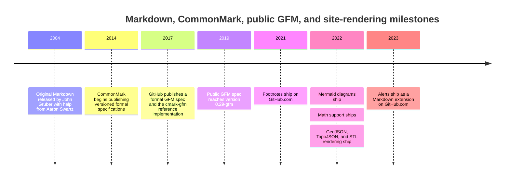

# GitHub Flavored Markdown Analysis

> [!INFO] Related research
> - [[commonmark-and-original-markdown|CommonMark and Original Markdown]]
> - [[gitlab-flavored-markdown-analysis|GitLab Flavored Markdown Analysis]]
> - [[mdx-analysis|MDX Analysis]]
> - [[multimarkdown-analysis|MultiMarkdown Analysis]]
> - [[pandoc-markdown-deep-research-report|Pandoc Markdown Deep Research Report]]


## Executive summary

The most important distinction is that “GFM” names at least three different things in practice: the original 2004 Markdown syntax description by John Gruber with help from Aaron Swartz; the versioned, test-driven CommonMark spec created largely under the leadership of John MacFarlane; and the public GFM spec, which is a strict superset of CommonMark 0.29 and is still published as version **0.29-gfm (2019-04-06)**. Meanwhile, the latest CommonMark spec is **0.31.2 (2024-01-28)**, and the site’s actual renderer has continued to evolve beyond the frozen public GFM spec.

Formally, the published GFM spec adds **exactly five extensions** beyond CommonMark: **tables, task list items, strikethrough, extended autolinks, and disallowed raw HTML/tagfilter**. By contrast, things many people now associate with “GitHub Markdown” on the site—**footnotes, alerts, @mentions, issue/PR/commit autolinks, label rendering, emoji, Mermaid, GeoJSON/TopoJSON/STL diagrams, math, color chips, relative repo links, heading anchors, and various unfurls**—are mostly **site-level rendering behaviors or later product features**, not part of the normative 2019 public spec. Fenced code blocks are **not** a GFM extension at all; they already belong to CommonMark core.

The public spec is therefore best understood as a **syntax contract** for Markdown parsing, while the site’s renderer is a **pipeline**: Markdown-to-HTML parsing, then sanitization, syntax highlighting, and then additional filters for features such as emoji, anchors, task list widgets, image handling, and autolinking. That split is explicitly documented both in the spec and in the site’s rendering pipeline documentation.

For portability, the safest mental model is this: **author to CommonMark or to the published GFM subset if you need tables/task lists/strikethrough/bare autolinks; treat everything else as platform-specific sugar**. The largest portability breaks are generated references such as `#123`, `@user`, wiki links, Obsidian block refs, MDX JSX/ESM, and site-only features like alerts, Mermaid, math, and color swatches.

## Lineage and specification boundaries

Original Markdown was released in 2004 as a prose syntax description and a Perl script, not as an unambiguous formal grammar. The CommonMark project was created specifically to close that ambiguity gap by turning examples into executable conformance tests. The public GFM spec then layered GitHub’s syntax additions on top of CommonMark without rewriting CommonMark’s core rules. That is why the GFM spec repeatedly emphasizes that it is “based on the CommonMark Spec” and a “strict superset of CommonMark.”

The table below separates the three levels that are often conflated in everyday use. The comparisons synthesize the official syntax description, versioned specs, and site documentation.

| Layer | Public authority | Current public version/date | What it normatively defines | What it does **not** define well |
|---|---|---:|---|---|
| Original Markdown | Daring Fireball syntax page + `Markdown.pl` | 2004 origin | A human-readable syntax description for headings, lists, blockquotes, links, images, indented code blocks, inline HTML, and angle-bracket autolinks | Precise parsing precedence, many corner cases, and most extensions people now expect |
| CommonMark | CommonMark spec + reference implementations | 0.31.2, 2024-01-28 | A versioned core Markdown syntax with exhaustive examples/tests | GitHub-specific extensions and site behaviors |
| Published GFM | GFM spec + `cmark-gfm` | 0.29-gfm, 2019-04-06 | CommonMark 0.29 plus five formal extensions | Later site features such as footnotes, alerts, Mermaid, math, mentions, issue refs |
| Site rendering | GitHub Docs, changelog, renderer pipeline docs | Continuously evolving | User-visible behaviors on the site, including post-processing and feature-specific UI | A single unified normative spec covering every behavior end to end |

A key analytical consequence follows from that table: **“GFM” is overloaded**. In strict spec talk, it means the 2019 published syntax. In everyday developer talk, it often means “whatever the site currently renders.” In tooling ecosystems, it can even mean a compatibility bundle that follows current site behavior more closely than the frozen spec.

The timeline below highlights the split between the frozen public syntax spec and the continuing growth of the platform renderer. Dates come from the public specs, engineering post, docs, and changelog entries.



## Formal GFM syntax and its actual edge cases

The published GFM spec’s table of contents makes the formal extension set unusually clear. There are extension chapters only for **tables**, **task list items**, **strikethrough**, **autolinks**, and **disallowed raw HTML**. Everything else in the spec is either inherited CommonMark or explanatory material. That matters because many developers incorrectly file fenced code blocks, footnotes, and site-only callouts under “formal GFM,” when the public spec does not.

The table below condenses the normative parsing rules and the most important edge cases from the spec. It is based directly on the public GFM and CommonMark example-driven rules.

| Syntax feature | Formal status | Core parsing rule | Important edge cases |
|---|---|---|---|
| Tables | GFM extension | A table is a leaf block with exactly one header row, one delimiter row, and zero or more body rows; inline content is parsed inside cells; block elements are not allowed inside cells | Header and delimiter row must have the same number of cells or the construct is **not** a table; body rows may underflow or overflow; missing cells are padded, excess cells dropped; escaped `\|` works even inside code/strong spans; table ends at the first blank line or another block structure |
| Task list items | GFM extension | A list item becomes a task item only when its **first block** is a paragraph beginning with a task marker plus at least one following whitespace character | Marker is `[ ]`, `[x]`, or `[X]`; whitespace inside brackets means unchecked; semantics of interaction are intentionally unspecified by the spec |
| Strikethrough | GFM extension | Matching one- or two-tilde delimiters create `<del>` | Parsing stops at a paragraph break; three or more tildes do **not** create strikethrough |
| Extended autolinks | GFM extension | Bare URL/email-style text may autolink without angle brackets in limited contexts | Recognition only starts at line start, after whitespace, or after `*`, `_`, `~`, `(`; trailing punctuation is dropped; unmatched trailing `)` is dropped after parenthesis balancing; `<` ends the autolink; bare email rules are stricter than “anything with @” |
| Disallowed raw HTML / tagfilter | GFM extension | Only nine raw tags are filtered by replacing the leading `<` with `&lt;` in HTML output | The filtered set is narrow: `title`, `textarea`, `style`, `xmp`, `iframe`, `noembed`, `noframes`, `script`, `plaintext`; all other tags are left untouched by the **spec** |
| Fenced code blocks | CommonMark core, inherited by GFM | Opening fence is at least three backticks or tildes; closing fence must use the same character and be at least as long | Backtick fences forbid backticks in the info string; fences can interrupt paragraphs; unclosed fences run to end of containing block/document |

Three compact examples show why these details matter in processor comparisons.

```md
Visit www.commonmark.org.
Visit <http://example.com/>.
```

Under formal GFM, the first line autolinks because extended bare autolinks are enabled. Under original Markdown and CommonMark core, the second line is the portable form because angle-bracket autolinks are part of the older/core syntax while the bare `www.` form is not.

```md
| a | b |
| --- |
| c |
```

This is **not** a table in formal GFM, because the header row and delimiter row do not match in cell count. Some authors assume any pipe-looking block becomes a table; the public spec is stricter than that.

```md
This will ~~~not~~~ strike.
```

Formal GFM leaves that text literal. The spec allows one or two tildes for `<del>`, but not three or more.

## Platform rendering beyond the formal GFM spec

The site’s renderer is explicitly broader than the public syntax spec. The spec itself says the platform performs “additional post-processing and sanitization after GFM is converted to HTML,” and the renderer pipeline documentation describes the stages as: choose a markup engine, sanitize the HTML, syntax-highlight code blocks, and then apply additional filters for emoji, task lists, named anchors, image handling, and autolinking.

That difference is the single biggest source of confusion in discussions of “what GFM supports.” The table below separates normative syntax from site rendering behavior. It summarizes public docs and changelog items rather than hidden implementation details.

| Feature on the site | In published GFM spec? | On GitHub.com / GitHub Enterprise? | Scope and caveats |
|---|---|---|---|
| Sanitization of rendered HTML | Partly | Yes | Much broader than tagfilter; strips dangerous constructs and certain attributes |
| Syntax highlighting | No | Yes | Applied after HTML generation |
| Issue / PR / discussion references like `#26` | No | Yes | In conversations; docs note these are not created in wikis or repo files |
| Commit SHA shortlinks | No | Yes | Repo-context aware; shortens commit references |
| Label URL rendering | No | Yes | Same-repo labels only; names with `.` do not auto-render from label URLs |
| Custom autolinks to external systems | No | Yes | Repository admins can configure patterns such as ticket IDs |
| `@mentions` and team mentions | No | Yes | Also trigger notifications subject to access rules |
| `:emoji:` codes | No | Yes | Replaced visually by emoji |
| Footnotes | No | Yes | Supported in Markdown fields; docs say not supported in wikis |
| Alerts / admonitions | No | Yes | Five types; based on blockquotes; docs say not nestable |
| Mermaid diagrams | No | Yes | Fenced `mermaid` code blocks; supported in several content surfaces |
| GeoJSON / TopoJSON / STL rendering | No | Yes | Special fenced blocks |
| Math | No | Yes | LaTeX-style math via MathJax |
| Relative repo links / images | No | Yes | Branch-aware and file-context-aware resolution |
| Color chips for backticked colors | No | Yes | Only in issues, pull requests, discussions |
| Heading anchors / section links | No | Yes | Generated anchors and named-anchor filters are site behavior |

A particularly important analytical wrinkle is **footnotes**. The public 2019 GFM spec does not contain a footnote chapter, but the platform docs now document footnotes as a supported Markdown feature. In the JavaScript tooling ecosystem, widely used “GFM” bundles such as `mdast-util-gfm` and `micromark-extension-gfm` also include footnotes. In other words, some libraries use “GFM” to mean “current practical platform behavior,” not only “the frozen public 0.29-gfm spec.”

The most consequential GitHub.com-only syntaxes are easy to recognize because they depend on repository or UI context rather than just pure text parsing:

```md
Closes #10
See owner/repo#42
a5c3785ed8d6a35868bc169f07e40e889087fd2e
@org/team-name
:+1:
> [!WARNING]
> Take care with this migration.
```

The first four require repository, issue, commit, or account context; the emoji and alert forms require post-processing rules the public GFM spec does not define. The docs also make the scope distinctions explicit: issue/PR references are not created in wikis or repository files; footnotes are not supported in wikis; color chips only render in issues, pull requests, and discussions.

One subtle but highly practical point is that the site’s own authoring docs sometimes add guidance that is stricter than the formal spec. For example, the docs recommend a **blank line before a table** for correct rendering, even though the formal spec’s table grammar does not express that as a general requirement. In practice, adding the blank line is wise because it improves readability and cross-processor robustness.

## Compatibility and portability matrix

The matrix below is a synthesis of the official manuals and help pages for each dialect or processor the user asked about. “Portability” here is my assessment of how much syntax is likely to survive unchanged when you move content out of the original tool or platform.

| Dialect / processor | Officially declared basis | Major documented differences from formal published GFM | Portability assessment |
|---|---|---|---|
| Original Markdown.pl | Original 2004 syntax description | No formal versioned grammar; no GFM tables/task lists/strikethrough/bare autolinks; indented code instead of fenced code | Low if you rely on modern Markdown idioms |
| CommonMark | Versioned standardized core Markdown | No GFM extension chapters; bare autolinks, tables, task list items, strikethrough, tagfilter are outside core | High if you stay in core syntax; medium against current GitHub.com because site adds more |
| Published GFM | CommonMark 0.29 + 5 extensions | Public spec does not cover later site features like footnotes, alerts, Mermaid, math, mentions, issue refs | High for syntax; medium for full site fidelity |
| Pandoc | Supports a `gfm` format and a deprecated `markdown_github`; broader Pandoc Markdown is far richer | Pandoc Markdown adds tables, footnotes, citations, math, multiple table types, wikilink extensions, and many configurable extensions | Medium to high if you explicitly use `gfm`; lower if you use Pandoc’s broader Markdown features |
| MultiMarkdown | Markdown + substantial document-authoring extensions | Metadata, automatic cross-references, tables, footnotes, citations, math, labeling | Medium for prose/docs, lower for strict web portability |
| Markdown Extra | Markdown + pragmatic extensions | Fenced code blocks, tables, definition lists, footnotes, abbreviations, element attributes | Medium; overlaps with GFM in some areas but diverges in others |
| Obsidian | Supports both Markdown links and wiki-style links | Wikilinks by default, embeddings, callouts, headings/blocks links, block refs, and block-reference syntax that the docs say is not standard Markdown | Low by default; medium if configured to emit Markdown links and if you avoid block refs/callouts |
| [[mdx-analysis|MDX]] | CommonMark parsed through a compile pipeline, plus JSX/ESM/expressions | JSX, expressions, imports/exports; GFM features require a plugin such as `remark-gfm` | Low for raw portability; best treated as a programming-language-adjacent format |

Two comparisons are especially worth calling out.

First, **Pandoc** is best thought of as a family of Markdown modes, not a single dialect. Its manual explicitly distinguishes `gfm`, deprecated `markdown_github`, `commonmark`, and its much richer default Pandoc Markdown; it also lets users enable or disable individual extensions and warns that HTML output from untrusted input should still be sanitized. That makes Pandoc powerful for conversion, but it also means “Pandoc Markdown” often exceeds GFM by design.

Second, **Obsidian** and **MDX** are practically the opposite portability stories. Obsidian’s docs explicitly support both standard Markdown links and its wiki-link/block-reference layer, and they explicitly warn that block references are not standard Markdown and will not work outside Obsidian. MDX, by contrast, is not merely extended Markdown but a format that combines Markdown with JSX, expressions, and ESM; the MDX docs also state that GFM support is a plugin choice rather than the base language.

## Security model and risk surface

From a security perspective, the formal GFM spec should not be mistaken for a complete safety model. CommonMark and GFM both allow raw HTML as part of the language, and the published GFM `tagfilter` extension blocks only nine tag names while leaving all other tags untouched. That is a parser-level rule, not a full browser-security policy.

The site explicitly compensates for that by performing **post-render sanitization**. Its renderer documentation says rendered HTML is sanitized aggressively, removing items such as `script` tags, inline styles, and `class`/`id` attributes before later filters run. That is the correct architectural lesson: GFM parsing alone is not the trust boundary; sanitization is.

The public security record reinforces the point. Official Enterprise Server release notes describe at least two recent Markdown-adjacent vulnerabilities: a 2025 cross-site-scripting issue caused by insufficient escaping in math blocks, and a sanitizer-related issue where injected HTML IDs could collide with server-initialized DOM state. Those fixes are strong evidence that Markdown rendering must be treated as a hostile-input pipeline, not as a harmless formatting convenience.

Tooling outside the site shows the same pattern. The `commonmark.js` renderer has an implementation-level `safe` option that suppresses raw HTML and dangerous URLs, while the Pandoc manual explicitly says its generated HTML is **not guaranteed safe** and should be passed through an HTML sanitizer when processing untrusted input. Those are implementation choices, not spec guarantees.

An important inference follows for MDX. Because MDX permits embedded JSX, expressions, and ESM and compiles content into JavaScript-oriented component output, untrusted MDX is not merely “unsafe HTML” risk; it is a broader code- and compile-surface problem. In practice, its trust model is fundamentally different from plain Markdown or GFM.

## Authoring and validation recommendations

For **maximum portability**, write to **CommonMark core plus the small published GFM subset only when you genuinely need it**. In concrete terms, prefer explicit Markdown links over bare autolinks and site-only reference shortcuts, keep tables simple, use fenced code blocks rather than HTML for code, minimize raw HTML, and avoid platform-only syntaxes such as alerts, mentions, issue references, color chips, or wiki/block links unless the document’s home is explicitly the site or another tool that documents support for them.

For **site-first authoring**, use the extra features deliberately rather than casually. Use relative links for files and images inside repositories because the platform rewrites them branch-sensitively; use footnotes only where the docs say they are supported; use alerts sparingly and not nested; use Mermaid and math only in supported surfaces; and remember that some autolinks are context-bound, such as issue references in conversations versus repository files.

For validation, the best stack is layered rather than single-tool. The public GFM and CommonMark specs both say their side-by-side examples double as conformance tests and can be run with `spec_tests.py`; the public `cmark-gfm` repository contains the spec source and test harness; `cmark`/`commonmark.js` remain the reference implementations for CommonMark; and the site’s REST Markdown endpoint can render in `gfm` mode with repository `context`, which is the cleanest public way to compare your local parser against the site’s server-side behavior for references. Note that the `/markdown/raw` endpoint explicitly says GFM is **not** supported there.

A pragmatic validation workflow looks like this:

1. Check **syntax-level correctness** with `cmark-gfm` against the public spec examples. 
2. Check **CommonMark portability** with `cmark` or `commonmark.js` and the CommonMark dingus/reference implementations. 
3. Check **actual site behavior** with the REST Markdown API in `gfm` mode and an explicit repository `context` when references such as `#42` or SHAs matter. 
4. Use **style linting** separately from conformance linting; for example, GitHub Docs’ own content linter is based on `markdownlint`, which is about style and content rules, not parser equivalence.

The most important naming recommendation is simple: in technical documentation and tool docs, use **“published GFM spec”** when you mean the 2019 normative syntax, and use **“GitHub.com Markdown rendering”** when you mean the richer, evolving site behavior. That single terminological split prevents most avoidable confusion.

## Open questions and limitations

The biggest public limitation is structural: the normative GFM spec page is still **0.29-gfm from 2019**, while many user-visible site features have shipped later and are documented only through docs and changelog posts. So there is no single public specification that fully unifies parser semantics, sanitizer behavior, and UI-level post-processing for current GitHub.com rendering.

A second limitation is terminology drift in the ecosystem. Packages and tools that advertise “GFM” may target the frozen spec, the current site behavior, or a practical compatibility bundle somewhere in between. The clearest example in the sources here is that current ecosystem packages labeled for GFM include footnotes, even though the public 2019 GFM spec does not.

A third limit is that not every site behavior is exposed as a fully normative rule. The docs tell you what works—mentions, alerts, diagrams, math, links, footnotes—but they do not provide the kind of exhaustive, example-driven parsing contract that CommonMark and the published GFM spec provide for core syntax. For exact edge-case behavior on current GitHub.com, the public API and live rendering remain the practical source of truth.
