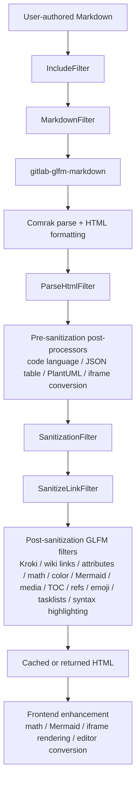
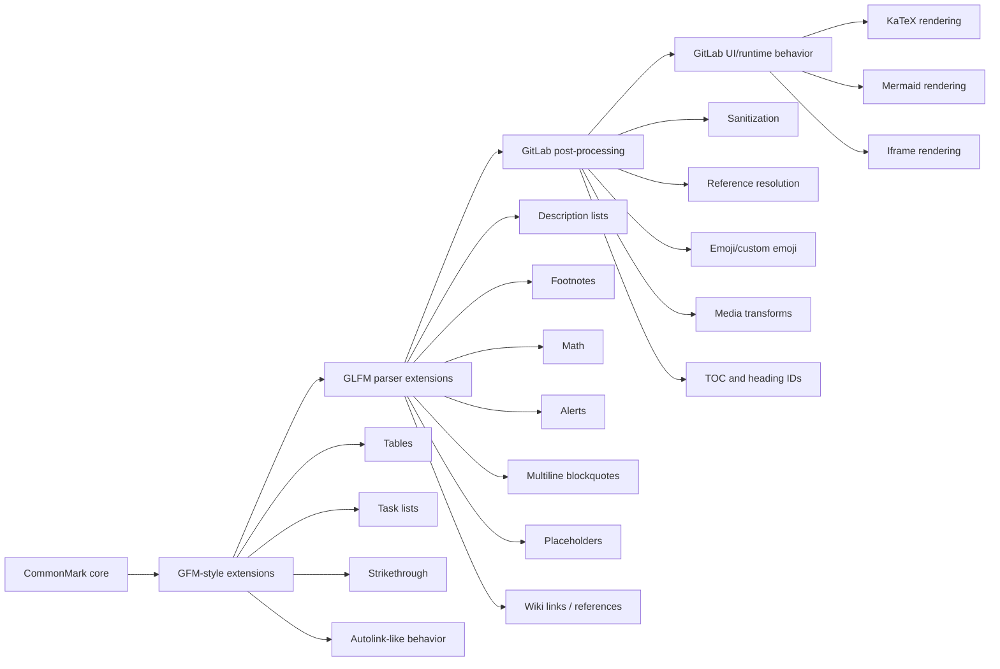

# GitLab Flavored Markdown Analysis

> [!INFO] Related research
> - [[commonmark-and-original-markdown|CommonMark and Original Markdown]]
> - [[github-flavored-markdown-analysis|GitHub Flavored Markdown Analysis]]
> - [[mdx-analysis|MDX Analysis]]
> - [[multimarkdown-analysis|MultiMarkdown Analysis]]
> - [[pandoc-markdown-deep-research-report|Pandoc Markdown Deep Research Report]]


## Executive summary

GitLab Flavored Markdown docs and the accompanying GLFM development guidelines present GLFM as a three-layer dialect: CommonMark as the core syntax model, selected GFM extensions such as tables and task lists, and then a substantial GitLab-specific layer added through parser options, HTML post-processing, reference resolution, sanitization, and some browser-side rendering. In other words, GLFM is **not** just “CommonMark plus a few extra tokens”; it is a full rendering system whose observable behavior depends on the parser, the Banzai filter pipeline, GitLab data lookups, and frontend widgets for math and diagrams.

The most important syntax differences from plain/CommonMark Markdown are these: GLFM supports GFM-style tables, task lists, strikethrough, and autolink-like behavior, but it also adds GitLab-specific references and mentions, emoji shortcodes and custom emoji, multiline blockquotes, description lists, footnotes, LaTeX math, Mermaid fences, PlantUML and other diagram integrations, table-of-contents tags, front matter display, include directives, placeholders, inline diffs, JSON-rendered tables, alert/admonition blocks, media dimension attributes, and GitLab-specific media embedding. Several of those features are version-gated or context-gated.

The biggest behavioral differences from CommonMark are these: raw HTML is **not** a simple passthrough because GLFM sanitizes tags, attributes, classes, IDs, and links; issue/MR/user references are resolved against GitLab data and are redacted for readers who should not see them; headings get generated link IDs; task lists gain interactive or accessibility affordances; math and Mermaid are rendered partly in the browser; and external links receive post-processing such as `nofollow`, `noreferrer`, `noopener`, `target="_blank"`, IDN/tooltips, and RTLO handling. This means a renderer that only implements the parser surface will still fall short of actual GitLab behavior.

For migration: if your content must round-trip cleanly across CommonMark, GFM, GitHub.com, static-site generators, and GitLab, stay close to CommonMark plus the narrow GFM subset. Treat GLFM-specific features such as `::include`, `%{placeholders}`, GitLab object references, `[[_TOC_]]`, `[TOC]`, `[~]`, description lists, JSON tables, PlantUML/Kroki, and GitLab-specific media behavior as **GitLab-only**. For tool builders, the closest parser-level approximation is the gitlab-glfm-markdown gem README, backed by Comrak, but reproducing GitLab faithfully also requires Banzai-like sanitization, reference filters, external-link logic, emoji/custom-emoji handling, and frontend rendering for math and Mermaid.

## What GLFM actually is

At the specification level, GLFM’s own developer docs say that CommonMark is its core, and that GitLab tries to remain fully CommonMark-compliant while adding GFM extensions and a smaller number of GitLab-specific extensions only where necessary. The available evidence therefore supports a layered model: **CommonMark core → GFM-like extensions → GitLab-only extensions and filters**.

GitLab’s rendering architecture makes that layering concrete. The documented “basic flow” is: user Markdown enters the backend, the Banzai pipeline runs, the Markdown is converted to basic HTML by `gitlab-glfm-markdown` using Comrak, then additional filters transform the HTML for references, emoji, diagrams, sanitization, and related GitLab behavior, after which the frontend renders or enhances some blocks such as math and Mermaid. The `FullPipeline` is the combination of `PlainMarkdownPipeline` and `GfmPipeline`; the former runs `IncludeFilter`, `MarkdownFilter`, and `ParseHtmlFilter`, and the latter applies the larger stack of post-parse filters.

The first diagram summarizes that current architecture.



The practical consequence is that “GLFM support” has at least four distinct meanings: parser compatibility, HTML output compatibility, GitLab-object reference compatibility, and runtime rendering compatibility. A tool that implements only the parser options exposed by `gitlab-glfm-markdown` will cover much of the syntax layer, but it will still miss authorization-aware references, external-link post-processing, HTML allowlist logic, some task-list semantics, media embedding transforms, JSON-table behavior, asset-proxy behavior for Mermaid images, and GitLab UI context rules.

A second way to see GLFM is as a superset relationship:



That difference between parser and runtime also explains why official GitLab docs repeatedly distinguish between “works in GitLab” and “works only in some GitLab contexts,” such as work-item titles, repository Markdown files, wiki pages, comments, or snippets.

## Syntax and behavior differences

The cleanest way to compare the dialects is to separate **core parser support** from **GitLab runtime behavior**. The table below focuses on CommonMark as baseline, then GLFM, and, where helpful, the formal GFM spec or documented GitHub behavior. The formal GFM spec is explicit that GFM is a strict superset of CommonMark and enumerates extensions such as tables, task list items, strikethrough, autolink literals, and disallowed raw HTML. By contrast, current GitHub docs document additional site behavior such as footnotes, alerts, Mermaid, and MathJax that are not part of the older formal GFM spec text; GLFM has a similar parser-versus-site split.

| Feature | CommonMark baseline | GLFM support | Example input | Expected GLFM behavior | Notes / edge cases |
|---|---|---|---|---|---|
| Paragraphs and line breaks | Yes | Yes | `a⏎b` | Same paragraph unless forced break | GLFM docs explicitly say a single newline stays in the same paragraph, while two spaces or backslash force a line break; this follows CommonMark behavior. |
| Raw HTML | Yes, in spec | Yes, but sanitized | `<details><summary>x</summary>y</details>` | Allowed if tag/attrs survive sanitization | GitLab allows raw HTML “usually,” but sanitizes via HTML::Pipeline allowlists and extra GitLab rules. Markdown inside HTML only works reliably when separated on its own lines. |
| Tables | No core support | Yes | `| a | b |` table syntax | Rendered HTML table | Tables are inherited from GFM-style behavior; GLFM adds task items in table cells and JSON tables. |
| Task lists | No core support | Yes, plus `[~]` | `- [~] Inapplicable` | Checkbox with inapplicable state | GLFM extends ordinary GFM task lists with “inapplicable” tasks and, in 18.9+, task items in Markdown table cells when the checkbox is the only cell content. |
| Strikethrough | No core support | Yes | `~~old~~` | `<del>old</del>`-style rendering | Formal GFM includes strikethrough; GLFM supports it too. |
| Autolink literals | Core CommonMark only has angle-bracket autolinks | Yes | `https://example.com` | Auto-linked URL | GitLab docs describe permissive auto-linking and show support for `http`, `https`, `smb`, `irc`, and `localhost`; external links then receive security-oriented post-processing. |
| GitLab references and mentions | No | Yes | `#123`, `!456`, `@user`, `group/proj#1` | Linked to GitLab objects | This is the single biggest GLFM-only family: issues, MRs, snippets, labels, milestones, wiki pages, alerts, work items, commits, comments, designs, and more. Resolution depends on GitLab database context and can be redacted for unauthorized readers. |
| Emoji shortcodes | No core support | Yes | `:bug:` | Emoji rendered | GitLab supports shortcode emoji and custom emoji; newer Unicode 15.1 support landed in 17.7 release notes. Emoji processing is capped in the filter and skipped inside `pre/code/tt`. |
| Description lists | No | Yes | `Term⏎: definition` | `<dl><dt>…</dt><dd>…</dd></dl>` | Introduced in GitLab 17.7. Not part of CommonMark core or the formal GFM spec. |
| Footnotes | No | Yes | `x[^1]` + definition | Rendered footnote section at bottom | GLFM numbers by reference order, not label order; rendered at bottom regardless of definition position; footnote IDs are randomized per render to avoid collisions and capped at 1000 processed references. |
| Math | No | Yes | `$x^2$`, `$$x^2$$`, `````math` | Inline or block math | GitLab uses KaTeX, supports `$…$`, `$`…`$`, `$$…$$`, and fenced `math`; frontend imposes limits on most contexts. GitHub docs document math too, but via MathJax. |
| Mermaid | No | Yes | `````mermaid` | Browser-rendered diagram | GitLab.com docs say Mermaid version 10 is supported; the frontend adds `js-render-mermaid`, and asset-proxy logic can drop unapproved embedded images fail-safe. |
| PlantUML / Kroki | No | Yes, admin-dependent | `````plantuml` | Diagram image/rendered service output | PlantUML is enabled on GitLab.com; Self-Managed requires admin enablement. Kroki also requires admin enablement. This is beyond formal GFM and beyond documented GitHub user Markdown, which instead documents Mermaid, GeoJSON, TopoJSON, and ASCII STL. |
| Alerts / admonitions | No | Yes | `> [!note]` | Styled alert block | Introduced in 17.10. Syntax matches GitHub-style alert/callout syntax, but GLFM explicitly says multiline blockquotes also support alerts, while GitHub docs say alerts cannot be nested within other elements. |
| Table of contents tags | No | Yes | `\[\[_TOC_]]` or `[TOC]` | Auto-generated heading list | Context-specific: supported in Markdown files, wiki pages, issues, merge requests, and epics, but not notes/comments. There is also a documented unintended single-bracket rendering quirk. |
| Front matter | No standardized CommonMark feature | Yes, display-oriented | `--- … ---` at file top | Shown in a box above rendered content | Only for repository Markdown files and wiki pages; supports YAML, TOML, JSON, and language-tagged delimiters. GLFM does not silently consume it the way many static site tools do. |
| Includes | No | Yes, file/wiki only | `::include{file=chapter1.md}` | Included content inserted before normal Markdown processing | Introduced in 17.7; must start at column 1; nested includes ignored; default limit 32; external URL includes require admin setting; include directives also work inside code blocks. |
| Placeholders | No | Experimental | `%{project_title}` | Dynamic replacement at render time | Feature-flagged, test-only/experimental as documented. The gem and formatter implement placeholder detection, but GitLab docs explicitly say it is not production-ready. |
| Generic attributes | No core support | Narrow only | `!&#91;img](x){width=100}` | Width/height applied to media embed | Current GitLab post-filter is intentionally narrow: width/height only, essentially for image/media embed cases; unsupported attrs are discarded. This is **not** generic fenced/block attribute support. `json:table` uses info-string syntax, not attributes. |

Three behavior differences deserve special emphasis. First, GLFM reference syntax is not merely syntactic sugar: it is permission-aware, database-backed, and subject to redaction in cached HTML, which makes it fundamentally different from static Markdown links or GitHub issue references outside the GitLab environment.

Second, sanitization is a first-class part of the language’s observable behavior. In normal GLFM pipelines, unsafe HTML is not simply preserved or escaped according to a fixed parser option; instead, GitLab runs explicit sanitization and link-sanitization filters, removes unknown tags/classes/IDs, restricts `style` to safe table alignment, whitelists specific task-list, alert, footnote, and heading-anchor attributes, and returns a safe timeout message rather than partial unsanitized output if link sanitization exceeds limits.

Third, site context matters. For example, work-item and merge-request titles do **not** support full GLFM; current docs say titles support only emoji, auto-linked URLs, and GitLab-specific references, while ordinary Markdown formatting remains literal text. Repository files and wiki pages have additional features such as front matter and includes that are not available everywhere else. GitLab-specific references are also explicitly unsupported in Markdown snippet files.

## Migration guidance for authors and tool builders

For authors, the safest portability rule is simple: if content must render similarly in CommonMark engines, GitHub, package registries, docs generators, and GitLab, prefer the **CommonMark core plus conservative GFM subset**: headings, emphasis, links, images, fenced code blocks, blockquotes, tables, ordinary task lists, and strikethrough. The moment you use GitLab object references, description lists, footnotes, math, Mermaid, PlantUML, `\[\[_TOC_]]`, `::include`, `%{placeholders}`, JSON tables, or `[~]`, you are leaving the portable subset.

For authors targeting GitLab specifically, the most useful practices are context-aware ones. Use GitLab references only where the receiving surface has project/group context. Use footnotes when bottom-of-document notes are acceptable, because GitLab always rehomes them there. Use `$`…`$` or fenced `math` only when you know the surface permits math rendering. Use Mermaid when you want browser-rendered diagrams; use PlantUML or Kroki only if your instance enables them. For titles, do not expect ordinary Markdown emphasis or lists to work. For snippet files, do not rely on GitLab-specific reference expansion.

For authors moving from GitHub to GitLab, portability is mixed. Tables, ordinary task lists, footnotes, math fences, Mermaid, emoji shortcodes, and alert syntax are broadly similar at a glance, but there are subtle differences: GitLab adds `[~]` inapplicable tasks, GitLab references and cross-project shorthand, file/wiki-only include directives, table-of-contents tags, description lists, and title-context constraints; GitHub docs say alerts cannot be nested within other elements, जबकि GitLab says multiline blockquotes can carry alert syntax. GitHub’s documented math engine is MathJax, while GitLab uses KaTeX, so macro support and rendering details can differ even when the same dollar-delimited source parses.

For tool builders, the closest parser-level starting point is the gitlab-glfm-markdown gem. Its documented option surface and Rust `RenderOptions` show how GitLab exposes parser extensions and rendering flags, including `alerts`, `description_lists`, `footnotes`, `math_code`, `math_dollars`, `multiline_block_quotes`, `placeholder_detection`, `tasklist_in_table`, `relaxed_tasklist_character`, `inapplicable_tasks`, `header_ids`, `sourcepos`, `escaped_char_spans`, `gfm_quirks`, and `unsafe`. Those options map onto Comrak options, but GitLab’s live product behavior goes further.

A practical implementation stack for non-GitLab tooling is therefore: parser parity first, then sanitizer parity, then only the GitLab-only post-processors you truly need. If you want “close enough for preview,” enable the parser options and basic HTML sanitization. If you want “close enough for authoring round-trips,” also preserve `data-sourcepos`, escaped-character spans, heading IDs, and GitLab-compatible task-list/table structure. If you want “close enough to real GitLab,” you must additionally reproduce Banzai-style reference resolution, emoji/custom-emoji replacement, media transforms, external-link post-processing, and browser-side math/Mermaid behavior.

One specific pitfall for builders is assuming generic attribute-list support. The current GitLab post-filter is intentionally narrow: it looks for attribute text after images, accepts only `width` and `height`, rejects unsupported attributes, and disallows multiline attribute lists. So if your internal Markdown tooling already supports broad Pandoc/CommonMark-HS-style attributes on arbitrary elements, that behavior will be **more permissive than GLFM**, not the other way around.

Another pitfall is assuming the formal GFM spec is sufficient as a comparison target. The formal GFM spec still centers the parser/spec layer, while actual GitHub docs now describe additional site features such as footnotes, alerts, Mermaid, and MathJax-rendered math. GLFM has the same split between formal parser-ish behavior and host-site behavior, but leans even further into host-specific processing because of GitLab references, permissions, caching, and redaction.

## Validation test plan

A useful GLFM test plan should explicitly separate **parse tests**, **post-processing tests**, **context/permission tests**, and **frontend/runtime tests**. GitLab’s own architecture and sourcepos support make that distinction unavoidable. For a serious compatibility suite, store the raw Markdown, the parser HTML, the post-filtered HTML, and the final browser-observed rendering as separate artifacts.

The following representative cases are high-value because each one exercises a documented difference rather than a generic Markdown behavior.

### Parser-level extension cases

**Description list**

```markdown
Fruits
: apple
: orange
```

Expected GLFM behavior: rendered as a description list (`dl/dt/dd` structure), not as ordinary paragraphs; unsupported in CommonMark core and not part of the formal GFM spec. This is version-dependent: GitLab docs mark it as introduced in 17.7.

**Inapplicable task list**

```markdown
- [x] Done
- [~] Not applicable
- [ ] Open
```

Expected GLFM behavior: three checkboxes, with `[~]` treated as an inapplicable task rather than literal text or an invalid checkbox. Builder parity may require `relaxed_tasklist_character` plus `inapplicable_tasks`.

**Footnotes**

```markdown
Here is a note.[^a]

[^a]: Footnote text.
```

Expected GLFM behavior: superscript reference in text and a footnote section appended at the bottom; numbering follows reference order, not label names. Across multiple rendered Markdown blocks on one page, GitLab adds randomized suffixes to footnote IDs to avoid collisions.

**Math delimiters**

```markdown
Inline: $`a^2+b^2=c^2`$

$$
a^2+b^2=c^2
$$

```math
a^2+b^2=c^2
```
```

Expected GLFM behavior: first instance rendered inline; latter two rendered as block math. In many GitLab UI contexts only the first 50 inline math nodes are rendered before the rest fall back to text; repository files and wiki pages are exempt from those limits.

**Alert block**

```markdown
> [!warning] Data deletion
> The following instructions are destructive.
```

Expected GLFM behavior: styled warning alert with title override. This is version-dependent: introduced in 17.10; parser-level support also appears in the gem changelog `v0.0.25`.

### Post-filter and context cases

**GitLab reference resolution**

```markdown
See #123, !456, @alice, and my-group/my-project#789.
```

Expected GLFM behavior inside a relevant project/group context: links to the issue, merge request, user, and cross-project issue. Expected non-parity in ordinary CommonMark/GFM renderers: literal text. Expected GitLab-specific behavior in cached HTML: unauthorized readers may see redacted references rather than the original resolved link.

**Includes**

```markdown
::include{file=chapter1.md}
```

Expected GLFM behavior in repository Markdown files or wiki pages: inline inclusion of the target file contents, then normal Markdown processing over the expanded text. Expected non-parity elsewhere: literal text. Nested includes in included content are ignored; default include limit is 32; URL includes need the admin setting enabled.

**Table-of-contents tag**

```markdown
[[_TOC_]]

## A
## B
```

Expected GLFM behavior in files/wiki/issues/MRs/epics: autogenerated linked heading list. Expected non-parity in CommonMark, most GFM parsers, and many static renderers: literal text or no output. Edge case: GitLab docs note an unintended single-bracket `[TOC]` rendering quirk.

**Title-context restriction**

```markdown
**Bold title**
```

Expected GLFM behavior in a work-item title field: literal asterisks, not bold text. Expected behavior in ordinary Markdown body: bold text. This test is essential because many tools mistakenly assume a single dialect applies uniformly across all GitLab fields.

### Sanitization and security cases

**Disallowed or stripped HTML**

```markdown
<script>alert(1)</script>
<span class="foo">x</span>
```

Expected GLFM behavior: dangerous tags are removed/neutralized by sanitization; unsupported classes are stripped unless they match GitLab’s allowlisted classes for anchors, alerts, task lists, inline diffs, and similar structures. A correct security test should assert both tag removal and class removal.

**Allowed HTML with Markdown-on-own-lines rule**

```markdown
<details>
<summary>

Click to _expand._

</summary>

Text with **Markdown**.

</details>
```

Expected GLFM behavior: collapsible details block that preserves Markdown when the Markdown lines are separated onto their own lines. A variant without those blank lines should be expected to behave less naturally or to preserve raw asterisks.

**External link post-processing**

```markdown
https://example.com
[IDN](https://ｅxample.com)
```

Expected GLFM behavior: links sanitized and post-processed; external links get `nofollow noreferrer noopener`, `target="_blank"`, and suspicious IDN/RTLO cases may receive a tooltip with the normalized/punycode target.

### Runtime cases

**Mermaid**

```markdown

```

Expected GLFM behavior: the backend marks the block for frontend rendering, and the browser renders the diagram. On self-managed instances, restrictive `Cross-Origin-Resource-Policy` settings can silently break Mermaid rendering. If asset proxying is enabled, unapproved Mermaid-referenced images are dropped fail-safe.

**PlantUML**

```markdown
```plantuml
Bob -> Alice: hello
```
```

Expected GLFM behavior: image output only if PlantUML is enabled for the instance context; otherwise the block should remain unrendered as ordinary code. This is an administrator-controlled capability, not a baseline parser guarantee.

## Timeline of notable changes

The most reliable sources for a GLFM timeline are GitLab’s current docs “History” annotations, monthly release notes, the `gitlab-glfm-markdown` gem changelog, and selected security releases. Not every syntax feature has a prominent monthly release-note entry, so the timeline below combines those official sources and calls out where behavior is version-dependent.

| Version / period | Notable GLFM change | Why it matters |
|---|---|---|
| 16.0 | Mermaid support expanded to Entity Relationship diagrams and mind maps. | Marked a broadening of GitLab’s browser-rendered diagram surface beyond simple flowcharts. |
| 16.9 | Iteration cadence references introduced. | Shows how GLFM keeps growing its GitLab-object reference grammar. |
| 16.11 | Wiki-page autocomplete for GitLab references introduced. | Improves authoring ergonomics for GitLab-specific links. |
| 17.0 | Heading-link generation changed. | Important for stable anchor links, docs migrations, and snapshot tests. |
| 17.1 | Group label references introduced. | Expanded object-reference syntax beyond project-scoped labels. |
| 17.7 | Description lists introduced; include directives introduced; Unicode 15.1 emoji support landed in release notes. | One of the largest recent expansions of GLFM authoring syntax. |
| 17.9 | JSON tables introduced. | Added a structured-data rendering mode via fenced `json:table` blocks. |
| 17.10 | Alerts introduced; release notes also grouped math/image/editor/include/alert improvements as an “Enhanced Markdown experience.” | Formalized GitHub-like alert syntax inside GLFM. |
| 18.0 to 18.11 | “Full GLFM support” in titles was introduced in 18.0 and removed in 18.11; current docs restrict titles again. | An important warning that field-level behavior is version-sensitive. |
| 18.1 to 18.2 | Unified `[work_item:123]` references introduced behind a flag in 18.1 and made generally available in 18.2; experimental placeholders also appeared in 18.2. | Shows ongoing convergence of planning objects and Markdown reference grammar. |
| 18.3 | Escaping color chips introduced. | Small but important because color-chip detection can collide with literal inline-code values. |
| 18.4 | `[epic:123]` reference syntax introduced. | More explicit work-item reference syntax. |
| 18.9 | Native task items in Markdown table cells introduced. | A concrete example of GLFM diverging further from ordinary GFM tables. |

For tool builders specifically, the gem changelog is also revealing: `v0.0.25` added alert/admonition support, `v0.0.30` added placeholder detection, `v0.0.33` added inapplicable tasks, `v0.0.34` added header accessibility output, `v0.0.39` added `tasklist_in_table` and broader whitespace matching for incomplete tasks, and `v0.0.41` refined task-table output classes. Those releases explain why “GLFM compatibility” in third-party tooling should always be pinned to a concrete gem and GitLab version, not just to the string “GLFM.”

## Security and sanitization specifics

GLFM’s security model is one of its sharpest distinctions from ordinary Markdown. GitLab’s own Banzai docs say backend processing is responsible for security because it runs robust sanitization, reference redaction, and consistent rendering before HTML is cached or returned; the frontend then handles math blocks, Mermaid blocks, and certain rendering limits. That architecture reflects a conscious design choice to avoid trusting client-side rendering alone.

The current `SanitizationFilter` source shows the implementation shape. It extends a base sanitization allowlist, then explicitly allows only particular classes and IDs needed for GLFM output: heading anchors, footnotes, alert boxes, task lists, inline diffs, JSON table metadata, and certain source-position / escaped-character data attributes. Unsafe or unexpected classes and IDs are actively removed, not merely ignored. Table `style` attributes are narrowed to `text-align` only. Non-tasklist `<input>` elements are stripped.

The user-facing HTML docs align with that code. GitLab says raw HTML “usually works pretty well,” but points readers to HTML::Pipeline’s allowlist and then documents GitLab-specific additions: `span`, `abbr`, `details`, `summary`, and `rel="license"` on links. The same page also explains that HTML comments are hidden in rendered output but remain visible in source, which is why commenters are warned not to put sensitive information in them.

Link safety is handled in a separate filter. The dedicated `SanitizeLinkFilter` validates/sanitizes link-bearing attributes and has its own timeout path that returns safe fallback HTML rather than partial unsanitized content. It imposes a hard ceiling of 10,000 link attributes for a document before aborting with a “reduce the number of links” style message. `ExternalLinkFilter` then normalizes and decorates external links, adds `nofollow noreferrer noopener` and `target="_blank"`, preserves `rel=license`, and adds tooltips for suspicious IDN or RTLO cases.

Math and Mermaid have their own safety controls. GitLab’s docs say only the first 50 inline math instances are rendered in most contexts, with further limits for block math based on render time; the `MathFilter` source confirms the 50-node limit and the grouped setting that can disable limits. Mermaid blocks are marked for frontend rendering, and the `MermaidFilter` source shows image URLs referenced by Mermaid are preprocessed through asset-proxy logic; if an image URL is not permitted/proxied, the frontend is instructed to drop it. GitLab also documents a 2026 patch release for information disclosure in Mermaid image handling, which underlines that diagrams are part of the live security surface, not just presentation sugar.

Include directives also carry security implications. GitLab restricts them to wiki pages and repository Markdown, defaults URL includes off unless the relevant admin setting is enabled, limits the number processed, ignores transitive includes, and emits inline error text for unreadable or missing targets. The pre-parse `IncludeFilter` also escapes link text/destinations when falling back to a literal Markdown link, reducing the risk of malformed include targets being reflected unsafely.

Selected patch and security releases show that Markdown rendering has repeatedly been a security-sensitive area: GitLab has issued fixes for FrontMatterFilter ReDoS, InlineDiffFilter ReDoS, DollarMathPostFilter ReDoS, broader Banzai-pipeline resource-exhaustion issues, Mermaid information disclosure, and at least one later “improper authorization issue in markdown rendering.” The right operational conclusion is that GLFM is a feature-rich, security-relevant subsystem deserving version pinning and upgrade attention, not a static text formatter.

## Open questions and limitations

This report can describe the current documented and source-visible behavior with high confidence, but a few boundaries remain version-sensitive or host-sensitive. The formal GFM spec and current GitHub docs do not line up perfectly anymore, because GitHub-the-site now documents features such as footnotes, alerts, Mermaid, and MathJax-rendered math beyond the older formal GFM spec text. Likewise, current GitLab docs sometimes describe behavior at the user level while the underlying source shows implementation details that may evolve quickly, especially for experimental features such as placeholders and for output-shape details used by the rich-text editor. Tool builders should therefore pin to a specific GitLab release and, where relevant, a specific `gitlab-glfm-markdown` gem version rather than assuming a single timeless “GLFM spec.”
