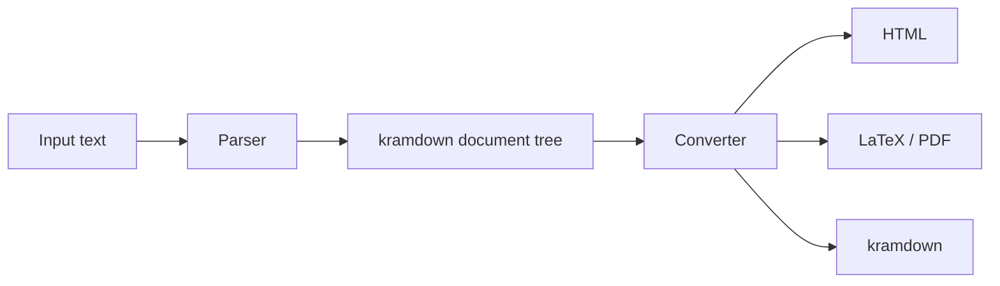

# kramdown Analysis

> [!INFO] Related research
> - [[commonmark-and-original-markdown|CommonMark and Original Markdown]]
> - [[markdown-extra-analysis|Markdown Extra Analysis]]
> - [[github-flavored-markdown-analysis|GitHub Flavored Markdown Analysis]]
> - [[pandoc-markdown-deep-research-report|Pandoc Markdown Deep Research Report]]
> - [[mdx-analysis|MDX Analysis]]

## Executive Summary

kramdown is a Ruby Markdown-superset converter and syntax family. Its official site describes it as a free MIT-licensed Ruby library for parsing and converting a superset of Markdown, with standard Markdown support, modifications, and extensions popularized by [[markdown-extra-analysis|PHP Markdown Extra]] and Maruku. As of the current site, kramdown 2.5.2 was released on January 19, 2026.

The important design point is strictness. The syntax page says kramdown is based on Markdown and enhanced with features from Maruku, PHP Markdown Extra, and Pandoc, but strives for definite rules and is therefore not completely compatible with original Markdown. In practice, kramdown is a pragmatic authoring dialect with better-specified behavior than Gruber Markdown and a stronger attribute model than CommonMark.

kramdown is especially relevant in the Ruby and Jekyll ecosystems. Jekyll exposes Kramdown configuration and historically made kramdown a common static-site Markdown processor. kramdown can also parse GFM through a separate `kramdown-parser-gfm` gem, which has mattered for GitHub Pages and Jekyll workflows.

## Architecture



The parser/converter split makes kramdown more than one syntax. The main parser is the kramdown parser, but the ecosystem also includes GFM and other parser options. Converters decide how the internal document tree is emitted.

## Feature Inventory

| Feature | kramdown behavior |
|---|---|
| Original Markdown core | Supported with corrections and stricter rules. |
| Headings | ATX and Setext, with explicit header IDs using `{#id}`. |
| Lists | Ordered, unordered, nested, plus definition lists. |
| Definition lists | Borrowed from PHP Markdown Extra style. |
| Tables | Pipe/ASCII tables based on Markdown Extra ideas. |
| Fenced code blocks | Tilde fences, with language or attributes. |
| Inline code | Backticks, with span inline attribute lists. |
| Footnotes | Supported as span-level markup. |
| Abbreviations | Supported. |
| Math blocks | Supported in syntax. |
| HTML blocks/spans | Parsed with options controlling whether kramdown syntax is processed inside HTML. |
| Attribute lists | Attribute list definitions, block inline attribute lists, span inline attribute lists. |
| Extensions | kramdown-specific extension syntax for comments and options. |
| GFM parser | Available through `kramdown-parser-gfm` since kramdown 2.0. |

## Attribute Model

kramdown's attribute syntax is one of its most distinctive features. It supports attributes on headings, links, images, code blocks, spans, list items, definition-list terms, and other elements through inline attribute lists or attribute list definitions.

```markdown
# Heading {#intro}

This *word*{:.underline} has a class.

[link](https://example.com){:rel="noopener"}

{:height="36px" width="36px"}

~~~
puts "hello"
~~~
{: .language-ruby}
```

That is powerful for HTML and static-site output, but it is not portable to CommonMark or strict GFM. In Obsidian, those attributes usually remain literal text unless a plugin or export pipeline understands them.

## Differences from Original Markdown

kramdown intentionally fixes or narrows ambiguous areas:

- Setext and ATX headings generally need block boundaries.
- Ordered and unordered markers are not mixed into one list the way original Markdown allowed.
- Link titles in parentheses are not allowed in link definitions for consistency.
- Tables and definition lists are first-class syntax rather than raw HTML workarounds.
- Fenced code blocks use syntax inherited from Markdown Extra, especially tilde fences.
- HTML parsing can be configured through options such as `parse_block_html`, `parse_span_html`, and `html_to_native`.

This makes kramdown easier to implement predictably but less identical to historical Markdown.

## kramdown and Jekyll

Jekyll documents kramdown configuration under Markdown options. Its configuration can select a Kramdown input processor, configure syntax highlighting, and pass advanced options such as `header_offset` and `smart_quotes`. Jekyll also notes that CommonMark does not support every kramdown syntax element, including block inline attribute lists. That is the core portability trade-off: kramdown is richer than CommonMark, but that richness binds content to the Ruby/Jekyll processor family.

## Portability

| Target | Risk |
|---|---|
| CommonMark | High for attributes, definition lists, tables, footnotes, math, and extension blocks. |
| GFM | Medium to high; some table/fence behavior overlaps, but kramdown attributes do not. |
| Jekyll/kramdown | Low, if configured consistently. |
| Obsidian | Medium; basic Markdown works, kramdown attribute syntax is mostly literal. |
| Pandoc | Medium; Pandoc has overlapping features but different exact syntax and AST behavior. |

For portable authoring, keep to CommonMark plus simple tables and fences. For Jekyll-specific authoring, kramdown attributes and definition lists can be useful and ergonomic.

## Security Notes

kramdown can preserve or process HTML depending on parser/converter options. It is not a hosted-platform sanitizer by itself. When rendering user-authored content to HTML, pair kramdown with an explicit HTML sanitization policy. Also remember that attributes can emit IDs, classes, dimensions, and custom attributes into HTML output.

## Validation Checklist

- Pin the kramdown version in Ruby projects.
- Record whether input is `Kramdown` or `GFM`.
- Test syntax highlighting and code block attributes in the actual converter.
- Avoid kramdown attributes in content intended for CommonMark-only tools.
- Sanitize rendered HTML if the source is untrusted.
- Test Jekyll output when using Jekyll-specific kramdown options.

## Authoritative Sources

- [kramdown home](https://kramdown.gettalong.org/index.html)
- [kramdown syntax](https://kramdown.gettalong.org/syntax.html)
- [kramdown parser documentation](https://kramdown.gettalong.org/parser/kramdown.html)
- [kramdown GFM parser](https://kramdown.gettalong.org/parser/gfm.html)
- [Jekyll Markdown options](https://jekyllrb.com/docs/configuration/markdown/)

