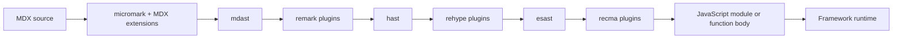
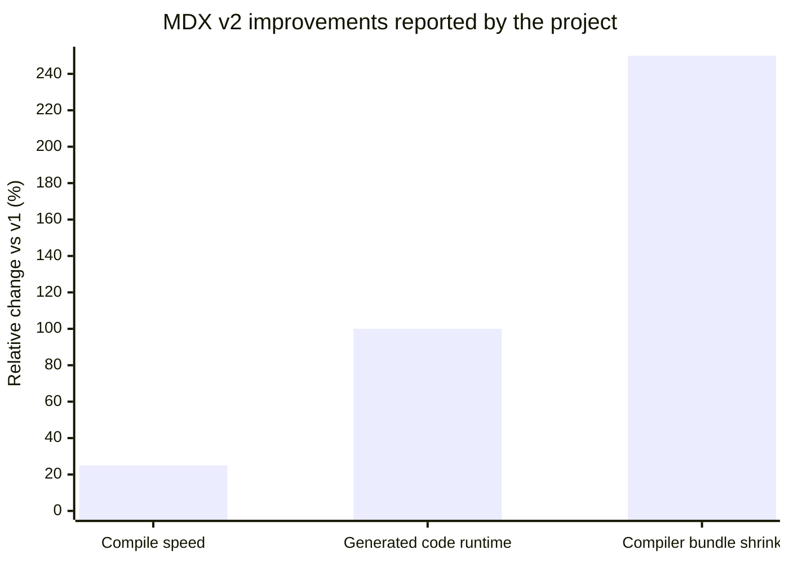

# MDX Analysis

> [!INFO] Related research
> - [[commonmark-and-original-markdown|CommonMark and Original Markdown]]
> - [[github-flavored-markdown-analysis|GitHub Flavored Markdown Analysis]]
> - [[gitlab-flavored-markdown-analysis|GitLab Flavored Markdown Analysis]]
> - [[multimarkdown-analysis|MultiMarkdown Analysis]]
> - [[pandoc-markdown-deep-research-report|Pandoc Markdown Deep Research Report]]


## Executive summary

[[mdx-analysis|MDX]] is best understood not as “Markdown with a few embedded widgets,” but as a source format that blends markdown, JSX, JavaScript expressions, and ESM imports/exports, then compiles that source into a JavaScript component. In the official toolchain, MDX flows through a unified pipeline that parses MDX into markdown ASTs, transforms through remark and rehype, converts to a JavaScript AST, applies recma transforms, and finally serializes JavaScript. That architecture explains both MDX’s strengths—componentized docs, design-system integration, shared rendering, and rich content composition—and its costs: ESM constraints, bundler/runtime coupling, stricter syntax, and code-execution risk when you evaluate untrusted content.

Historically, MDX’s public arc has three major phases. The project’s “What is MDX?” documentation dates to August 2018. MDX v2, released in 2022, tightened the language so markdown-in-JSX behaves more like JavaScript/JSX, added any-JSX-runtime support, and reported substantial compile/runtime/bundle improvements over v1. MDX v3, released in October 2023, was a smaller migration that emphasized Node 16+, automatic JSX runtime, and `useMDXComponents`-style provider patterns; the public releases page currently lists 3.1.1, dated August 29, 2025, as the latest release.

The practical conclusion is straightforward. MDX is a strong fit when prose and application components should live in one artifact: docs portals, blogs with interactive callouts/charts, design systems, product education, and component documentation in tools like Storybook. It is a weaker fit when authors need a tightly constrained, declarative content language; when content must remain maximally portable across non-JS toolchains; or when the input is untrusted and must be treated purely as data instead of executable code. Because no target framework was specified, the analysis below treats core MDX as the stable center and framework behavior as a host-specific layer.

## Definition and history

The official definition is precise: MDX allows markdown, JSX, JavaScript expressions, and ESM `import`/`export` statements in one document. The core compiler package, `@mdx-js/mdx`, turns that document into JavaScript, and compiled output is fundamentally a component function that merges markdown-element mappings with any passed or provided components. In other words, MDX is not an HTML serializer first; it is a component compiler with markdown syntax as its authoring surface.

A subtle but important architectural point is that MDX itself has no direct representation in HTML. The `remark-mdx` package exists to parse and serialize MDX syntax inside unified/remark workflows, while actual compilation and evaluation happen in `@mdx-js/mdx`. That separation is why AST-aware linting and transforms are so central to MDX practice.

| Release line | What changed at a high level | What it meant in practice | Sources |
|---|---|---|---|
| Legacy v1 baseline | Earlier MDX behavior was looser and more HTML-like in JSX regions; v2 was explicitly designed to change this legacy behavior. | Older MDX content is the main migration hotspot, especially content that relied on v1’s parsing quirks inside JSX. | |
| v2 | Released in 2022; syntax moved closer to JS(X), any JSX runtime was supported, AST fidelity improved, and the project reported faster compilation, faster generated code, and a much smaller compiler bundle. | v2 is the watershed release that made modern MDX feel stricter, more portable across runtimes, and more compiler-oriented. | |
| v3 | Released October 24, 2023; migration was intentionally small, but Node 16+, export maps, automatic JSX runtime, and `useMDXComponents`-style patterns were emphasized. | Most projects mainly updated Node/plugins and replaced older provider/runtime patterns. | |
| Current public release line | 3.1.1 is listed on the public releases page with date August 29, 2025. | The ecosystem is now firmly on the v3 line; advice that still assumes classic runtime or v1 parsing is usually outdated. | |

## Core concepts

At authoring time, the essential MDX mental model is: markdown covers structural prose, while JSX covers named components and interactive leaf nodes. The `components` prop is the bridge between those worlds. Official docs define three important classes of component keys: HTML-equivalent names such as `h1` for markdown syntax, a special `wrapper` key for layout, and valid JSX identifiers for JSX elements such as `<Planet />`. Lowercase JSX names resolve differently from uppercase identifiers, and member expressions such as `<theme.text>` resolve through object members.

What many teams still call “shortcodes” are, in modern MDX, just components resolved through imports or the `components` map. MDX’s official docs no longer center the shortcode vocabulary; instead, they describe imported components, passed components, and component-name resolution rules. That framing is healthier because it treats MDX as JSX-aware component composition, not as a templating mini-language bolted onto markdown.

Frontmatter is a host-level convention, not a built-in MDX language feature. The core MDX guide explicitly says YAML frontmatter is not supported by default because MDX follows standard markdown/CommonMark; the recommended built-in alternative is ESM exports. If you do want YAML/TOML frontmatter, the usual path is `remark-frontmatter` to parse it and `remark-mdx-frontmatter` to convert it into JavaScript exports. Frameworks can then add opinionated support on top: Gatsby supports frontmatter in its MDX plugin by default, while Next.js does not.

The provider story is similarly nuanced. The official MDX docs say you often do **not** need an `MDXProvider`; passing `components` directly is usually enough. Providers become useful when MDX files nest other MDX files and prop-drilling the `components` object becomes verbose. In those cases, packages such as `@mdx-js/react`, `@mdx-js/preact`, or `@mdx-js/vue` expose `MDXProvider`, and compiler option `providerImportSource` injects `useMDXComponents` into compiled output. Nested providers merge components by default.

The official “Components” table page is also important. It formalizes the idea that markdown syntax maps to replaceable HTML-equivalent elements. That is the basis of “components-as-markdown elements”: rewriting `# Heading` to your design-system heading component, `a` tags to router-aware links, or `blockquote` to a callout shell without forcing authors to abandon markdown syntax.

The following framework-neutral example follows the official MDX patterns: ESM exports for metadata, imported JSX components, and a local default export for layout. YAML frontmatter is intentionally **not** used here because core MDX does not support it by default.

```mdx
export const metadata = {
  title: 'Hello MDX',
  description: 'Core MDX prefers ESM exports for metadata.'
}

import Callout from './Callout.tsx'

export default function Layout({ children }) {
  return <article className="prose">{children}</article>
}

# {metadata.title}

<Callout tone="info">
  MDX lets you mix **Markdown** and JSX in one file.
</Callout>

- This list item is plain markdown
- The callout above is a JSX component
```

A generic React-flavored provider setup looks like this. In modern App Router projects in Next.js, the equivalent global mapping is usually done through the required `mdx-components.tsx` file-convention rather than a hand-written top-level `MDXProvider`.

```tsx
import { MDXProvider } from '@mdx-js/react'
import type { ReactNode } from 'react'

const components = {
  h1: (props: JSX.IntrinsicElements['h1']) => (
    <h1 className="text-4xl font-bold" {...props} />
  ),
  a: (props: JSX.IntrinsicElements['a']) => (
    <a rel="noopener noreferrer" {...props} />
  ),
  Callout: ({ children }: { children: ReactNode }) => (
    <aside role="note">{children}</aside>
  ),
}

export function DocsProvider({ children }: { children: ReactNode }) {
  return <MDXProvider components={components}>{children}</MDXProvider>
}
```

## Architecture and toolchain

The core compiler documents an eight-step architecture: parse MDX to `mdast`, transform through remark, convert `mdast` to `hast`, transform through rehype, convert `hast` to `esast`, do MDX-specific component work, transform through recma, and serialize JavaScript. The same docs explain that parsing uses `micromark` and MDX extensions backed by `acorn`, while plugin phases split naturally into markdown-stage remark plugins, HTML-stage rehype plugins, and JavaScript-stage recma plugins.

A useful corollary is that plugin choice should line up with the semantic layer you actually want to change. Use remark for markdown syntax features such as GFM or frontmatter parsing. Use rehype for HTML-semantic transforms such as math rendering, heading IDs, syntax highlighting, or sanitization. Use recma when you need to intervene in the generated JavaScript module itself.



MDX’s runtime API surface also matters. `compile()` turns MDX into JavaScript. `evaluate()` compiles **and** runs it. `run()` executes code already compiled to `outputFormat: 'function-body'`. The official docs explicitly warn that `evaluate()` and `run()` `eval` JavaScript, and that when possible you should prefer `compile()` plus normal framework/server execution. The “MDX on demand” guide adds another important limit: MDX is **not** a bundler, so it will not magically resolve arbitrary imported code from a remote string into a production-ready bundle.

The following generic compile configuration shows the most common plugin tiers in one place. It is intentionally framework-neutral; host frameworks usually forward the same options through their own integrations.

```ts
import { compile } from '@mdx-js/mdx'
import remarkGfm from 'remark-gfm'
import remarkFrontmatter from 'remark-frontmatter'
import remarkMdxFrontmatter from 'remark-mdx-frontmatter'
import remarkMath from 'remark-math'
import rehypeKatex from 'rehype-katex'
import rehypeSlug from 'rehype-slug'
import rehypeSanitize from 'rehype-sanitize'

const file = await compile(source, {
  remarkPlugins: [
    remarkGfm,
    remarkFrontmatter,
    [remarkMdxFrontmatter, { name: 'frontmatter' }],
    remarkMath,
  ],
  rehypePlugins: [
    rehypeKatex,
    rehypeSlug,
    rehypeSanitize,
  ],
})
```

## Integrations and ecosystem

The best way to think about framework integrations is: MDX owns parsing/compilation semantics, while the host framework owns route mapping, data loading, rendering mode, hydration boundaries, and DX ergonomics. In practice, that means the “same” MDX file behaves differently depending on whether it lives in a pure compiler pipeline, a docs-site framework, a component-workshop environment, or a full-stack React framework.

| Integration | Support model | Frontmatter stance | Rendering / runtime notes | Caveats | Sources |
|---|---|---|---|---|---|
| Next.js | `@next/mdx`; MDX pages/imports; App Router requires `mdx-components.tsx` | Not supported by default; recommends exports or plugins such as `remark-frontmatter`, `remark-mdx-frontmatter`, `gray-matter` | Supports local and remote MDX; App Router supports Server Components; plugins configurable through `createMDX` | `mdxRs` Rust compiler is still experimental and not recommended for production; Turbopack currently requires serializable plugin options | |
| Gatsby | Official `gatsby-plugin-mdx` | Supported by default in plugin flow | MDX in `src/pages` becomes pages automatically; MDX can also be imported into JSX; frontmatter available in GraphQL and page context | Gatsby-specific data model and file sourcing remain part of the experience | |
| Docusaurus | Built-in MDX support | Uses its own front matter schemas in content plugins | Both `.md` and `.mdx` compile through MDX; default in v3 is MDX format even for `.md`; can opt into CommonMark/detect | Excellent for docs; less neutral if you want raw framework control | |
| Astro | Official `@astrojs/mdx` integration | Supported by default in MDX integration | MDX files can use Astro components and UI framework components; UI framework components need `client:` directives when appropriate; inherits/overrides markdown config | Excellent content ergonomics; hydration model is Astro’s island model, not React’s default client model | |
| Remix / React Router | Official Remix docs only document MDX for classic compiler; Vite users are directed to `@mdx-js/rollup`; React Router documents MDX routes in RSC Framework Mode | Host-driven | React Router supports CSR, SSR, and static pre-rendering at framework level; RSC Framework Mode supports MDX routes with `@mdx-js/rollup` v3.1.1+ | Official guidance is split by compiler/mode; current advice is more Vite/Rollup-centric than older Remix-specific MDX routes | |
| Rollup / Vite / esbuild / webpack / Node | Core MDX integrations: `@mdx-js/rollup`, `@mdx-js/esbuild`, `@mdx-js/loader`, `@mdx-js/node-loader` | Compiler-driven | Best when you want MDX without a heavy docs framework; options generally mirror `CompileOptions` from `@mdx-js/mdx` | You own routing, page generation, metadata flow, and runtime behavior | |

Two “ecosystem layers” deserve separate mention. Storybook uses MDX for component documentation and Doc Blocks, making it a natural fit for design systems. Nextra is not a new language at all; it is a framework on top of Next.js that standardizes MDX-powered content sites, with `page.mdx` and `mdx-components` conventions. MDX Deck is a more specialized derivative: a React/MDX presentation system rather than a general docs stack.

## Developer workflow

A productive MDX workflow usually has five layers: authoring, component mapping, type checking, linting/formatting, and host-framework feedback loops. Authoring stays calm when prose remains mostly markdown and JSX is reserved for genuine component boundaries. Official docs show three robust authoring patterns: import components directly within the MDX file, pass them through the `components` prop, or provide them globally through a provider or file-convention such as `useMDXComponents`. Layout can come from a default export or from `components.wrapper`.

TypeScript support is better than many people assume, but it is not “TypeScript inside MDX.” The core compiler packages are fully typed, and the MDX Analyzer tooling says plainly that MDX does **not** support TypeScript syntax in files; instead, it supports types through JSDoc-like annotations, plus editor integrations via an MDX language server and a TypeScript plugin. The same tooling documents strict checking through `mdx.checkMdx`, plus special types such as `Props` and `MDXProvidedComponents`.

Linting is similarly layered. `eslint-mdx` exists specifically to lint MDX’s embedded ECMAScript and can also lint code blocks; its own README highlights interoperability with other ESLint plugins and with remark-based linting. For markdown-structural rules, `remark-lint` and its presets remain the canonical complementary choice. On the editor side, MDX Analyzer exposes a language service, language server, TS plugin, and a `vscode-mdx` extension that adds syntax highlighting and editor-specific support; the official marketplace page also documents code-block highlighting behavior.

Hot reload and rapid iteration depend more on the host build tool than on MDX itself. The public Vite docs emphasize fast HMR; the MDX 3.1.0 release notes specifically mention adding an HMR example for MDX with Vite. In practice, that means MDX authoring tends to feel best in Vite-class or Turbopack-class development loops, provided your plugin chain is simple and serializable enough for the host tool.

Testing is less standardized in official MDX docs than compilation and integration are. The reliable inference from the compiler output is that MDX files compile to components, so most teams test them the same way they test components: render the compiled/imported MDX, assert on semantic output, and keep framework behavior in integration tests instead of trying to unit-test the compiler itself. That approach aligns with the official compiled output examples and with MDX’s component-first runtime model.

The following TypeScript-oriented pattern is the cleanest modern baseline for React-style projects that want editor help and strict typing. It combines `MDXComponents`, a typed provider file, and MDX Analyzer’s documented `MDXProvidedComponents` / `checkMdx` model.

```ts
// mdx-components.ts
import type { MDXComponents } from 'mdx/types'
import { Callout } from './components/Callout'

export const components = {
  Callout,
  h1: (props: JSX.IntrinsicElements['h1']) => <h1 {...props} />,
} satisfies MDXComponents

export type MDXProvidedComponents = typeof components

export function useMDXComponents(): MDXProvidedComponents {
  return components
}
```

```json
{
  "compilerOptions": {},
  "mdx": {
    "checkMdx": true,
    "plugins": ["remark-gfm"]
  }
}
```

```mdx
{/* @import {MDXProvidedComponents} from '../mdx-components' */}

<Callout>
  This component is now visible to editor tooling.
</Callout>
```

## Performance, security, and accessibility

The first performance principle is to distinguish compilation from rendering. Official docs are blunt: compiling and running MDX takes time. `evaluate()` is convenient but expensive and recreates a new function each time; the docs even recommend calling `MDXContent(props)` directly in certain live-rendering scenarios to avoid virtual-DOM diff churn. For stable content, build-time or server-time compilation is materially saner than repeatedly evaluating strings in the client.

The project’s own v2 release notes reported three headline improvements versus v1: at least 25% faster compilation, 100% faster generated-code runtime, and a compiler bundle more than three times smaller. Those are version-to-version project claims rather than universal app benchmarks, but they are still the best official directional numbers available for understanding why modern MDX feels much lighter than legacy v1-era stacks.



Host tools can add more performance variance than MDX itself. `@mdx-js/esbuild` explicitly notes that esbuild handles modern-JS downleveling without needing Babel in the same way some other integrations do. Vite emphasizes fast startup and HMR. By contrast, `mdxRs` in Next.js is a Rust-based compiler path that the official docs still describe as experimental and not recommended for production. The practical takeaway is that MDX performance is a joint property of compiler version, plugin chain, and framework/bundler choice.

Security is where teams most often under-model MDX. The official compiler docs warn that `evaluate()` and `run()` `eval` JavaScript. Combined with framework support for remote MDX, that means untrusted MDX must be treated as executable code, not as innocent content. If you must process third-party content, the safer posture is: keep the language constrained, compile in a tightly controlled environment, and sanitize HTML-layer input where appropriate. The Next.js docs’ “deep dive” uses `rehype-sanitize` in its markdown-to-HTML example for exactly this reason.

Accessibility in MDX is less about the language and more about the components you map into it. The compiler docs justify the `mdast` → `hast` step partly on semantic grounds: the system wants to know that something is an `<a>`, not merely that it originated from one markdown link form or another. That implies a strong best practice: when replacing markdown elements with custom components, preserve semantics. A design-system `<Heading>` should remain a real heading; a custom link wrapper should remain a real anchor or equivalent navigational primitive; and decorative wrappers should not flatten or reorder heading structure.

## Migration, tradeoffs, pitfalls, and recommendations

Migration strategy depends on where you are starting from. From pure markdown, the lowest-risk move is selective adoption: keep prose-heavy files as markdown or CommonMark where possible, convert only component-heavy pages to `.mdx`, and use ESM exports for document-local metadata before adding YAML frontmatter plugins. From legacy MDX v1, expect parsing differences inside JSX and old provider/runtime assumptions to be your main friction points. From runtime markdown systems such as Docsify, the deeper change is architectural: Docsify loads and parses markdown in the browser without generating static HTML, whereas MDX stacks typically shift content into a compile/build/server pipeline that can participate in SSR, prerendering, or component-driven docs systems.

| Option | Strengths | Weaknesses | Best fit | Sources |
|---|---|---|---|---|
| Pure Markdown / CommonMark | Maximum portability, minimal tooling surface, easiest author onboarding | No native component composition or JSX imports/exports | Content that should remain renderer-agnostic and low-complexity | |
| MDX | Richest composition model; imports/exports, JSX, design-system reuse, docs-as-components | Stricter syntax, ESM/toolchain coupling, security concerns if evaluated unsafely | App-adjacent content, interactive docs, design systems, content sites with shared UI | |
| Markdoc | Declarative tags and attributes rather than arbitrary JSX; easier to constrain authoring | Less direct reuse of app JSX/component code; different mental model and syntax | Large docs sites that want controlled extension points instead of full JSX freedom | |
| MyST Markdown | CommonMark-plus model aimed at technical/scientific docs; strong Sphinx/Docutils story | Not app-component-first; different ecosystem center of gravity | Scientific/technical publishing, Sphinx-heavy workflows | |
| Docsify | No build process; simple markdown-site workflow | No static HTML generation; weaker compile-time optimization and component-first composition story | Very small docs sites that value zero-build simplicity over app-style composition | |

For non-React runtimes, the official story is better in modern MDX than many old articles suggest. The v2 release highlighted support for “any JSX runtime,” including React, Preact, and Vue, and the current package docs include dedicated runtime packages for Preact and Vue. The 2.3.0 release also explicitly added improved support for non-React frameworks. The caveat is that ecosystem ergonomics still skew React-first, especially in major framework integrations and docs examples.

Common pitfalls are highly repeatable. The official troubleshooting docs emphasize ESM friction, runtime-option errors, and parse failures with imports/exports or expressions; Docusaurus warns that MDX is strict and recommends the MDX playground for debugging; Storybook’s MDX docs explain that blank lines matter because MDX mixes several languages in one document; and Docusaurus’ current React/MDX page notes that Prettier still only properly supports legacy MDX v1, recommending workarounds such as ignoring problematic files or using remark-based tooling.

A conservative plugin baseline is usually better than a maximal one. The official docs and examples most often surface the following set: `remark-gfm` for GitHub-flavored markdown; `remark-frontmatter` plus `remark-mdx-frontmatter` if you truly need YAML/TOML metadata; `remark-math` + `rehype-katex` for math; `rehype-slug` for heading anchors; and `rehype-sanitize` when you need HTML sanitization in a pipeline that admits raw/unsafe content. Everything beyond that should be justified by a real authoring or rendering need.

| Recommended plugin | Layer | Use it for | Default recommendation | Sources |
|---|---|---|---|---|
| `remark-gfm` | remark | Tables, task lists, footnotes, strikethrough, autolinks | High-value default for docs/blog content | |
| `remark-frontmatter` | remark | Parse YAML/TOML-style frontmatter blocks | Only if you must keep frontmatter conventions | |
| `remark-mdx-frontmatter` | remark | Convert frontmatter into JS exports | Use with `remark-frontmatter` when you want frontmatter to behave like MDX exports | |
| `remark-math` + `rehype-katex` | remark + rehype | Math authoring and rendering | Excellent specialized add-on for scientific/docs content | |
| `rehype-slug` | rehype | Stable heading IDs | Useful default in docs sites with deep linking/TOCs | |
| `rehype-sanitize` | rehype | HTML sanitization | Recommended whenever unsafe or user-derived HTML can enter the HTML stage | |

Notable real-world examples and repositories illustrate that MDX is most successful when embedded into an opinionated content workflow, not when treated as raw text with infinite power. The MDX project’s own docs are authored in MDX, Astro’s docs repository uses `.mdx` content in a structured docs tree, Storybook uses MDX for its documentation pages and Doc Blocks, PostHog’s website/docs repo accepts both `.md` and `.mdx`, and Nextra standardizes a Next.js+MDX site model for content-focused websites.

| Example | Why it matters | Sources |
|---|---|---|
| [mdx-js/mdx](https://github.com/mdx-js/mdx) | The language/compiler project dogfoods MDX for its own docs; best reference for idiomatic modern patterns | |
| [withastro/docs](https://github.com/withastro/docs) | Shows MDX in a large documentation site with content collections and structured docs content | |
| [storybookjs/storybook](https://github.com/storybookjs/storybook) | Demonstrates MDX as a component-docs layer with Doc Blocks and arbitrary JSX | |
| [PostHog/posthog.com](https://github.com/PostHog/posthog.com) | Illustrates a production content repo that explicitly accepts both `.md` and `.mdx` | |
| [shuding/nextra](https://github.com/shuding/nextra) | Example of an ecosystem framework that packages MDX into a polished content-site workflow | |

**Open questions / limitations.** The public official sources are strong on language design, compiler architecture, and framework setup, but much thinner on apples-to-apples production benchmarks across frameworks, standardized MDX testing strategies, and long-term formatter support. The biggest unspecified variable in your prompt is the target framework: the best “operating model” for MDX differs materially between Next App Router, Gatsby’s node/data layer, Docusaurus’ docs conventions, Astro’s island model, and React Router’s Vite-first modes.
