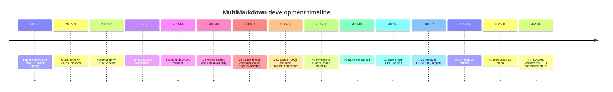
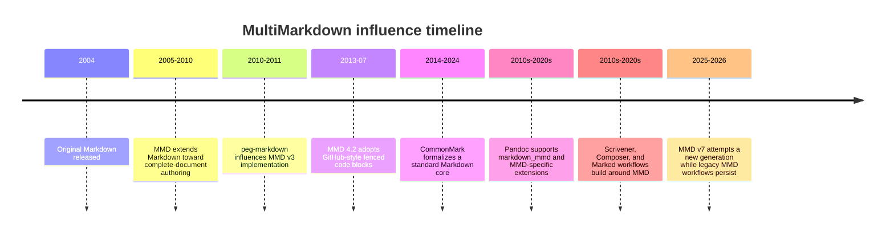
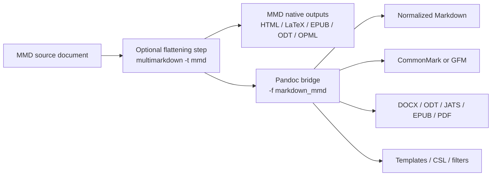

# MultiMarkdown Analysis

> [!INFO] Related research
> - [[commonmark-and-original-markdown|CommonMark and Original Markdown]]
> - [[github-flavored-markdown-analysis|GitHub Flavored Markdown Analysis]]
> - [[gitlab-flavored-markdown-analysis|GitLab Flavored Markdown Analysis]]
> - [[mdx-analysis|MDX Analysis]]
> - [[pandoc-markdown-deep-research-report|Pandoc Markdown Deep Research Report]]


## Executive Summary

[[multimarkdown-analysis|MultiMarkdown]] is an extended Markdown system created by Fletcher T. Penney to make Markdown suitable for complete documents rather than just web fragments. Its defining move was to keep the plain-text readability ethos of John Gruber’s Markdown while adding features that matter in long-form writing and publishing: metadata, tables, footnotes, citations, math, cross-references, transclusion, and multi-format export beyond HTML. The primary sources consistently describe MMD as a *superset* of original Markdown and as a content-first authoring tool whose text source should remain readable without rendering.

Historically, MMD evolved through several major implementation eras: an initial Perl lineage derived from `Markdown.pl`; a C/PEG rewrite in the v3 line based on John MacFarlane’s `peg-markdown`; a major v4 rewrite; a v5 restructuring around CMake; and a v6 parser rewrite focused on correctness and performance. As of May 11, 2026, the stable v6 line is effectively in maintenance mode and explicitly marked deprecated in favor of v7, while v7 itself is still officially pre-release. That means MMD remains important historically and practically, but it is no longer the clearest choice when maximum interoperability and standardized behavior matter more than MMD-native features.

Analytically, MMD’s strongest niche is still long-form, local-first authoring for academic, technical, and publishing workflows that benefit from LaTeX-oriented output, metadata-rich documents, and document assembly features. Its main weaknesses are also clear in the primary sources: bibliography support is intentionally “rudimentary” unless handed off to BibTeX/natbib or another downstream system; table support is useful but not fully general; direct DOCX output is not a native MMD strength; and its syntax is not a formal standard in the way CommonMark is. In practice, Pandoc is the best bridge in and out of MMD because it can both read and write `markdown_mmd`, expose several MMD-specific extensions, and convert onward to CommonMark, GFM, DOCX, JATS, EPUB, and many other formats.

## Origin and Evolution

The official MMD materials identify Fletcher T. Penney as the author and describe MultiMarkdown as beginning as a Perl script modified from the original `Markdown.pl`. They also describe a sequence of rewrites rather than a single continuously stable implementation: v3 was based on `peg-markdown`, v4 was a significant rebuild, v5 kept the v4 code while changing the build system, and v6 rewrote the parser again for speed and accuracy. The primary sources do **not** give a single unambiguous canonical “first public release” date for MMD 1.x; that detail is therefore unspecified in the materials reviewed here. What *is* documented is public evidence of an MMD 2.0a-era code base by November 2005 and explicit 2.0 beta releases in 2007.

The release record shows that MMD’s version history is best understood as a sequence of architectural pivots rather than minor incremental syntax tweaks. V3 shifted from Perl/regex-heavy processing toward a C implementation with PEG parsing and major speed gains. V4 focused on parser reentrancy, better internal structure, and feature parity with v3. V5 primarily modernized packaging and builds. V6 added another deep parser rewrite, direct EPUB 3 support, and later improved zip-based OpenDocument handling. V7, announced in late 2025 and documented again in March 2026, is explicitly still in alpha/pre-release.

The following timeline compiles the major milestones from official release posts, repository documentation, and release pages.



| Date | Version or milestone | What changed | Why it mattered |
|---|---|---|---|
| 2005-11-20 | Public evidence of MMD 2.0a-era tooling | The `Markdown Drag and Drop` utility lists an update to the “MultiMarkdown 2.0.a code base”; exact initial MMD 1.x release date is unspecified in the reviewed primary sources. | Earliest solid public evidence that MMD was already a distinct project with multiple outputs. |
| 2007-09-16 | 2.0.b3 | XSLT/LaTeX pipeline changes and raw LaTeX pass-through refinements. | Confirms the older v2 architecture centered on XHTML plus XSLT for non-HTML output. |
| 2010-12-04 | v3 rewrite underway | Penney announces a rewrite derived from `peg-markdown`, aiming for speed and flexibility. | Major architectural break from the Perl/XSLT era. |
| 2011-04-08 | 3.0 | Final v3 released; Perl-based 2.0 no longer under active development. | Establishes the C/PEG line as the main branch going forward. |
| 2013-04-22 to 2013-04-25 | v4 rewrite and 4.0b | Reentrant/thread-safe C implementation, new internal structure, easier addition of outputs. | Another deep implementation reset without abandoning MMD semantics. |
| 2013-07-09 | 4.2 | Adds GitHub-style fenced code blocks and Pandoc-like super/subscripts. | Shows MMD borrowing useful conventions from neighboring Markdown ecosystems. |
| 2015-03-05 | 4.7 | Adds `{{TOC}}`, `mmd` transclusion export, improved YAML support. | Strengthens whole-document workflow features. |
| 2015-11-15 | 5.0 | Same basic code as v4, but project restructured around CMake. | Build and packaging modernization rather than syntax revolution. |
| 2017-01-18 | 6.0 alpha | Parser rewrite, partial feature coverage, test suite emphasis. | Start of the v6 generation. |
| 2017-03 to 2017-07 | 6.x feature expansion | Direct EPUB 3 support, improved ODT/FODT support. | Broadens native export story beyond HTML/LaTeX. |
| 2023-06-11 | 6.7.0 | Latest v6 release; later repository banner deprecates v6 in favor of v7. | Marks the mature endpoint of the v6 line. |
| 2025-11 onward | 7.x pre-release | v7 announced on the site; March 2026 README still calls it pre-release. | Current development focus, but not yet the settled stable target. |

The table above is synthesized from official release posts and repositories; when a precise release fact was absent from those primary sources, I state it as unspecified rather than infer a date.

## Design Philosophy

The User’s Guide is unusually explicit about MMD’s purpose. Penney says Markdown “lacked a few features” needed for **entire documents** and that he wrote MultiMarkdown to keep Markdown’s readable syntax while converting text into “complete HTML documents, LaTeX, PDF, and ODF.” He also says he tried to remain faithful to Gruber’s readability ideal: MMD should still look like text written for people, not computers. That combination—*complete-document semantics plus source readability*—is the single best short description of MMD’s design philosophy.

This philosophy explains several seemingly disparate MMD features. Metadata is not merely decorative; it lets one plain-text document behave like a real manuscript with title, author, bibliography, CSS, LaTeX support files, and cross-document structure. Cross-references, captions, and transclusion similarly move MMD away from “web note” Markdown toward “book, article, letter, slideshow, outline” Markdown. Even the output list reflects this: HTML is only one target among many, not the sole or even always primary one.

MMD’s philosophy is also conservative in a second sense: it often prefers *readable author syntax* over *maximal formal generality*. Penney explicitly describes himself as a “Markdown purist” when discussing link and image attributes, and he frames bibliography support as intentionally basic rather than aspiring to replace BibTeX or citeproc. That is why MMD often offers a useful 80 percent solution and expects heavy-duty scholarly styling to be delegated downstream, especially in LaTeX-based workflows.

A final philosophical point matters for evaluation: MMD is best seen as an implementation-centered ecosystem rather than a formal standard. The reviewed primary materials provide a user guide, release notes, examples, test suites, and code, but not a separate normative specification with the status and ecosystem role that CommonMark later established for core Markdown. That difference is central to MMD’s long-term interoperability story.

## Technical Feature Analysis

### Metadata and front matter

MMD metadata must appear at the very top of a document, with no preceding blank lines. It can optionally be fenced with `---` before and after, or ended with `...`, for better YAML compatibility, but the documentation explicitly says MMD does **not** support all YAML metadata. Keys are case-insensitive and normalized by stripping spaces; metadata is treated as plain text, not parsed as MMD markup; multiline values are allowed; and a blank line ends the metadata block. MMD also supports variable substitution from metadata fields and defines a short list of standardized keys such as `Title`, `Author`, `BibTeX`, `Biblio Style`, `CSS`, `Language`, `LaTeX Begin`, `LaTeX Footer`, `LaTeX Mode`, `MMD Header`, `MMD Footer`, and `Transclude Base`.

Analytically, this is one of MMD’s most important differentiators. Original Markdown has no comparable document-level mechanism. The trade-off is that MMD front matter is *YAML-adjacent* rather than YAML-native, so portability into ecosystems that expect fully standardized YAML often requires cleanup rather than a zero-loss handoff. The primary docs themselves recommend compatibility with YAML only in a partial sense.

### Tables, figures, and images

MMD tables are “generally compatible” with Michel Fortin’s PHP Markdown Extra syntax, but extend it with grouping, captions, labels, HTML `<tbody>` segmentation, and cross-reference behavior. The rules are intentionally simple: at least one pipe per line, a structural separator line, one-line cell contents, and limitations around complex table layouts. MMD’s own docs warn that the table system is meant for “most tables for most people,” not all tables for all purposes, and that native RTF table export is especially limited.

Images also receive document-oriented treatment. When an image stands alone in a paragraph, MMD treats it as a block figure and, in HTML, wraps it in `<figure>` with the alt text promoted to `<figcaption>`. That caption can itself contain inline MMD formatting. MMD further supports link and image attributes such as width, height, classes, and styles, including inline attribute syntax in v6. This is more publishing-oriented than plain Markdown and much closer to a manuscript workflow.

Output-specific asset handling evolved over time. Direct EPUB 3 export arrived in v6 in March 2017, while July 2017 posts documented improved zip-based OpenDocument support, including packaging of image assets in ODT. The March 2017 EPUB announcement specifically said images were not yet supported at launch; the later primary sources reviewed here do not give a single equally explicit definitive statement of final EPUB image parity, so current EPUB image behavior is only partially specified in the reviewed official materials.

### Footnotes, citations, and bibliography

MMD implements footnotes using the syntax that John Gruber proposed but never shipped in original Markdown. It also extends footnotes into glossary terms for LaTeX-oriented glossary workflows. This made MMD attractive very early to academic writers, because footnotes were one of the most obvious structural omissions from vanilla Markdown.

Citations are where MMD is simultaneously strong and limited. It supports inline citation references and bibliography entries using a link-like MMD syntax, including optional locators, and it can integrate with BibTeX/natbib in LaTeX workflows via metadata. But the manual is blunt that bibliography support is “rudimentary” and meant as a basic standalone feature rather than a replacement for BibTeX or citeproc. In other words, MMD gives you enough structure to write scholarly prose, but not a modern universal citation-processing stack on its own. In v6 HTML output, citations are also separated from footnotes and citation markers changed from brackets to parentheses.

### Math, cross-references, TOC, and extensions

MMD 2 used ASCIIMathML, but the v3 rewrite replaced that path with a MathJax/LaTeX-friendly approach. The current guide documents support for `\(...\)`, `\[...\]`, `$...$`, and `$$...$$` delimiters, with spacing rules to reduce false positives. For HTML, the documentation’s example injects MathJax through `HTML Header` metadata; for LaTeX output, the same TeX-like source can flow naturally into the downstream LaTeX toolchain. MMD also supports lightweight superscript and subscript syntax outside full math blocks.

Cross-references are a classic MMD feature. A link of the form `[Some Text][]` is resolved as an internal cross-link if a matching header exists, and authors can disambiguate headings with explicit labels in square brackets. Images and tables can also be labeled for cross-reference use. For long documents, this is a substantial ergonomic improvement over manually managing anchors. MMD’s auto-generated `{{TOC}}` marker, added in v4.7 and later extended with level ranges such as `{{TOC:2}}` and `{{TOC:2-3}}`, pushes the same complete-document logic further. When possible, MMD uses the native TOC mechanism of the output format, such as `\tableofcontents` in LaTeX.

MMD’s other extensions reinforce its identity as a writing system rather than merely a Markdown parser. These include definition lists, abbreviations, CriticMarkup handling, recursive file transclusion, format-selective raw source spans and blocks, smart typography in multiple languages, OPML input/output, ITMZ support for iThoughts files, and TextBundle-related formats in v6. Several of these changed syntax or behavior in v6, especially abbreviations, glossary terms, citations, raw source, and HTML-block parsing.

### Output formats

Programmatically, the v6 library exposes output formats including HTML, EPUB, LaTeX, Beamer, Memoir, FODT, ODT, TextBundle, compressed TextBundle, OPML, ITMZ, and raw MMD. The public site also frames PDF as an important outcome, but explicitly by way of LaTeX rather than as a direct core writer. Likewise, Word is positioned as something reached through OpenDocument/RTF conversion rather than as a native MMD target in the way Pandoc offers DOCX directly.

That distinction is analytically important. MMD’s output model is rich, but it is shaped by the publishing stack it grew up in: HTML, LaTeX/PDF, EPUB, ODT/FODT, outliner formats, and editorial helpers. If the end goal is manuscript-quality LaTeX, Beamer slides, long-form EPUB, or outliner round-tripping, that bias is productive. If the end goal is “give me clean DOCX and a broad conversion matrix,” the user is usually better served by Pandoc, or by using Pandoc as MMD’s interop bridge.

## Implementations and Maintenance

The implementation lineage is unusually clear in the author’s own documentation. The original line started as a Perl modification of `Markdown.pl`. V3—also called `peg-multimarkdown`—was a C implementation derived from `peg-markdown`, using a parsing expression grammar and aiming to compile on almost any operating system. Penney credits Daniel Jalkut with work that removed the need for external library requirements in that generation. V4 kept a PEG-based approach but substantially rewrote the surrounding internals, with explicit attention to reentrancy and thread safety. V5 kept the v4 codebase while moving to a CMake-centered build system. V6 was then described by Penney as the biggest rewrite since v3, with a completely rewritten parser for accuracy and performance.

At the repository level, v6 is more than a CLI tool: it is also a reusable C library, `libMultiMarkdown`, with string-based, `DString`-based, and engine-based APIs. The v6 repo documents CLI build workflows (`make release`, `make debug`, `ctest`, `make xcode`), exposes output and extension enums, and includes directories for test suites, LaTeX support files, a Swift-related area, and a `lemon` directory containing `lemon.c` and `lempar.c`. Release notes also mention updates to `re2c` scanners. Together, those sources show a mature compiled-toolchain architecture rather than a single-script utility. The v6 README also lists bundled third-party components such as CuTest, uthash, miniz, and argtable3 under their respective licenses.

The command-line interface is straightforward at the surface but surprisingly capable underneath. Official examples show HTML as the default output, other targets selected through `-t`, batch mode through `-b`, OPML input via `--opml`, and transclusion preprocessing through `-t mmd`. For complex outputs like EPUB, the library README distinguishes string-returning conversion from file/data-producing conversion functions, reflecting the fact that some targets are more than just plain-text streams.

Current maintenance status is the most important practical fact for 2026 users. The v6 line has an official 6.7.0 release dated June 11, 2023, but the main `MultiMarkdown` and `MultiMarkdown-6` repositories are explicitly labeled deprecated in favor of v7. V7, announced on Penney’s site in November 2025 and documented in a README dated March 13, 2026, is still called pre-release/alpha and states that one important gap relative to v6 is the lack of native ODT export at that stage; it also says installers are currently only available for macOS. In other words: v6 is the last clearly mature MMD line, while v7 is the active but still settling successor.

One ecosystem wrinkle is version lag outside the core project. Official help for Marked says it ships with MultiMarkdown 5, not 6 or 7. That matters because many real-world “MMD workflows” are toolchain workflows, not just parser workflows, and the surrounding apps do not all track the newest MMD generation at the same pace.

## Compatibility and Interoperability

MMD is not best understood as “another CommonMark implementation.” It is historically older than CommonMark’s formalization, is rooted in original Markdown plus independent extensions, and was designed around long-form document production rather than a rigorously standardized core syntax. CommonMark, by contrast, presents itself as a standard and conformance suite meant to remove ambiguity in Markdown.

[[github-flavored-markdown-analysis|GitHub Flavored Markdown]] (GFM) is different again. The formal GFM spec explicitly says it is a *strict superset of CommonMark* and marks non-CommonMark features as extensions. In the formal spec those extensions include tables, task list items, strikethrough, autolink extensions, and raw-HTML filtering behavior. But current GitHub Docs also documents platform-rendered footnotes and alerts that are not part of the older formal GFM spec page. So “GFM” can mean either the formal spec or the current GitHub.com rendering environment, and those are not perfectly identical.

Pandoc occupies the bridge position. Its manual documents `markdown_mmd` as both an input and output format, and it also exposes MMD-specific extensions such as `mmd_title_block`, `mmd_link_attributes`, and `mmd_header_identifiers`. At the same time, Pandoc warns that conversions from more expressive formats to less expressive ones can be lossy because its AST cannot perfectly preserve every format-specific detail. That makes Pandoc the best practical interop path, but not a magic guarantee of zero-loss MMD round-tripping.

The comparison below summarizes the practical differences that matter most in migration decisions. It is compiled from the MMD guide and README, the Pandoc manual, the CommonMark spec, the formal GFM spec, and current GitHub Docs.

| Capability | MultiMarkdown | Pandoc Markdown | CommonMark | GFM |
|---|---|---|---|---|
| Governing model | Implementation + guide + tests | Reader/writer system over a shared AST | Formal core spec + tests | CommonMark superset spec; platform behavior on GitHub adds more |
| Metadata block | Native MMD title block; YAML-compatible but not full YAML | Native YAML; also supports MMD title block extension | No standardized metadata block in core spec | No standardized metadata block in formal GFM spec |
| Tables | Native table syntax with captions/labels and some grouping | Multiple table syntaxes, richer model overall | Not in core spec | Yes in formal spec |
| Footnotes | Yes | Yes, plus inline notes | Not in core spec | Not in formal spec; supported on GitHub platform |
| Citations / bibliography | Yes, but intentionally rudimentary; BibTeX/natbib integration for LaTeX | Rich native citation syntax and CSL workflows | No | No |
| Math | Yes, TeX-style delimiters and MathJax/LaTeX workflows | Yes | No core math syntax | No math in the formal GFM spec reviewed here |
| Cross-references | Native heading/table/image cross-refs | Partial equivalents via broader Pandoc extensions | No standard equivalent in core | No standard MMD-style cross-ref system |
| Transclusion | Native recursive file transclusion | Not a core Markdown syntax feature | No | No |
| Direct DOCX output | No native DOCX writer documented | Yes | Not applicable | Not applicable |
| Best fit | Long-form manuscript/publishing workflows | Interop hub and universal conversion | Standardized core Markdown | Repository/web collaboration on GitHub |

A second timeline is useful because the MMD story is partly about influence and echo across the Markdown ecosystem rather than only internal releases.



## Strengths, Limitations, and Use Cases

MMD’s strengths are clearest when the document is larger than a README and richer than a web fragment. Metadata, BibTeX hooks, footnotes, figures, ToC generation, cross-references, transclusion, Beamer/Memoir/LaTeX modes, and outliner-oriented formats all push it toward book, article, lecture-note, and technical-manuscript workflows. This is exactly why early academic and Scrivener communities found it attractive, and why MMD’s own examples include manuscripts, letters, and Beamer slide decks rather than only web snippets.

Its limitations are equally structural. Bibliography support is intentionally basic. Tables are useful but not comprehensive. PDF is effectively “LaTeX plus a PDF engine,” not a fundamentally separate document model. Direct DOCX is not a native v6 target. The syntax is implementation-specific enough that round-tripping into CommonMark/GFM/Pandoc ecosystems can require deliberate cleanup. And current project maintenance is transitional: v6 is deprecated, while v7 is not yet described by its author as fully settled.

A concise way to see the distribution of strengths is the scenario table below.

| Scenario | Why MMD fits | Main caution |
|---|---|---|
| Academic writing | Footnotes, BibTeX hooks, math, LaTeX/PDF, Beamer, manuscript structure | Native bibliography layer is basic; many users still combine MMD with downstream tools |
| Book and technical publishing | Metadata, transclusion, figures, ToC, EPUB/ODT/LaTeX outputs | DOCX-centered publishing pipelines are better served by Pandoc |
| Note-taking and outlining | OPML, ITMZ, TextBundle-related support, outliner-friendly structure | Not the dominant mainstream note-taking Markdown dialect |
| GitHub README / issue writing | Possible only in a reduced subset | Many marquee MMD features do not transfer cleanly to formal GFM/CommonMark targets |

The most notable *projects* using or embedding MMD are well documented: MultiMarkdown Composer is designed around MMD syntax; Scrivener 3 can export to any MMD format; Marked ships with MultiMarkdown 5 support; and the official MMD Gallery contains sample publications including a Beamer presentation, a manuscript example, a letter, and an introductory slideshow. The official User’s Guide also exists in multiple formats, which is itself a demonstration of MMD’s publishing logic.

For *publications authored with MMD*, the evidence is thinner and more anecdotal. A reputable Higher Ed workflow article reports that the author completed comprehensive exams entirely in MultiMarkdown and then converted them with Pandoc. But the reviewed official MMD sources do **not** provide a canonical public registry of major books, journals, or publishers using MMD at scale, so any broader claim about external publication volume would be unspecified.

## Migration, Security, and Source URLs

For migration, the key principle is simple: preserve MMD-specific meaning *before* moving into a stricter or more standardized target. In practical terms, that usually means flattening transclusions first, deciding whether metadata should become YAML, converting bibliography syntax, and then using Pandoc as the bridge for downstream formats. Pandoc’s own model is ideal for this because it understands `markdown_mmd` as both input and output, but its manual also warns that conversions can be lossy when the source format is more expressive than the target.



The following commands are concrete, conservative workflows based on the official MMD CLI examples and Pandoc’s documented support for `markdown_mmd`, `commonmark`, and `gfm`.

```bash
# Flatten transclusions but keep MMD source
multimarkdown -t mmd manuscript.mmd > manuscript.flat.mmd

# Native MMD HTML
multimarkdown manuscript.flat.mmd > manuscript.html

# Native MMD LaTeX (then compile to PDF with your TeX engine)
multimarkdown -t latex manuscript.flat.mmd > manuscript.tex
xelatex manuscript.tex

# Native MMD EPUB 3
multimarkdown -b -t epub manuscript.flat.mmd

# MMD -> Pandoc Markdown
pandoc -f markdown_mmd -t markdown -o manuscript.pandoc.md manuscript.flat.mmd

# MMD -> CommonMark
pandoc -f markdown_mmd -t commonmark -o manuscript.commonmark.md manuscript.flat.mmd

# MMD -> GFM
pandoc -f markdown_mmd -t gfm -o README.md manuscript.flat.mmd

# MMD -> DOCX through Pandoc
pandoc -f markdown_mmd -o manuscript.docx manuscript.flat.mmd

# Pandoc Markdown -> MMD
pandoc -f markdown -t markdown_mmd -o manuscript.mmd manuscript.md
```

The most important migration mismatches are semantic rather than mechanical. MMD title blocks are not the same thing as Pandoc YAML metadata; MMD citations use bibliography-entry syntax and locators such as `[][#Key]`, whereas Pandoc uses native citation syntax such as `[@key]`; MMD transclusion has no direct equivalent in CommonMark or formal GFM; and MMD’s cross-references, glossary behavior, and several raw-source features are processor-specific. So “convert and review” is the right mentality, not “convert and trust blindly.”

A concrete syntax comparison helps make that visible.

| Concern | Typical MMD form | Typical migration target |
|---|---|---|
| Front matter | `Title:...` / `Author:...` / `BibTeX:...` | Pandoc YAML metadata block |
| Citation callout | `source[][#Doe:2006]` | `source [@doe2006]` in Pandoc |
| Bibliography entry | Inline MMD bibliography definition | External `.bib` plus CSL / citeproc |
| Document assembly | `{{chapter1.md}}` transclusion | Preprocess first, then convert |
| Output-specific raw material | ```` ```{=latex}... ``` ```` | Review carefully; often preserved only in formats that understand it |

On security and privacy, MMD should be treated as an **authoring processor**, not as a sanitizing renderer. The official docs describe recursive file transclusion, raw-source pass-through for `html`, `odt`, `epub`, and `latex`, raw LaTeX in metadata, and verbatim XML insertion for ODF headers. They do **not** document a built-in HTML sanitization layer. By contrast, the formal GFM spec explicitly says GitHub performs additional post-processing and sanitization after conversion to HTML, and Pandoc notes that its CommonMark-family parser is less vulnerable to pathological performance on untrusted input than its older markdown parser. The practical inference is straightforward: trusted local documents are MMD’s natural habitat; untrusted inputs should be sandboxed, and HTML intended for the public web should be sanitized downstream. Privacy-wise, the official MMD interfaces are local CLI and library interfaces; the reviewed official docs do not describe any requirement to upload documents to a remote service.

### Selected Source URLs

The report relied primarily on official MMD materials, author release posts, repository release notes, and the Pandoc/CommonMark/GFM documentation, with a small number of secondary and academic sources for context.

- https://fletcher.github.io/MultiMarkdown-6/MMD_Users_Guide.html
- https://fletcherpenney.net/multimarkdown/
- https://github.com/fletcher/MultiMarkdown-6
- https://github.com/fletcher/MultiMarkdown-6/releases
- https://github.com/fletcher/MultiMarkdown-7/blob/develop/README.md
- https://fletcherpenney.net/2025/11/multimarkdown_7
- https://pandoc.org/MANUAL.html
- https://spec.commonmark.org/
- https://github.github.com/gfm/
- https://docs.github.com/en/get-started/writing-on-github/getting-started-with-writing-and-formatting-on-github/basic-writing-and-formatting-syntax
- https://github.com/fletcher/MultiMarkdown-Gallery
- https://multimarkdown.com/composer/
- https://www.literatureandlatte.com/blog/epub-kindle-and-multimarkdown-export-in-scrivener-3
- https://markedapp.com/help/Choosing_a_Processor.html
- https://pandoc-scholar.github.io/
- https://www.insidehighered.com/blogs/gradhacker/using-markdown-academic
