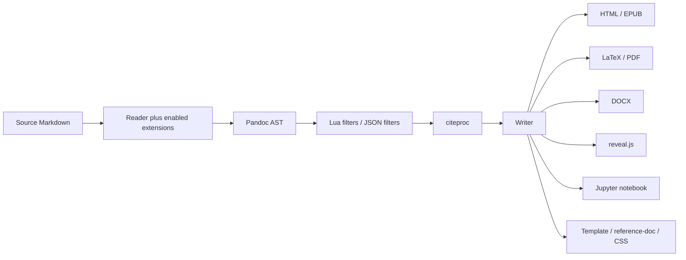
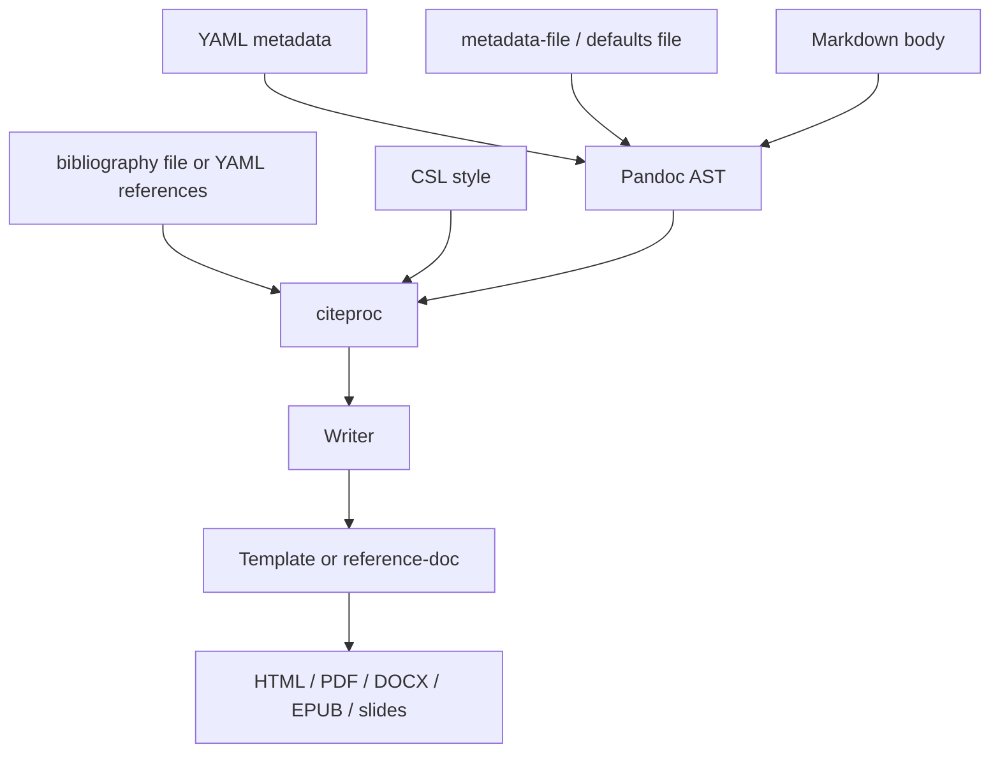

# Pandoc Markdown Deep Research Report

> [!INFO] Related research
> - [[commonmark-and-original-markdown|CommonMark and Original Markdown]]
> - [[github-flavored-markdown-analysis|GitHub Flavored Markdown Analysis]]
> - [[gitlab-flavored-markdown-analysis|GitLab Flavored Markdown Analysis]]
> - [[mdx-analysis|MDX Analysis]]
> - [[multimarkdown-analysis|MultiMarkdown Analysis]]


## Executive summary

Pandoc Markdown is best understood not as “just another Markdown flavor,” but as a semantic authoring language optimized for conversion through Pandoc’s document AST into many targets, including HTML, LaTeX/PDF, DOCX, EPUB, reveal.js slides, and Jupyter notebooks. Its design goal differs from original Markdown in one crucial way: original Markdown was centered on HTML authoring, while Pandoc Markdown is designed for multi-format publishing, so it adds native syntax for structures that survive cross-format conversion better than ad hoc raw HTML does: citations, metadata, math, attributes, Div/Span containers, tables, footnotes, and more.

The practical consequence is that Pandoc Markdown is far more powerful than [[commonmark-and-original-markdown|CommonMark]], [[github-flavored-markdown-analysis|GitHub Flavored Markdown]], or [[multimarkdown-analysis|MultiMarkdown]] for scholarly and high-end publishing workflows, but it is also less “portable” as generic Markdown. When portability across Markdown engines matters most, use `commonmark` or `gfm`; when publishing power and conversion fidelity matter most, use `markdown` or `commonmark_x` with carefully chosen extensions.

For advanced work, the best results come from staying as semantic as possible: YAML metadata instead of hand-coded title pages, native citations plus CSL instead of raw bibliography markup, native math plus a format-appropriate renderer, and attributes/Divs/Spans instead of literal target markup. Raw HTML, raw LaTeX, and raw OpenXML remain important escape hatches, but they should be used sparingly because they reduce portability and often disappear or are suppressed in non-native writers.

Pandoc’s strongest built-in cross-referencing story is for headings and internal links. Rich cross-references for figures, tables, equations, and listings are partly writer-specific and partly ecosystem-driven: ODT/DOCX have native numbering and some native cross-reference support, MathJax can handle equation labels in HTML, LaTeX handles `\label`/`\ref` natively, and broad figure/table/equation cross-referencing across formats is most commonly supplied by filters such as pandoc-crossref or higher-level wrappers such as [Quarto](https://quarto.org).

## Scope, goals, and the extension model

Pandoc’s own manual describes Pandoc Markdown as an “extended and slightly revised” version of Markdown whose syntax choices are guided by readability, but with a broader mission than original Markdown: portable conversion among many formats, not HTML alone. That is why Pandoc favors native syntax for document structure over HTML-centric tricks. The same architecture explains both its strengths and its limits: Pandoc parses input into a native AST, optionally transforms that AST with filters, and then writes a target format. That architecture enables enormous flexibility, but because the AST is simpler than some source or target formats, conversions can still be lossy, especially for complex formatting or complex tables.

Extensions are the main mechanism by which Pandoc Markdown is customized. They can be enabled or disabled per input or output format by appending `+EXTENSION` or `-EXTENSION` to the format name, and the authoritative way to inspect the effective set for a given reader or writer is `pandoc --list-extensions=FORMAT`. This matters because `markdown`, `commonmark`, `commonmark_x`, `gfm`, `markdown_mmd`, and `markdown_strict` do not expose the same defaults.

The workflow below reflects Pandoc’s actual architecture: parse to AST, optionally run filters and citeproc, then render through a format-specific writer and template.



A second workflow, crucial for production publishing, is the metadata-and-citations path. Metadata can come from YAML blocks, command-line metadata, metadata files, or defaults files; citations can come from bibliography files or from YAML `references`; styles come from CSL; and templates/reference documents control presentation at the writer stage.



## Extension taxonomy and syntax

The table below synthesizes the major current Pandoc Markdown extension families named in Pandoc’s manual, plus the heading and typography extensions that materially change Pandoc Markdown behavior. The syntax column is intentionally terse; detailed examples follow in later sections.

| Family | Major extension names | Typical syntax | Why it matters |
|---|---|---|---|
| Typography | `smart` | straight quotes, `--`, `---`, `...` | Converts plain ASCII punctuation into typographic punctuation; affects both reading and writing. |
| Headings and IDs | `auto_identifiers`, `ascii_identifiers`, `gfm_auto_identifiers`, `header_attributes`, `implicit_header_references`, `blank_before_header`, `space_in_atx_header` | `# Title {#id.class}`; `[Section]` | Gives headings stable IDs, labels, classes, and implicit intra-document references. |
| Line handling | `escaped_line_breaks`, `hard_line_breaks`, `ignore_line_breaks`, `east_asian_line_breaks` | `line\` newline; bare newlines | Controls whether newlines become spaces, `<br>`, or are ignored. |
| Code blocks and code spans | `fenced_code_blocks`, `backtick_code_blocks`, `fenced_code_attributes`, `inline_code_attributes` | ```` ```{.python #id}````; `` `x`{.lang} `` | Enables language classes, IDs, and attributes for syntax highlighting or downstream processing. |
| Lists | `fancy_lists`, `startnum`, `task_lists`, `definition_lists`, `example_lists` | `iv.` / `#.`, `- [x]`, `Term` then `: Definition`, `(@label)` | Supports richer ordered lists, task lists, definition lists, and numbered examples. |
| Tables | `table_captions`, `simple_tables`, `multiline_tables`, `grid_tables`, `pipe_tables`, `table_attributes` | pipe tables, grid tables, caption lines | Gives Pandoc a family of native table syntaxes, captions, and attributes. |
| Metadata | `pandoc_title_block`, `yaml_metadata_block` | `% title` or YAML `---... ---` | Provides document metadata, template variables, citation config, EPUB metadata, etc. |
| Inline formatting | `intraword_underscores`, `strikeout`, `superscript`, `subscript`, `mark`, plus underline/smallcaps classes | `~~x~~`, `x^2^`, `H~2~O`, `==mark==`, `[Small]{.smallcaps}` | Adds typographic and semantic inline forms beyond basic emphasis/code. |
| Math input | `tex_math_dollars`, `tex_math_gfm`, `tex_math_single_backslash`, `tex_math_double_backslash`, `latex_macros` | `$...$`, `$$...$$`, `\(...\)`, `\[...\]` | Lets TeX math survive conversion to multiple outputs; `latex_macros` can expand custom macros across math/raw TeX. |
| Raw content and HTML mixing | `raw_html`, `markdown_in_html_blocks`, `native_divs`, `native_spans`, `raw_tex`, `raw_attribute`, `markdown_attribute` | raw HTML/TeX; ```` ```{=html}```` | Escape hatch for target-specific markup or for converting HTML `div`/`span` into native AST elements. |
| Attributes, containers, and images | `bracketed_spans`, `fenced_divs`, `link_attributes`, `implicit_figures`, `attributes` | `[text]{.class}`; `::: {.callout}`; `{width=50%}` | Adds structured attributes to inlines/blocks/images and enables semantic containers. |
| Notes and citations | `footnotes`, `inline_notes`, `citations` | `[^1]`, `^[note]`, `[@key]` | Core publishing features for scholarly and technical writing. |

Several important but more specialized or compatibility-oriented non-default extensions sit on top of that core. `rebase_relative_paths` rewrites relative image/link paths for multi-file projects; `old_dashes` changes smart-dash parsing; `angle_brackets_escapable`, `lists_without_preceding_blankline`, `four_space_rule`, and `spaced_reference_links` adjust parser compatibility; `emoji`, `alerts`, and `autolink_bare_uris` add convenience syntax; `mmd_title_block`, `mmd_link_attributes`, `mmd_header_identifiers`, and `short_subsuperscripts` help migrate MultiMarkdown content; `sourcepos` preserves source positions when parsing CommonMark; `wikilinks_title_after_pipe` supports wiki-link syntax; and `gutenberg` targets plain-text conventions for Project Gutenberg-style output.

### Key syntax and edge rules

At the paragraph level, a newline in normal Markdown is usually just a space; two trailing spaces or a backslash-newline create a hard break, and in multiline/grid table cells the backslash form is the reliable one because trailing spaces are ignored there. Turning on `hard_line_breaks` changes the semantics of every newline inside a paragraph.

Heading IDs are generated automatically unless you provide one explicitly. You can force ASCII-only IDs with `ascii_identifiers`, or GitHub-style ID generation with `gfm_auto_identifiers`. Internal section links can be written explicitly as `(#id)` links or implicitly as `[Heading text]`, but if an explicit reference-link definition exists, it takes precedence over an implicit header reference. Duplicate heading text links to the first matching heading unless you use an explicit ID link.

Attributes matter in two distinct ways. In Pandoc Markdown proper, headings, fenced code blocks, links/images, tables, bracketed spans, and fenced Divs all have dedicated attribute syntaxes. In `commonmark+attributes`, the more general `attributes` extension subsumes several of those specialized syntaxes and may introduce wrapper `Span` or `Div` nodes because Pandoc’s AST cannot attach arbitrary attributes directly to every element.

Raw content also has subtle precedence rules. Bare raw HTML passes through to HTML-family outputs and is suppressed in many others; bare raw TeX is preserved for LaTeX/ConTeXt and ignored elsewhere. The more precise `raw_attribute` form is safer because it binds content to a specific target format like `html`, `latex`, or `openxml`. If `latex_macros` is enabled, macro definitions are applied across LaTeX math and raw LaTeX, but not inside content marked with `raw_attribute`.

Metadata blocks also interact in defined ways. Pandoc title blocks and YAML metadata blocks both map into document metadata, but `pandoc_title_block` or `yaml_metadata_block` take precedence over `mmd_title_block`. YAML metadata blocks can appear multiple times in Pandoc Markdown, with later blocks overriding earlier values for duplicate fields; in `commonmark`-style formats, they are more restricted and must occur at the beginning of the document.

## Citations, math, metadata, labels, and cross-references

### Citations and bibliography processing

Pandoc’s citation syntax is native and expressive. Basic citations look like `[@key]`, grouped citations use semicolons, and each citation item can carry a prefix, locator, and suffix, as in `[see @doe99, pp. 33-35; @smith04, chap. 1]`. Author-in-text citations omit brackets, and `-@key` suppresses the author name. Locator parsing follows CSL locale terms, so terms like `p.`, `pp.`, `chap.`, `sec.`, and `§` are interpreted structurally rather than as plain suffix text.

Pandoc’s current citation workflow is built around built-in citeproc. The current manual documents `--citeproc`, the `citeproc` filter entry for controlling filter order, CSL style selection, bibliography sources, and LaTeX-specific alternatives such as `--natbib` and `--biblatex`. Those LaTeX citation methods affect LaTeX output only and are not for use with `--citeproc` or direct PDF output. In new workflows, built-in citeproc is the default recommendation; `pandoc-citeproc` mainly persists as legacy external-filter terminology and in older pipelines.

Pandoc accepts bibliography data from external files in BibLaTeX, BibTeX, CSL JSON, CSL YAML, and RIS, or directly from a YAML `references` array embedded in the document metadata. It also parses markup differently by bibliography format: LaTeX markup in BibTeX/BibLaTeX fields, Markdown in CSL YAML, and HTML-like markup in CSL JSON. CSL styles themselves are external XML style descriptions, and Pandoc defaults to `chicago-author-date` unless you specify another CSL file.

A production pattern worth remembering is that when citeproc is active, Pandoc disables the writer’s own citation syntax so citeproc-rendered citations win. If you need citeproc to happen before or after another filter, put `citeproc` explicitly into the filter list in the desired position.

### Citation example with expected output

The following is idiomatic Pandoc Markdown for embedded references plus a citation. The rendered citation and bibliography style depend on the CSL style, but the structure is stable. The example output shown is representative HTML generated by Pandoc with citeproc in an author-date style.

```md
---
references:
  - type: article-journal
    id: doe99
    author:
      - family: Doe
        given: Jane
    issued:
      date-parts: [[1999]]
    title: Frogs
    container-title: Journal of Amphibians
    volume: 44
---

Blah blah [@doe99, p. 33].
```

```html
<p>Blah blah <span class="citation" data-cites="doe99">(Doe 1999, 33)</span>.</p>
<div id="refs" class="references csl-bib-body hanging-indent" role="list">
  <div id="ref-doe99" class="csl-entry" role="listitem">
    Doe, Jane. 1999. <span>“Frogs.”</span> <em>Journal of Amphibians</em> 44.
  </div>
</div>
```

### Math delimiters, renderers, and equation numbering

Pandoc’s default native math syntax is TeX math with `$...$` for inline and `$$...$$` for display math, with careful delimiter rules to avoid accidental capture of currency amounts. It also supports GitHub-style math fences through `tex_math_gfm`, and single- or double-backslash delimiters through `tex_math_single_backslash` and `tex_math_double_backslash`. In all cases, math is parsed semantically and then rendered according to the output writer or HTML math method.

For HTML-family outputs, Pandoc offers several rendering modes: plain/unicode-ish fallback, MathML, MathJax, KaTeX, WebTeX, and GladTeX. The manual is explicit that plain HTML rendering is only acceptable for basic math; for serious mathematical documents you usually want `--mathjax`, `--katex`, or `--mathml`. EPUB inherits the HTML math choice because EPUB is HTML-based, with EPUB 3 also supporting MathML-based semantics.

Equation numbering is not a single Pandoc feature so much as a stack-dependent capability. In LaTeX/PDF workflows, numbering and cross-references are naturally provided by LaTeX environments and labels. In HTML with MathJax docs, automatic numbering is off by default but can be enabled with `tex.tags: 'ams'` or `'all'`; MathJax supports `\tag`, `\label`, `\ref`, and `\eqref`. In HTML with KaTeX docs, the docs show strong support for environments and `\tag`, but automatic numbering and LaTeX-style `\label`/`\ref` support are materially less complete than MathJax’s documented labeling model, so KaTeX is typically best when speed matters more than rich equation cross-referencing. For figure/table/equation numbering across multiple output formats, Pandoc’s own ecosystem points users toward filters such as pandoc-crossref documentation.

### Math and cross-reference examples

The example below shows Pandoc math source and the relevant command-line choices. The exact emitted HTML wrapper differs by method, but the semantic input remains the same.

```md
Inline $E=mc^2$.

$$
\int_0^1 x^2\,dx = \frac{1}{3}
$$
```

```bash
pandoc math.md -s -t html5 --mathjax -o mathjax.html
pandoc math.md -s -t html5 --katex   -o katex.html
pandoc math.md -s -t html5 --mathml  -o mathml.html
pandoc math.md -s -t latex           -o math.tex
```

For HTML equation labels with MathJax, a MathJax-aware workflow looks conceptually like this. MathJax’s documented behavior is that `\label` creates a usable reference target and `\eqref` inserts the equation number.

```md
In equation \eqref{eq:sample}, we evaluate the integral.

\[
\int_0^\infty \frac{x^3}{e^x-1}\,dx = \frac{\pi^4}{15}
\label{eq:sample}
\]
```

For cross-format figure/table/equation references via pandoc-crossref, the project’s documented syntax uses labels such as `#fig:...`, `#tbl:...`, and `#eq:...`, then references them via citation-like references such as `@fig:label` and `@eq:label`. That is not native Pandoc Markdown in the narrowest sense; it is a widely used filter-layer convention built on top of Pandoc’s AST.

```md
{#fig:arch}

See @fig:arch.

$$
E = mc^2
$$ {#eq:einstein}

As shown in @eq:einstein, mass and energy are equivalent.
```

### Attributes, spans, divs, and expected HTML

Pandoc’s attribute system is one of the clearest places where it distinguishes itself from simpler Markdown flavors. Headings, links/images, tables, code blocks, bracketed spans, and fenced Divs can all carry IDs, classes, and key/value attributes; in HTML-family outputs, unknown attributes are generally passed through or normalized into `data-*` attributes. In DOCX/ODT/ICML, the same attribute system becomes the bridge to custom styles and output-specific behaviors.

```md
# Intro {#intro .lead data-kind=chapter}

[Small Caps]{.smallcaps} and [highlight]{.mark}.

::: {.callout #box custom-style="MyBlock"}
Block content.
:::

See [Intro].
```

```html
<h1 class="lead" data-kind="chapter" id="intro">Intro</h1>
<p><span class="smallcaps">Small Caps</span> and <mark>highlight</mark>.</p>
<div id="box" class="callout" data-custom-style="MyBlock">
  <p>Block content.</p>
</div>
<p>See <a href="#intro">Intro</a>.</p>
```

## Output behavior and conversion fidelity

The matrix below is an analytic synthesis of Pandoc’s writer documentation rather than an official Pandoc rating scale. “Fidelity” here means practical preservation of structure and high-value semantics from Pandoc Markdown into each target, not pixel-perfect formatting identity. Pandoc itself explicitly warns that its AST is less expressive than some formats and that complex tables or fine-grained formatting can be lossy.

| Output | Practical fidelity from Pandoc Markdown | Strongest features | Notable limits and edge cases |
|---|---|---|---|
| HTML / HTML5 | Very high | IDs/classes/attributes, Divs/Spans, CSS targeting, raw HTML, flexible math methods, section anchors | Raw HTML from untrusted input is unsafe; plain math fallback is weak for serious math; sanitization may be needed |
| LaTeX / PDF | Very high for scholarly docs | Native citations, LaTeX math, labels, bibliography pipelines, templates, fine typography | Requires external PDF engine; raw HTML is suppressed; `natbib`/`biblatex` are LaTeX-only paths |
| DOCX | High | OMML math, reference-doc styling, custom styles, native numbering for figures/tables | Raw HTML/TeX do not port directly; use `openxml` raw blocks sparingly; some attributes are ignored |
| EPUB | High | YAML metadata, HTML-family attributes, CSS, embedded media, MathML/HTML math choices | Behavior follows HTML-family rules; raw target-specific content must match EPUB output model |
| reveal.js | High for slide-authoring idioms | Heading-driven slide structure, YAML-driven slide metadata, per-slide attributes, HTML math methods | Deep heading nesting is awkward; reveal.js backgrounds/options are HTML-slide-specific |
| Jupyter notebooks | Moderate to high | Markdown cells honor Markdown options/extensions; code cells and attachments can be generated | Mixed raw HTML/TeX in output cells is delicate; notebook round-tripping may need `raw_markdown`; some JS-heavy outputs need extra care |

Pandoc’s math mappings are especially format-sensitive. The manual states that DOCX and PowerPoint receive OMML math markup, ODT prefers MathML, LaTeX output preserves TeX form, and HTML-family outputs delegate rendering to the chosen HTML math method. That is why a mathematically identical source document may have different publication constraints depending on target format.

For cross-references, the target matrix is uneven. Heading anchors and internal links are built in for HTML, LaTeX, and ConTeXt. ODT/DOCX add native numbering of figures and tables, and ODT adds some native cross-reference substitutions. reveal.js and EPUB inherit HTML-style anchors and attribute pass-through. Rich figure/table/equation cross-references across all formats are best treated as ecosystem-level functionality, not as a fully uniform Pandoc core feature.

## Recommended workflows, tooling, performance, security, and migration

### Recommended minimal toolchain

A minimal serious Pandoc toolchain is small: Pandoc itself; a PDF engine such as `xelatex` or `lualatex` when PDF output is needed; built-in citeproc; a bibliography file in BibTeX/BibLaTeX/CSL JSON/CSL YAML/RIS; a CSL style; and, when producing DOCX/ODT/PPTX, a `--reference-doc` for house style control. Optional high-value additions are Lua filters, CSS for HTML/EPUB, and a reference manager that exports supported bibliography formats. Pandoc’s install docs explicitly note that PDF creation normally uses LaTeX, and Zotero’s docs confirm that CSL JSON, BibTeX, BibLaTeX, and RIS fit naturally into bibliographic workflows.

For editor and wrapper integrations, Pandoc’s official extras page highlights examples rather than a canonical stack: PanWriter, pandoc-mode for Emacs, vim-pandoc, wrappers such as panzer/pandocomatic/panrun, citation tools such as zotxt, and advanced publishing layers such as Quarto, Manubot, and pandoc-crossref. Treat that page as a curated ecosystem map, not as a commandment.

### Example command lines

For an academic paper with citations and math to PDF, the following is a strong baseline. The exact extension set can be customized, but the key pieces are citeproc, a bibliography, a CSL style, and a PDF engine.

```bash
pandoc paper.md \
  --from markdown+yaml_metadata_block+citations+tex_math_dollars+fenced_divs+bracketed_spans \
  --citeproc \
  --bibliography references.bib \
  --csl apa.csl \
  --pdf-engine=xelatex \
  --number-sections \
  --toc \
  -o paper.pdf
```

For a blog post to standalone HTML, the minimal professional additions are a stylesheet, resource embedding when desired, and a deliberate math choice if the post contains equations.

```bash
pandoc post.md \
  --standalone \
  --from markdown+yaml_metadata_block+smart \
  --to html5 \
  --css site.css \
  --embed-resources \
  --mathjax \
  -o post.html
```

For reveal.js slides, let headings define slide structure, keep the heading hierarchy shallow, and use YAML metadata or heading attributes for slide-level behavior.

```bash
pandoc slides.md \
  --standalone \
  --to revealjs \
  --slide-level=2 \
  --mathjax \
  --variable theme=white \
  -o slides.html
```

A DOCX workflow typically adds a reference document rather than a custom template, because styles in Word-family outputs are most effectively controlled that way.

```bash
pandoc report.md \
  --citeproc \
  --bibliography refs.bib \
  --reference-doc house-style.docx \
  -o report.docx
```

### High-end publishing best practices

For citations, prefer native Pandoc citations plus CSL over hand-formatted references. Keep bibliographic data in a source format Pandoc understands well, avoid hand-editing rendered bibliographies, and choose whether citeproc should run before or after custom filters. For complex houses styles, store the CSL file and bibliography in version control with the manuscript.

For math, decide early whether your HTML target is MathJax-first, KaTeX-first, or MathML-first, because equation numbering and cross-references differ materially among those choices. For PDF, prefer LaTeX-native math unless there is a compelling reason not to. For HTML with serious equation labeling, MathJax remains the most straightforward documented path.

For figures and tables, use native captions, IDs, and attributes before resorting to raw HTML or raw LaTeX. If you need production-grade numbering and cross-references across multiple formats, standard Pandoc Markdown plus `pandoc-crossref` is a more stable long-term approach than a pile of target-specific hacks. For DOCX/ODT house styles, use `custom-style` attributes and `--reference-doc`.

For metadata and templates, prefer YAML metadata blocks for document-level data and `--metadata-file` or defaults files for reusable project configuration. Use templates for structural presentation and `--reference-doc` for Word/OpenDocument styling. If you carry a custom template over time, track upstream template changes because Pandoc’s defaults evolve.

For filters, use Lua filters first when possible. Pandoc’s own documentation emphasizes that Lua filters avoid JSON serialization overhead and external dependency friction, and they are usually faster than JSON filters. JSON filters remain valuable when you need another programming language or external services, but for AST-local transformations Lua is the default high-performance choice.

### Performance and security

Performance concerns are real in two areas: parsing and filter orchestration. Pandoc’s security note warns that some parser corner cases can exhibit pathological performance, so untrusted workloads should be run under timeouts and, if using the executable, under heap limits such as `+RTS -M512M -RTS`. The same note also states that the `commonmark` family is less vulnerable to pathological performance than the classic `markdown` parser, so for untrusted Markdown input `commonmark` or `commonmark_x` is often the safer parser family.

Security-wise, the generated HTML is not automatically safe. With `raw_html` enabled, users can inject arbitrary HTML; even with `raw_html` disabled, dangerous URLs and attributes can still survive. Pandoc therefore recommends sanitizing HTML generated from untrusted user input. The `--sandbox` option can limit reader/writer file I/O to declared files, but it does not constrain filters or PDF engine execution; if you use Pandoc as a library, a `PandocPure`-style isolation model is the stronger analogue.

A practical secure-authoring policy is straightforward: disable or tightly control `raw_html` and `raw_tex`; prefer `raw_attribute` when target-specific raw content is unavoidable; use `--sandbox` for untrusted input; sanitize any HTML you expose to browsers; and be especially cautious with formats that embed resources into a binary output, because Pandoc’s security note explicitly calls out file-disclosure risks through embedded images/media in several outputs unless sandboxing is used.

### Migration and compatibility

Pandoc supports multiple Markdown reader variants directly: `markdown` for Pandoc Markdown, `markdown_strict` for original Markdown, `markdown_mmd` for MultiMarkdown, `commonmark`, `gfm`, and `commonmark_x` for CommonMark plus many Pandoc extensions. It also notes that `markdown_github` is deprecated and less accurate than `gfm`. In practice, that means migration is usually a matter of choosing the right reader/writer pair and then turning on only the extensions you need.

The comparison table below is intentionally concise. It focuses on the features that most distinguish Pandoc Markdown in real publishing workflows.

| Dimension | Pandoc Markdown | CommonMark | GitHub Flavored Markdown | MultiMarkdown |
|---|---|---|---|---|
| Primary goal | Multi-format conversion and publishing | Standardized core Markdown spec | GitHub authoring and platform conventions | Extended document authoring, historically LaTeX-friendly |
| Extension model | Fine-grained toggles per reader/writer | Minimal, spec-driven | Platform-defined additions on top of CommonMark | Engine-specific feature set |
| Native citations | Yes | No | No | Yes |
| YAML metadata | Yes | Core spec: no | Common platform use varies | Metadata supported |
| Math | Yes, several delimiter families | No native math in core spec | GitHub-specific math support exists in platform/spec context | Yes |
| Attributes / Divs / Spans | Strong | Minimal in core spec | Limited relative to Pandoc | Some attributes and label conventions |
| Table family | Multiple native syntaxes | Limited core table story | Pipe tables plus platform behavior | Strong table support |
| Footnotes | Yes | No in core spec | Yes | Yes |
| Task lists | Yes | No in core spec | Yes | Not central |
| Cross-format publishing | First-class | Not the main goal | Not the main goal | Yes, but narrower ecosystem than Pandoc |
| Best use case | Scholarly, technical, multi-output publishing | Portable Markdown interchange | GitHub docs/issues/README workflows | Existing MMD corpora and some long-form docs |

Migration guidance follows naturally from that table. From CommonMark, move to `commonmark_x` first if you want to keep a CommonMark parsing base while adding Pandoc capabilities. From GFM, use `gfm` when GitHub compatibility is the requirement and move to `markdown` or `commonmark_x` when you need citations, YAML metadata, broader table support, or more semantic attributes. From MultiMarkdown, Pandoc’s `markdown_mmd` reader is helpful for ingestion, but many teams normalize into Pandoc Markdown for long-term maintenance because the Pandoc ecosystem around citeproc, Lua filters, DOCX, and diverse writers is broader.

## Authoritative sources and limitations

The report above is anchored primarily in official Pandoc and closely adjacent primary-source documentation. In priority order, the most authoritative references for ongoing work are these:

- Pandoc User’s Guide
- Pandoc extensions section
- Pandoc releases and change history
- [Pandoc GitHub repository](https://github.com/jgm/pandoc)
- Pandoc filters documentation
- Pandoc Lua filters documentation
- [citeproc repository](https://github.com/jgm/citeproc)
- Citation Style Language documentation
- CSL styles repository
- MathJax documentation
- KaTeX documentation
- Pandoc Extras ecosystem page
- pandoc-crossref documentation

A few details remain inherently version- or stack-sensitive. Exact emitted HTML structure can vary by Pandoc version and template. Rich cross-reference behavior outside heading links depends heavily on writer choice and on third-party tooling such as pandoc-crossref or higher-level wrappers. KaTeX and MathJax continue to evolve independently, so equation-labeling behavior should always be validated against the current renderer docs before committing to a large HTML math workflow. Finally, the compatibility table is deliberately high-level: it compares design centers and major feature families, not every extension toggle or historical variant edge case.
