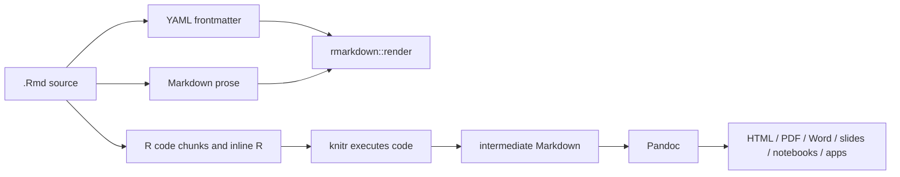

# R Markdown Analysis

> [!INFO] Related research
> - [[pandoc-markdown-deep-research-report|Pandoc Markdown Deep Research Report]]
> - [[commonmark-and-original-markdown|CommonMark and Original Markdown]]
> - [[github-flavored-markdown-analysis|GitHub Flavored Markdown Analysis]]
> - [[mdx-analysis|MDX Analysis]]
> - [[markdown-extra-analysis|Markdown Extra Analysis]]

## Executive Summary

R Markdown is not just a Markdown flavor. It is a computational document format built around `.Rmd` files, `knitr`, Pandoc, YAML frontmatter, and executable code chunks. The `rmarkdown` package describes its purpose as creating dynamic analysis documents that combine code, rendered output such as figures, and prose. Rendering is a two-stage pipeline: `knitr` executes chunks and produces an intermediate Markdown document, then Pandoc converts that Markdown into HTML, PDF, Word, slides, notebooks, dashboards, package vignettes, and other outputs.

As Markdown syntax, R Markdown inherits [[pandoc-markdown-deep-research-report|Pandoc Markdown]] plus compatibility extensions, rather than defining a wholly separate prose grammar. Its distinctive syntax is the executable layer: fenced code chunks such as ```` ```{r}````, chunk options such as `echo = FALSE`, inline R expressions such as `` `r nrow(df)` ``, YAML `output:` configuration, parameters, Shiny runtime options, and output-format-specific settings.

For new multi-language publishing projects, Quarto is often the strategic successor. Quarto's own docs call it a next-generation version of R Markdown and document key differences: Quarto prefers `format:` instead of R Markdown's `output:`, and chunk options are typically written as YAML-style `#|` comments inside chunks rather than as R expressions in the chunk header. R Markdown remains important for legacy `.Rmd` projects, RStudio workflows, established R package vignettes, and projects that depend on the mature R Markdown package ecosystem.

## Processing Pipeline



The important implementation point is that R Markdown output is generated, not merely parsed. Code can read files, use packages, produce plots, create tables, and mutate global state unless the render environment is controlled.

## Core File Structure

````markdown
---
title: "Sample Document"
author: "Analyst"
output:
  html_document:
    toc: true
    theme: united
params:
  dataset: "airquality.csv"
---

# Results

The current dataset is `r params$dataset`.

```{r setup, include = FALSE}
knitr::opts_chunk$set(echo = TRUE, warning = FALSE)
```

```{r plot, echo = FALSE, fig.cap = "Temperature and ozone"}
plot(airquality$Temp, airquality$Ozone)
```
````

The source has three layers:

| Layer | Syntax | Role |
|---|---|---|
| YAML metadata | `--- ... ---` | Title, author, output formats, parameters, runtime, format options. |
| Markdown prose | Pandoc Markdown | Narrative, headings, links, tables, math, citations when enabled. |
| Executable code | ```` ```{r}```` chunks and inline `` `r ...` `` | Computation, figures, tables, dynamic text. |

## Feature Inventory

| Feature | R Markdown behavior |
|---|---|
| Base prose syntax | Pandoc Markdown with optional compatibility features. |
| YAML frontmatter | Controls metadata, `output`, parameters, runtime, and output options. |
| Code chunks | Fenced code regions with engine and options in the opening line. |
| Inline code | Backtick expression qualified with `r`. |
| Chunk options | `include`, `echo`, `message`, `warning`, `fig.cap`, cache settings, and many knitr options. |
| Global options | `knitr::opts_chunk$set(...)` inside a setup chunk. |
| Parameters | `params:` in YAML, passed to `render(..., params = ...)`. |
| Output formats | HTML, PDF/LaTeX, Word, ODT, RTF, Markdown, GFM, slides, notebooks, websites, dashboards, Shiny documents. |
| Execution runtime | Static by default; Shiny and prerendered Shiny modes are available. |
| Intermediate artifacts | `render(run_pandoc = FALSE)` can stop after knitting and return the intermediate Markdown. |

## R Markdown versus Quarto

| Area | R Markdown | Quarto |
|---|---|---|
| Primary extension | `.Rmd` | `.qmd` |
| Output key | `output:` | `format:` |
| Chunk options | Usually in chunk header, e.g. `{r, echo = FALSE}` | Usually YAML-style `#| echo: false` comments inside chunks |
| Language center | R-first | Multi-language first: R, Python, Julia, Observable, others |
| Execution engine | `knitr` for R chunks | `knitr` for R, Jupyter for other engines |
| Project types | Supported through R packages such as bookdown, blogdown, flexdashboard | More project types built into Quarto |

Quarto can render many existing `.Rmd` files, but the migration is not zero-risk. Chunk option syntax, format names, cross-references, project configuration, and package-specific R Markdown features may need review.

## Security and Reproducibility

R Markdown is executable content. That is its strength and its main risk.

Security concerns:

- Rendering an untrusted `.Rmd` file can execute arbitrary R code.
- Chunks can read local files, make network calls, install packages, or write output.
- HTML widgets and Shiny output can add browser-side behavior.
- Parameterized reports can expose data if parameters are not validated.

Reproducibility concerns:

- Results depend on package versions, R version, Pandoc version, locale, random seeds, working directory, and external data.
- Rendering in the current R session can accidentally depend on existing objects.
- Cache invalidation can preserve stale computations if not managed carefully.

Practical safeguards:

- Render untrusted documents only in isolated environments.
- Use project-local dependency management such as `renv`.
- Set seeds and record session information for analyses.
- Prefer explicit relative paths from the project root.
- Render in a clean session for production outputs.

## Portability

R Markdown is portable as source text but not portable as ordinary Markdown. A generic Markdown parser will treat code chunks as fenced code blocks and inline R as code spans; it will not execute them. For archival Markdown, render to an output Markdown flavor such as `md_document` or `github_document`. For computation-preserving migration, keep the `.Rmd` source and document the required R environment.

## Validation Checklist

- Render with `rmarkdown::render()` in a clean session.
- Confirm the expected output format is selected from YAML or render arguments.
- Check that Pandoc is available and version-compatible.
- Inspect the intermediate `.md` when Pandoc output looks wrong.
- Verify code chunks do not depend on hidden global state.
- Decide explicitly whether a new project should use R Markdown or Quarto.

## Authoritative Sources

- [rmarkdown package documentation](https://rmarkdown.rstudio.com/docs/)
- [R Markdown: How It Works](https://rmarkdown.rstudio.com/lesson-2.html)
- [R Markdown: Code Chunks](https://rmarkdown.rstudio.com/lesson-3.html)
- [R Markdown: Output Formats](https://rmarkdown.rstudio.com/lesson-9)
- [R Markdown Quick Tour](https://rmarkdown.rstudio.com/authoring_quick_tour.html)
- [rmarkdown::render reference](https://pkgs.rstudio.com/rmarkdown/reference/render.html)
- [Quarto: Using R](https://quarto.org/docs/computations/r.html)
