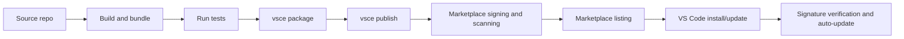

# VS Code Extension Publishing

## Executive Summary

Publishing a VS Code extension comes down to four things:

1. A correct root `package.json` manifest

2. A clean package payload

3. A publisher identity backed by a Personal Access Token

4. An automated release path built around `@vscode/vsce`

The official model: author and bundle, package into a `.vsix`, publish to the Marketplace, let the Marketplace sign it, and VS Code verifies the signature on install/update. The Marketplace stack is backed by Azure DevOps services. Official automation examples exist for both Azure Pipelines and GitHub Actions.

> [!IMPORTANT] Non-negotiable manifest requirements
>
> - Every extension needs a root `package.json`
> - `name`, `version`, `publisher`, and `engines.vscode` are **required**
> - `engines.vscode` cannot be `*`
> - `main` and/or `browser` determine whether the extension runs in Node.js, the browser, or both
> - In modern web-capable extensions, browser support, untrusted workspaces, and virtual workspaces are part of the **publishing-quality bar**, not an afterthought

> [!WARNING] Practical publishing risks
> The most common failures are **operational**, not conceptual:
>
> - Shipping too many files
> - Over-broad activation events
> - Leaking tokens or `.env` files
> - Forgetting to bundle web code into a single browser-compatible artifact
> - Relying on native modules that force platform-specific packaging

> [!NOTE] VSIX size cap — murky area
> Official docs clearly document icon rules, HTTPS image rules, SVG restrictions, and minimum icon size — but do **not** prominently restate a current hard VSIX size cap. The only explicit official numeric cap found is a 2017 release note raising the limit from 20 MB to **100 MB**. Current authoring docs focus on bundling and package hygiene. **Treat the exact hard cap as unclear; keep well below 100 MB and verify with Marketplace support if close.**

---

## Scope and Assumptions

This document assumes:

- A **public** Marketplace release (not a private enterprise marketplace)

- A JavaScript or TypeScript codebase managed with **npm or Yarn v1**

- A general-purpose extension intended for current stable VS Code, with optional web support

Where behavior differs for web-only extensions, platform-specific native extensions, extension packs, or proposed-API experiments, those cases are called out explicitly.

**Source priority:** official Microsoft and VS Code Marketplace guidance first; popular repos like `vscode-extension-samples` and major published extensions only for concrete examples and cautionary patterns.

---

## Manifest and Required Artifacts

### Core Required Fields

| Field | Rule |
|---|---|
| `name` | Lowercase, no spaces |
| `version` | SemVer-compatible |
| `publisher` | Identifies the publishing identity |
| `engines.vscode` | Defines compatibility; cannot be `*` |

### Optional But Recommended Fields

| Field | Purpose |
|---|---|
| `main` | Node-based extension entry point |
| `browser` | Web extension entry point |
| `contributes` | UI and feature registrations |
| `activationEvents` | Lazy loading triggers |
| `extensionDependencies` | Extension-to-extension deps |
| `extensionPack` | Bundle related extensions |
| `extensionKind` | Where it prefers to run |
| `capabilities` | Untrusted/virtual workspace support |
| `icon` | Marketplace icon |
| `repository`, `bugs`, `homepage` | Source provenance links |
| `qna`, `sponsor`, `pricing` | Marketplace metadata |

**Ship in extension root:** `README.md`, `LICENSE`, `CHANGELOG.md`, `SUPPORT.md`

### Reference Manifest

Desktop-first with optional web support, adapted from the official manifest docs, web extension guide, and `vscode-extension-samples`:

```json
{
  "name": "my-extension",
  "displayName": "My Extension",
  "description": "Example extension",
  "version": "0.1.0",
  "publisher": "your-publisher",
  "license": "SEE LICENSE IN LICENSE",
  "repository": {
    "type": "git",
    "url": "https://github.com/your-org/your-repo"
  },
  "engines": {
    "vscode": "^1.100.0"
  },
  "categories": ["Other"],
  "main": "./dist/extension.js",
  "browser": "./dist/web/extension.js",
  "activationEvents": [
    "onCommand:myExtension.hello",
    "onLanguage:markdown"
  ],
  "contributes": {
    "commands": [
      {
        "command": "myExtension.hello",
        "title": "Hello World"
      }
    ],
    "configuration": {
      "title": "My Extension",
      "properties": {
        "myExtension.enableFeature": {
          "type": "boolean",
          "default": true,
          "description": "Enable the feature"
        }
      }
    }
  },
  "extensionKind": ["workspace", "ui"],
  "capabilities": {
    "untrustedWorkspaces": {
      "supported": "limited",
      "description": "Command execution is disabled in Restricted Mode."
    },
    "virtualWorkspaces": {
      "supported": true
    }
  },
  "icon": "images/icon.png",
  "scripts": {
    "vscode:prepublish": "npm run build",
    "build": "esbuild src/extension.ts --bundle --platform=node --external:vscode --outfile=dist/extension.js"
  }
}
```

### Common Trip-Wires

> [!TIP] `contributes` is declarative and broad
> Commands, configuration, grammars, snippets, menus, themes, walkthroughs, tree views, and many other contribution points all live here.

> [!TIP] Activation should be as narrow as possible
> The extension host uses lazy activation to isolate misbehaving extensions and avoid unnecessary CPU/memory use. Prefer `onCommand`, `onLanguage`, and task-specific events over broad startup behavior. Modern extensions can use `activationEvents: []` and rely on newer declarative activation behavior.

### Marketplace Asset Rules

These are policy checks performed by `vsce` — asset hygiene determines whether publishing succeeds:

| Asset | Rule |
|---|---|
| Icon | At least **128x128 px**; icon path may **not** be SVG |
| Badges | May not be SVG unless from trusted badge providers |
| README/CHANGELOG images | Must resolve to **HTTPS URLs**; no SVG except trusted badge providers |

---

## Localization

Two tracks for internationalization:

### Static Strings (in `package.json`)

Use `package.nls.json` and `package.nls.<locale>.json`:

```json
// package.json
{
  "l10n": "./l10n",
  "contributes": {
    "commands": [
      {
        "command": "my-extension.helloWorld",
        "title": "%my-extension.helloWorld.title%"
      }
    ]
  }
}
```

```json
// package.nls.json
{
  "my-extension.helloWorld.title": "Hello World"
}
```

### Runtime Strings (in code)

Use `vscode.l10n.t` (arrived in VS Code 1.73; set `engines.vscode` and `@types/vscode` to `^1.73.0` or later):

```ts
import * as vscode from 'vscode';

vscode.window.showInformationMessage(
  vscode.l10n.t('Hello from my extension')
);
```

**Tooling:** `@vscode/l10n-dev` for extraction, `@vscode/l10n` for subprocess localization.

---

## Packaging, Publishing, and CI/CD

### The Tool: `@vscode/vsce`

The canonical packaging and publishing tool. Requires **Node.js 20.x or newer**. Supports npm and Yarn v1.

The Marketplace uses Azure DevOps services. The PAT must include the Marketplace `Manage` scope.

### Minimum Local Commands

```bash
npm install -g @vscode/vsce
vsce login your-publisher
vsce package
vsce publish
vsce publish minor
vsce publish --pre-release
code --install-extension my-extension-0.1.0.vsix
```

### Release Pipeline

> [!NOTE] Signing
> Signing happens at Marketplace publish, not local packaging. VS Code verifies the signature on install and update. Authors do not opt into this manually.



### CI Setup

Microsoft documents three official automation patterns: **Azure Pipelines**, **GitHub Actions**, **GitLab CI**. The recommended pattern in all three:

1. Store PAT as a secure `VSCE_PAT` secret

2. Install `@vscode/vsce` as a dev dependency

3. Add a `deploy` script calling `vsce publish`

4. Trigger publication on **tagged releases only**, after tests pass

> [!WARNING] Linux CI caveat
> Headless Linux CI requires `xvfb` for VS Code extension tests.

#### Package Scripts

```json
{
  "scripts": {
    "deploy": "vsce publish --yarn"
  },
  "devDependencies": {
    "@vscode/vsce": "^3.0.0"
  }
}
```

#### GitHub Actions

```yaml
# .github/workflows/release.yml
name: CI
on:
  push:
    branches: [main]
  release:
    types: [created]

jobs:
  build-test-publish:
    runs-on: ubuntu-latest
    steps:
      - uses: actions/checkout@v4
      - uses: actions/setup-node@v4
        with:
          node-version: 20
      - run: npm ci
      - run: xvfb-run -a npm test
      - if: success() && startsWith(github.ref, 'refs/tags/')
        run: npm run deploy
        env:
          VSCE_PAT: ${{ secrets.VSCE_PAT }}
```

#### Azure Pipelines

```yaml
# azure-pipelines.yml
trigger:
  branches:
    include: [main]
  tags:
    include: [refs/tags/v*]

steps:
  - task: NodeTool@0
    inputs:
      versionSpec: '20.x'
  - script: npm ci
  - bash: |
      /usr/bin/Xvfb :99 -screen 0 1024x768x24 > /dev/null 2>&1 &
      npm test
    env:
      DISPLAY: ':99.0'
  - bash: npm run deploy
    condition: and(succeeded(), startsWith(variables['Build.SourceBranch'], 'refs/tags/'))
    env:
      VSCE_PAT: $(VSCE_PAT)
```

### Packaging Mode Comparison

| Mode | Toolchain | Best for | Secret handling | Strengths | Caveats |
|---|---|---|---|---|---|
| Local manual package | `@vscode/vsce` CLI | Author testing, private handoff, debugging a `.vsix` | Local credential store, `VSCE_PAT`, or interactive login | Fastest feedback; easy local install from VSIX | Manual and error-prone for repeatable releases |
| Local manual publish | `vsce login` + `vsce publish` | One-off public release | PAT with Marketplace `Manage` scope | Simplest official public-publish path | Weakest audit trail; easy to forget checks |
| GitHub Actions release | `vsce` in GitHub Actions | Most open-source repos | `secrets.VSCE_PAT` | Official documented pattern; easy tag-based releases | Linux test jobs need `xvfb`; still your responsibility to gate on tests |
| Azure Pipelines release | `vsce` in Azure Pipelines | Orgs already on Azure DevOps | Secret variable `VSCE_PAT` | Official pattern; good matrix support across Windows/macOS/Linux | Slightly more Azure-specific setup overhead |
| Manual Marketplace upload | `vsce package` then upload in publisher portal | Controlled releases, low automation maturity | Browser auth to publisher portal | Avoids scripting publish; keeps VSIX artifact explicit | Least automatable; easiest to drift from source-controlled release |

---

## Security, Policy, Legal, and Privacy

### Marketplace Security Model

> [!IMPORTANT] Extension signing (as of late 2022+)
> The Marketplace signs extensions on publish. VS Code verifies the signature on install and update. **Authors do not opt into this separately.** Signature verification is mandatory on Windows, macOS, and Linux (temporary Linux ARM32 exception was noted in release notes).

Additional Marketplace enforcement layers:

- Malware scanning on each new package and update

- Dynamic behavioral detection in a sandboxed clean-room VM

- Monitoring of unusual usage

- Blocking of malicious or compromised extensions

- Secret scanning on newly published extensions

- `vsce` scans `.env` files during packaging and can **block publishing** if secrets are detected

> [!DANGER] Pipeline discipline
> Never rely on "I will remember not to commit that later." **Your pipeline should fail closed** if sensitive artifacts make it into the package tree.

**Publisher trust:** end users see publisher-trust prompts when installing from a third-party publisher for the first time. Publishers can pursue a blue "verified publisher" badge after meeting Marketplace tenure and domain-age prerequisites.

### Extension Security Design

#### 1. Minimum activation and UI surface

Keep `activationEvents` as narrow as possible.

#### 2. Treat webviews as hostile-rendering surfaces

- Keep `enableScripts` off unless necessary

- Restrict `localResourceRoots`

- Start CSP from `default-src 'none'`

- Sanitize all workspace-derived input

- Avoid inline scripts and styles

```html
<!-- Webview CSP example -->
<meta
  http-equiv="Content-Security-Policy"
  content="default-src 'none'; img-src ${webview.cspSource} https:; script-src ${webview.cspSource}; style-src ${webview.cspSource};"
/>
```

#### 3. Avoid native node modules when possible

Browser extensions lose Node APIs and must be bundled to a single file. Native dependencies force platform-specific packages. Pure JS/TS or browser-compatible dependencies produce a smaller attack surface and a much easier release matrix.

### Secret Storage

> [!WARNING] Use `SecretStorage`, not `workspaceState`/`globalState`
> `workspaceState` and `globalState` store plaintext and should **not** be used for secrets.
>
> - Desktop: `SecretStorage` uses Electron `safeStorage`
> - Web: double-key-encryption approach
> - Not synchronized across machines

```ts
// Secret handling: prefer SecretStorage
export async function activate(context: vscode.ExtensionContext) {
  await context.secrets.store('apiToken', 'redacted');
  const token = await context.secrets.get('apiToken');
}
```

### Legal and Licensing

- Ship a root `LICENSE` file

- Set `"license": "SEE LICENSE IN <filename>"` in `package.json`

- Include third-party license notices when needed

- Add `repository`, `homepage`, `bugs` links for source provenance

- Subject to Marketplace Terms of Use

Minimum strong pattern: SPDX-style `license` metadata + root license file + third-party notices + provenance links.

### Telemetry and Privacy

> [!NOTE] Telemetry obligations
>
> - Use `@vscode/extension-telemetry` if it fits
> - Otherwise honor `isTelemetryEnabled` and `onDidChangeTelemetryEnabled`
> - Collect as little telemetry as possible
> - Avoid PII
> - Consider shipping `telemetry.json` so users can inspect emissions via `code --telemetry`

Model to follow: Microsoft's Jupyter and PostgreSQL extensions make telemetry disclosure prominent in READMEs and explicitly note respect for the user telemetry setting.

```json
// telemetry.json
{
  "events": {
    "commandExecuted": {
      "description": "Tracks which command was invoked",
      "properties": {
        "command": {
          "classification": "SystemMetaData",
          "purpose": "FeatureInsight"
        }
      }
    }
  }
}
```

---

## Compatibility, Versioning, Runtimes, and Limits

### Extension Runtimes

| Runtime | Entry point | Hosts |
|---|---|---|
| Node.js | `main` | Desktop, remote extension hosts |
| Browser WebWorker | `browser` | Web extension hosts |

An extension can ship one or both. `extensionKind` expresses where it prefers to run when local, remote, and web hosts all exist. For web-only extensions, generally do **not** define `extensionKind`.

### Workspace Capabilities Declaration

```json
{
  "extensionKind": ["workspace", "ui"],
  "capabilities": {
    "untrustedWorkspaces": {
      "supported": "limited",
      "description": "Runs read-only features only in Restricted Mode."
    },
    "virtualWorkspaces": {
      "supported": true
    }
  }
}
```

`capabilities.untrustedWorkspaces` and `capabilities.virtualWorkspaces` are the correct way to declare support under Restricted Mode and virtual file systems.

### Dependency Layers

| Layer | Where it goes |
|---|---|
| Node runtime dependencies | `dependencies` |
| Build-only tooling | `devDependencies` |
| Extension-to-extension relationships | `extensionDependencies` or `extensionPack` |

Supported package managers: **npm** and **Yarn v1** (`npm >=6`, `yarn >=1 <2`).

> [!WARNING] Native modules
> If you use native node modules, you may need platform-specific extension packages and `--target` builds. Web bundles must avoid Node module loading and usually must be packaged to a single file.

### Versioning and Pre-Releases

- `vsce publish minor` or `vsce publish 1.1.0` — updates manifest and publishes

- `vsce publish --pre-release` or `vsce package --pre-release` — pre-release track

- **Required format:** plain `major.minor.patch` (not SemVer prerelease identifiers)

- Pre-release and release versions must be **distinct**

- VS Code auto-updates users to the highest available version

> [!TIP] Version line convention
> Use **even-numbered minor lines** for releases, **odd-numbered minor lines** for pre-release tracks. Pinned CLI installs do not auto-update.

```bash
vsce publish patch
vsce publish 1.4.0
vsce publish --pre-release
code --install-extension your-publisher.your-extension@1.4.0
```

### Proposed APIs

> [!DANGER] Proposed APIs cannot be published to the Marketplace
> They are only available in Insiders and require `enabledApiProposals`. To share a proposed-API build, package a VSIX and install it manually in Insiders with `--enable-proposed-api=<extension-id>`. This is a partner preview path, not a public Marketplace strategy.

### Limits and Asset Reference

| Item | Official status | What sources say | Recommended practice |
|---|---|---|---|
| VSIX package size cap | **Unclear** in current author docs | Only explicit cap found: 2017 release note raising limit to 100 MB; current docs focus on bundling and asset policy | Keep below 100 MB; bundle aggressively; verify with Marketplace support if close |
| Icon format and size | Clearly documented | At least 128x128 px; may not be SVG | Use crisp PNG, ideally 256x256 for retina downscaling |
| README / CHANGELOG images | Clearly documented | Must be HTTPS; SVG blocked except from trusted badge providers | Host screenshots over HTTPS; avoid SVG unless explicitly trusted |
| Marketplace badges | Clearly documented | May not be SVG except from trusted badge providers | Use standard raster badges or trusted providers only |
| Telemetry inventory | Clearly documented, no numeric limit | Minimal, no PII, must respect telemetry enablement; documentable with `telemetry.json` | Publish small human-readable telemetry inventory + privacy section in README |

> [!NOTE] Auto-update implications
> VS Code automatically installs updated extension versions. Users can pin a specific version from the UI or CLI, stopping auto-update for that install. **Treat every published version as potentially long-lived in the wild.** Backward compatibility, changelog clarity, and rollback readiness matter.

---

## Quality, Accessibility, and Testing

### Testing Stack

| Test type | Tool |
|---|---|
| Desktop extension host tests | `@vscode/test-cli` + `@vscode/test-electron` |
| Browser-host extension tests | `@vscode/test-web` |
| Coverage | `--coverage` flag in the test CLI |

```bash
npm install --save-dev @vscode/test-cli @vscode/test-electron
npm test
npx vscode-test --coverage
```

**Minimum bar:** unit tests for logic + extension-host integration tests for desktop behavior + browser-host tests if `browser` is declared in the manifest.

### Accessibility in Webviews

Webviews receive CSS classes to respond to rather than hardcoding a single visual experience:

| Class | Meaning |
|---|---|
| `vscode-using-screen-reader` | Screen reader active |
| `vscode-reduce-motion` | Reduced motion preference |
| `vscode-high-contrast` | High-contrast theme |

The broader VS Code UX guidelines exist specifically so extension UI blends with VS Code rather than fighting it.

---

## Common Publishing Failures

> [!DANGER] Predictable failure modes
>
> - **Duplicate extension name** — names and display names must be unique
> - **PAT missing `Manage` scope** — PAT setup fails silently until publish time
> - **Signature failures** — block installation when package integrity checks fail
> - **Missing `xvfb` on Linux CI** — tests hang or fail on headless Linux
> - **Web bundle not single-file** — browser extensions fail when extra module loading is left in the web bundle
> - **External downloads at install time** — breaks offline/restricted-network installs (real Jupyter issue in practice)
> - **Source maps, pipeline YAML, or source trees leaked into bundle** — hygiene issues seen in the Jupyter ecosystem

---

## Pre-Publish Checklist

- [ ] `name`, `publisher`, `version`, and `engines.vscode` are correct and intentional

- [ ] `activationEvents` are as narrow as possible; no loading on startup unless truly required

- [ ] Production artifacts are bundled; package contents inspected before publishing

- [ ] `README.md`, `LICENSE`, and `CHANGELOG.md` are present and Marketplace-ready

- [ ] Icon is PNG and at least 128x128 px; untrusted SVG assets removed

- [ ] Scanned for secrets locally; `.env`, tokens, and credentials are not publishable

- [ ] Tested on desktop; browser tests added if `browser` is declared; Restricted Mode and virtual workspaces tested if manifest claims support

- [ ] Telemetry honors `isTelemetryEnabled`, avoids PII, and is documented

- [ ] If using native modules: platform-specific packages published intentionally; every claimed target validated

- [ ] Publishing from CI on tags only, using a secure `VSCE_PAT` secret

---

## FAQ

### Do I need `activationEvents` for commands?

Usually yes for explicitness. The web-extension docs note that for targets prior to 1.74 you had to list `onCommand:<id>` explicitly; newer command activation is more automatic in some cases. If you support older engines or want zero ambiguity, keep explicit activation events.

### Can I publish an extension that uses proposed APIs?

No. Proposed APIs are only available in Insiders and cannot be used in published Marketplace extensions. You can share a VSIX privately for testing via `--enable-proposed-api=<extension-id>` in Insiders.

### Who signs the extension?

The Marketplace signs it when you publish. VS Code verifies that signature when users install or update. Authors do not manually opt into Marketplace signing.

### Should I support web, untrusted workspaces, and virtual workspaces?

If your extension can, yes — they are now central compatibility modes in the official docs. Claim support only when tested and true; otherwise mark as `limited` or `false` with a description.

### What is the current Marketplace package size limit?

The least clearly documented area. The only explicit official number found is the historical increase to 100 MB in 2017. Current author docs focus on bundling and asset rules rather than a current hard cap. Treat the exact limit as unclear; keep well below 100 MB.

---

## Official References

| Source | URL |
|---|---|
| Publishing Extensions | https://code.visualstudio.com/api/working-with-extensions/publishing-extension |
| Extension Manifest | https://code.visualstudio.com/api/references/extension-manifest |
| Contribution Points | https://code.visualstudio.com/api/references/contribution-points |
| Activation Events | https://code.visualstudio.com/api/references/activation-events |
| Bundling Extensions | https://code.visualstudio.com/api/working-with-extensions/bundling-extension |
| Continuous Integration | https://code.visualstudio.com/api/working-with-extensions/continuous-integration |
| Web Extensions | https://code.visualstudio.com/api/extension-guides/web-extensions |
| Extension Host | https://code.visualstudio.com/api/advanced-topics/extension-host |
| Using Proposed API | https://code.visualstudio.com/api/advanced-topics/using-proposed-api |
| Testing Extensions | https://code.visualstudio.com/api/working-with-extensions/testing-extension |
| Extension Runtime Security | https://code.visualstudio.com/docs/configure/extensions/extension-runtime-security |
| Telemetry Authors Guide | https://code.visualstudio.com/api/extension-guides/telemetry |
| Common Capabilities | https://code.visualstudio.com/api/extension-capabilities/common-capabilities |
| vscode-l10n | https://github.com/microsoft/vscode-l10n |
| vscode-vsce | https://github.com/microsoft/vscode-vsce |
| vscode-extension-samples | https://github.com/microsoft/vscode-extension-samples |
| Jan 2023 (v1.75) — signing mandatory | https://code.visualstudio.com/updates/v1_75 |
| Mar 2017 (v1.11) — 100 MB cap | https://code.visualstudio.com/updates/v1_11 |
