# Bug Ticket Lifecycle

A **Bug** ticket (`BUG-NNN`) tracks a defect in implemented behaviour. Its lifecycle distinguishes triage (is this really a bug?) from investigation (what is broken?) and repair (TDD fix with regression guard). Terminal states other than `done` — `wont-fix` and `duplicate` — are first-class states, not footnotes.

---

## State Diagram

```mermaid
stateDiagram-v2
    [*] --> open

    open --> triaged    : root cause identified
    open --> duplicate  : same defect as existing ticket
    open --> wont_fix   : deliberate non-fix decision

    triaged --> in_progress : fix started (failing regression test written)
    triaged --> wont_fix    : deliberate non-fix after investigation
    triaged --> duplicate   : duplicate discovered during triage

    in_progress --> in_review : fix + regression test done; lint+type pass
    in_progress --> blocked   : cannot proceed

    blocked --> in_progress : blocker resolved
    blocked --> wont_fix    : decision made while blocked

    in_review --> verified  : CI green; regression test passing
    in_review --> in_progress : review gap found; new test needed

    verified --> done : accepted; regression guard complete

    done      --> [*]
    wont_fix  --> [*]
    duplicate --> [*]

    state "in-progress" as in_progress
    state "in-review"   as in_review
    state "wont-fix"    as wont_fix
```



---

## States

### `open`

Bug reported. Root cause is unknown. The defect has not yet been confirmed as a genuine violation of a requirement (as opposed to a misunderstanding, expected behaviour, or duplicate).

| | |
|---|---|
| **Entry criteria** | Ticket created from template; summary, reproduction steps, expected and actual behaviour filled in |
| **Agent obligations** | Reproduce the defect locally; identify the violated Planguage requirement; check for duplicate tickets |
| **Exit condition** | Root cause identified → `triaged`; confirmed duplicate → `duplicate`; expected behaviour → `wont-fix` |

---

### `triaged`

Root cause identified. The defect is confirmed as a genuine requirement violation (not a duplicate, not expected behaviour). A fix strategy is known.

| | |
|---|---|
| **Entry criteria** | Violated requirement identified and linked; reproduction steps confirmed; not a duplicate |
| **Agent obligations** | Populate the **Violated Requirement** and **Linked BDD Scenario** sections; note whether the BDD scenario gap exists; document the proposed fix in **Proposed Fix** section; update frontmatter `status` |
| **Exit condition (forward)** | Fix begins; transition to `in-progress` |
| **Exit condition (wont-fix)** | Decision made not to fix; document rationale |
| **Exit condition (duplicate)** | Duplicate discovered during triage |

---

### `in-progress`

Fix is being developed. As with tasks, a failing regression test must be written **before** any fix code.

| | |
|---|---|
| **Entry criteria** | Triage complete; failing regression test committed (RED commit in git log) |
| **Agent obligations** | Write the failing regression test first; commit it alone; then implement the fix; run full test suite after fix |
| **Exit condition** | Fix complete; regression test passes; lint and typecheck pass; transition to `in-review` |

**Regression test commit format:**
```
test(module): add regression test for BUG-NNN — <short description>
```

**Fix commit format:**
```
fix(module): resolve BUG-NNN — <short description>
```

---

### `in-review`

Fix and regression test are complete. Awaiting CI confirmation and review.

| | |
|---|---|
| **Entry criteria** | `bun test` exits 0 including the new regression test; `bun run lint --max-warnings 0` exits 0; `tsc --noEmit` exits 0 |
| **Agent obligations** | Verify all **Regression Guard** checkboxes; update [[test/matrix]] for the violated requirement; update [[test/index]] if a new test file was added; append `[!INFO]` log entry |
| **Exit condition (forward)** | CI green; transition to `verified` |
| **Exit condition (back)** | Review reveals additional uncovered case; write new failing test; transition back to `in-progress` |

---

### `verified`

CI is green. The fix is confirmed in the test suite. The regression test will prevent the same defect from silently reappearing.

| | |
|---|---|
| **Entry criteria** | CI green on the fix branch or PR; regression test present and passing in CI |
| **Agent obligations** | Confirm the BDD scenario gap is closed (new or updated scenario exists); confirm [[test/matrix]] row shows `✅ passing` |
| **Exit condition** | Human accepts the fix; transition to `done` |

---

### `done`

Bug closed. Fix is merged, regression guard is in place, and the defect cannot silently recur.

| | |
|---|---|
| **Entry criteria** | Fix merged; CI green on merge target; [[test/matrix]] updated; BDD scenario gap closed |
| **Agent obligations** | Append `[!CHECK]` Workflow Log entry with PR/commit evidence; update frontmatter `updated` date |
| **Exit condition** | Terminal state |

---

### `wont-fix`

The defect will not be fixed. This is a deliberate, documented decision — not an accidental omission.

| | |
|---|---|
| **Entry criteria** | Human decision with documented rationale (expected behaviour, out of scope, risk outweighs benefit) |
| **Agent obligations** | Append `[!CAUTION]` Workflow Log entry with the full rationale; if the decision changes the requirement scope, link or create the relevant ADR |
| **Exit condition** | Terminal state |

---

### `duplicate`

This defect is the same as an existing bug ticket. All future work occurs on the canonical ticket.

| | |
|---|---|
| **Entry criteria** | Canonical ticket identified and confirmed to describe the same defect |
| **Agent obligations** | Append `[!INFO]` Workflow Log entry linking to the canonical ticket; add `duplicate-of: "{{CANONICAL-TICKET-ID}}"` to frontmatter |
| **Exit condition** | Terminal state |

---

### `blocked`

The fix cannot proceed. A dependency (another bug fix, a design decision, a missing phase gate) is unresolved.

| | |
|---|---|
| **Entry criteria** | A specific named blocker prevents forward progress |
| **Agent obligations** | Append `[!WARNING]` Workflow Log entry naming the blocker; update `status` to `blocked` |
| **Exit condition** | Blocker resolves; transition back to `in-progress` |

---

## Transition Table

| From | To | Trigger | Agent Action |
|---|---|---|---|
| `open` | `triaged` | Root cause found; requirement identified | Fill Violated Requirement + BDD Scenario sections; append `[!NOTE]` |
| `open` | `duplicate` | Duplicate ticket identified | Link canonical; append `[!INFO]`; add `duplicate-of` to frontmatter |
| `open` | `wont-fix` | Expected behaviour confirmed | Append `[!CAUTION]` with full rationale |
| `triaged` | `in-progress` | Fix starts; regression test written | Commit RED test; update Linked Tests `🔴`; append `[!NOTE]` |
| `triaged` | `wont-fix` | Decision after investigation | Append `[!CAUTION]` with rationale |
| `triaged` | `duplicate` | Duplicate discovered | Link canonical; append `[!INFO]` |
| `in-progress` | `in-review` | Fix done; regression test passes; lint+type clean | Verify Regression Guard; update matrix/index; append `[!INFO]` |
| `in-progress` | `blocked` | Dependency | Append `[!WARNING]`; update `status` |
| `blocked` | `in-progress` | Blocker resolved | Append `[!NOTE]`; restore `in-progress` |
| `blocked` | `wont-fix` | Decision made | Append `[!CAUTION]` with rationale |
| `in-review` | `verified` | CI green; regression test present | Confirm BDD scenario gap closed; append `[!INFO]` |
| `in-review` | `in-progress` | Gap found | Write new RED test; append `[!NOTE]` |
| `verified` | `done` | Human accepts | Append `[!CHECK]` with evidence |

---

## Rules

1. **Regression test before fix.** The failing regression test commit must precede the fix commit. There is no exception — this is the same discipline as the task `red` phase.
2. **BDD gap must be closed.** Every bug that reaches `done` must have an associated BDD scenario (new or updated) that would have caught the defect. If no scenario exists, one must be added.
3. **`wont-fix` requires rationale.** A `wont-fix` ticket with no documented reason in the Workflow Log is a documentation defect.
4. **`duplicate` requires a link.** A `duplicate` ticket must name the canonical ticket in both the frontmatter (`duplicate-of`) and the Workflow Log.
5. **Severity drives priority.** `critical` bugs block the current phase from completing. `high` bugs must be resolved before the next phase gate. `medium` and `low` bugs may be deferred with a documented note.

---

## Allowed `status` Values

`open` · `triaged` · `in-progress` · `blocked` · `in-review` · `verified` · `done` · `wont-fix` · `duplicate`

---

## Related

- [[templates/tickets/bug]] — Bug ticket template
- [[templates/tickets/lifecycle/task-lifecycle]] — Task lifecycle (same TDD discipline applies to fixes)
- [[requirements/index]] — Planguage requirement tags (violated requirement reference)
- [[test/matrix]] — Requirements × tests traceability matrix
