# Chore Ticket Lifecycle

A **Chore** ticket (`CHORE-NNN`) represents maintenance work that improves internal quality without changing user-visible LSP behaviour. Its lifecycle is deliberately simple — chores are bounded, low-risk work items. If a chore unexpectedly introduces behaviour changes, it must be converted to a `TASK-NNN` ticket before proceeding.

---

## State Diagram

```mermaid
stateDiagram-v2
    [*] --> open

    open --> in_progress : work started
    open --> cancelled   : no longer needed

    in_progress --> in_review  : work complete; lint+type+test pass
    in_progress --> blocked    : cannot proceed
    in_progress --> cancelled  : abandoned

    blocked --> in_progress : blocker resolved
    blocked --> cancelled   : abandoned

    in_review --> done        : CI green; no regressions
    in_review --> in_progress : regression or issue found
    in_review --> cancelled   : abandoned

    done      --> [*]
    cancelled --> [*]

    state "in-progress" as in_progress
    state "in-review"   as in_review
```

---

## States

### `open`

Chore identified. The description, motivation, scope of change, and linked requirements are filled in. No work has started.

| | |
|---|---|
| **Entry criteria** | Ticket created from template; all `{{PLACEHOLDER}}` fields filled; **Scope of Change** file list is complete |
| **Agent obligations** | Confirm the scope of change is accurate; verify no files listed would change observable LSP behaviour (if they would, convert to a Task); confirm no blockers before starting |
| **Exit condition** | Work begins; transition to `in-progress` |

---

### `in-progress`

Work is underway. The agent is modifying, creating, or deleting files within the declared scope.

| | |
|---|---|
| **Entry criteria** | Agent has begun making changes |
| **Agent obligations** | Stay within the declared **Scope of Change**; if the scope must grow, update the scope list and append a `[!NOTE]` log entry explaining why; run `bun test` periodically to confirm no regressions; do not add new functionality |
| **Exit condition (forward)** | All changes made; `bun run lint --max-warnings 0` exits 0; `tsc --noEmit` exits 0; `bun test` exits 0; transition to `in-review` |
| **Exit condition (blocked)** | A dependency or decision prevents completion; transition to `blocked` |

**Scope creep rule:** If, during `in-progress`, the agent discovers that a change requires touching a file not listed in **Scope of Change**, it must:

1. Stop
2. Assess whether the additional change is still chore-level (no behaviour change)
3. If yes: update the scope list, append a log note, continue
4. If no: stop, convert the ticket to a `TASK-NNN`, carry over completed chore work if separable

---

### `in-review`

All changes are complete. Lint, typecheck, and tests pass. Awaiting CI confirmation.

| | |
|---|---|
| **Entry criteria** | `bun run lint --max-warnings 0` exits 0; `tsc --noEmit` exits 0; `bun test` exits 0; no new lint suppressions added |
| **Agent obligations** | Verify every **Acceptance Criteria** checkbox; confirm no behaviour-affecting changes reached `src/` (if they did, convert to Task); update [[test/matrix]] and [[test/index]] if test files changed; append `[!INFO]` log entry |
| **Exit condition (forward)** | CI green; no regressions; transition to `done` |
| **Exit condition (back)** | CI reveals regression or issue; transition back to `in-progress` |

---

### `done`

Chore complete. CI green, no regressions, all acceptance criteria met.

| | |
|---|---|
| **Entry criteria** | CI green on merge target; all **Acceptance Criteria** checked |
| **Agent obligations** | Append `[!CHECK]` Workflow Log entry with CI evidence; update frontmatter `updated` date |
| **Exit condition** | Terminal state |

---

### `blocked`

The chore cannot proceed. A dependency (tooling version, configuration decision, another chore's output) is unresolved.

| | |
|---|---|
| **Entry criteria** | A specific named blocker prevents forward progress |
| **Agent obligations** | Append `[!WARNING]` Workflow Log entry naming the blocker; update `status` to `blocked` |
| **Exit condition** | Blocker resolves; transition back to `in-progress` |

---

### `cancelled`

Chore abandoned. The work is no longer needed (e.g., the motivating requirement was removed, a better approach was chosen, the project direction changed).

| | |
|---|---|
| **Entry criteria** | Human decision with documented reason |
| **Agent obligations** | Append `[!CAUTION]` Workflow Log entry with reason; revert any partial changes that were not yet merged if they would leave the codebase in an inconsistent state |
| **Exit condition** | Terminal state |

---

## Transition Table

| From | To | Trigger | Agent Action |
|---|---|---|---|
| `open` | `in-progress` | Work starts | Append `[!INFO]` log entry; update `status` |
| `open` | `cancelled` | No longer needed | Append `[!CAUTION]` with reason |
| `in-progress` | `in-review` | Changes done; lint+type+test pass | Verify Acceptance Criteria; update matrix/index if needed; append `[!INFO]` |
| `in-progress` | `blocked` | Dependency | Append `[!WARNING]`; update `status` |
| `in-progress` | `cancelled` | Abandoned | Append `[!CAUTION]`; revert if needed |
| `blocked` | `in-progress` | Blocker resolved | Append `[!NOTE]`; restore `in-progress` |
| `blocked` | `cancelled` | Abandoned | Append `[!CAUTION]` |
| `in-review` | `done` | CI green; no regressions | Append `[!CHECK]` with evidence |
| `in-review` | `in-progress` | Regression or issue found | Append `[!NOTE]`; restore `in-progress` |
| `in-review` | `cancelled` | Abandoned | Append `[!CAUTION]` |

---

## Rules

1. **No behaviour changes.** If any change to `src/` would alter the response of any LSP method, the ticket must be converted to a `TASK-NNN` before that change is made. The conversion is not optional.
2. **No new lint suppressions.** A chore must not introduce `// eslint-disable` or `@ts-ignore` annotations to make lint pass. If a suppression is needed, it indicates a real issue that should be a `TASK-NNN` or `BUG-NNN`.
3. **Scope must be declared upfront.** The **Scope of Change** file list is a commitment. Undeclared changes that sneak in make the chore hard to review and revert.
4. **Tests must not regress.** If `bun test` exits non-zero at any point during a chore, the agent must stop and fix the regression before continuing — even if the regression appears pre-existing.
5. **Matrix and index must stay current.** If the chore adds, removes, or renames test files, [[test/matrix]] and [[test/index]] must be updated in the same commit as the file change.

---

## Allowed `status` Values

`open` · `in-progress` · `blocked` · `in-review` · `done` · `cancelled`

---

## Related

- [[templates/tickets/chore]] — Chore ticket template
- [[requirements/code-quality]] — Quality requirements this type of work supports
- [[requirements/ci-cd]] — CI/CD requirements
- [[requirements/development-process]] — Process requirements
- [[test/matrix]] — Must stay current through chore work
