# Feature Ticket Lifecycle

A **Feature** ticket (`FEAT-NNN`) represents a phase-aligned capability delivery spanning one or more child Tasks. Its lifecycle tracks the progression from specification through delivery and CI gate confirmation.

---

## State Diagram

```mermaid
stateDiagram-v2
    [*] --> draft

    draft --> ready       : spec complete
    draft --> cancelled   : abandoned before ready

    ready --> in_progress : first child task started
    ready --> cancelled   : abandoned

    in_progress --> blocked    : all active tasks blocked
    in_progress --> in_review  : all child tasks done

    blocked --> in_progress   : blocker resolved
    blocked --> cancelled     : abandoned while blocked

    in_review --> done        : CI gate passes + human approves
    in_review --> in_progress : review reveals gap; new tasks created

    done      --> [*]
    cancelled --> [*]

    state "in-progress" as in_progress
    state "in-review"   as in_review
```

---

## States

### `draft`

The feature exists as a ticket but specification is incomplete. Requirements are not fully linked, child tasks do not yet exist, or acceptance criteria are partially filled.

| | |
|---|---|
| **Entry criteria** | Ticket created from template |
| **Agent obligations** | Fill all `{{PLACEHOLDER}}` fields; link user requirements, functional requirements, and BDD feature files; enumerate child tasks |
| **Exit condition** | Transition to `ready` when all obligations below are met |

**Required before `ready`:**
- Every `{{PLACEHOLDER}}` in the frontmatter and body is replaced with real values
- All linked Planguage requirement tags resolve to rows in [[requirements/index]]
- All linked BDD feature files exist in `docs/bdd/features/`
- All child `TASK-NNN` tickets are created and in `open` state
- Dependencies section is complete (or explicitly marked "none")
- Acceptance criteria list is finalised

---

### `ready`

The feature is fully specified and all child tasks exist. No implementation has started. The feature is unblocked and waiting for the first task to begin.

| | |
|---|---|
| **Entry criteria** | All `draft` obligations met (see above) |
| **Agent obligations** | Verify the phase plan ([[plans/execution-ledger]]) allows this phase to start; confirm no unresolved `blocked-by` dependencies |
| **Exit condition** | First child task transitions to `red` (or `in-progress` for non-TDD work) |

---

### `in-progress`

At least one child task is actively being worked. The feature is making forward progress.

| | |
|---|---|
| **Entry criteria** | At least one child task is in `red`, `green`, `refactor`, or `in-review` state |
| **Agent obligations** | Keep the **Child Tasks** table in the feature ticket current; update child task statuses as they progress; escalate blockers immediately |
| **Exit condition (forward)** | All child tasks reach `done`; transition to `in-review` |
| **Exit condition (blocked)** | All active child tasks enter `blocked`; transition to `blocked` |

---

### `blocked`

All active child tasks are blocked, or a hard phase dependency is unresolved. No forward progress is possible.

| | |
|---|---|
| **Entry criteria** | Every child task that is not `done` or `cancelled` is in `blocked` state, OR a hard dependency (another feature or phase) has not completed |
| **Agent obligations** | Append a `[!WARNING]` Workflow Log entry naming the blocking ticket(s) or dependency; update frontmatter `status` to `blocked` |
| **Exit condition** | At least one blocker resolves; transition back to `in-progress` |

---

### `in-review`

All child tasks are `done`. The feature is awaiting CI gate confirmation and human review before closure.

| | |
|---|---|
| **Entry criteria** | Every child task is in `done` or `cancelled` state (at least one `done`); CI is running or has run against the branch |
| **Agent obligations** | Verify every acceptance criteria checkbox; confirm [[test/matrix]] and [[test/index]] are updated; confirm phase gate command passes; append `[!INFO]` log entry |
| **Exit condition (forward)** | CI gate passes and human approves; transition to `done` |
| **Exit condition (back)** | Review reveals a gap; create new `TASK-NNN` tickets; transition back to `in-progress` |

---

### `done`

The feature is complete. CI gate passes, all acceptance criteria are met, and the human reviewer has approved.

| | |
|---|---|
| **Entry criteria** | All acceptance criteria checked; CI green on merge target; human approval recorded |
| **Agent obligations** | Update [[plans/execution-ledger]] phase status to `✅ complete`; append `[!CHECK]` Workflow Log entry with CI evidence; update frontmatter `updated` date |
| **Exit condition** | Terminal state |

---

### `cancelled`

The feature was abandoned. Cancellation is a deliberate decision, not a default.

| | |
|---|---|
| **Entry criteria** | Human decision to stop work with a documented reason |
| **Agent obligations** | Append `[!CAUTION]` Workflow Log entry with reason; cancel or unlink all `open` child tasks; update frontmatter `status` to `cancelled` |
| **Exit condition** | Terminal state |

---

## Transition Table

| From | To | Trigger | Agent Action |
|---|---|---|---|
| `draft` | `ready` | All placeholders filled; all child tasks created | Update `status`; append `[!INFO]` log entry |
| `draft` | `cancelled` | Human abandons spec | Append `[!CAUTION]`; document reason |
| `ready` | `in-progress` | First child task moves to `red` | Update `status`; append `[!INFO]` log entry |
| `ready` | `cancelled` | Human abandons | Append `[!CAUTION]`; document reason |
| `in-progress` | `blocked` | All active tasks blocked | Update `status`; append `[!WARNING]` naming each blocker |
| `in-progress` | `in-review` | All child tasks `done` | Verify acceptance criteria; update `status`; append `[!INFO]` |
| `blocked` | `in-progress` | Blocker ticket resolves | Update `status`; append `[!NOTE]` naming resolved blocker |
| `blocked` | `cancelled` | Human abandons | Append `[!CAUTION]`; document reason |
| `in-review` | `done` | CI green + human approves | Update execution ledger; append `[!CHECK]` with evidence |
| `in-review` | `in-progress` | Review gap found | Create new `TASK-NNN`; update `status`; append `[!NOTE]` |

---

## Rules

1. **No implementation before `ready`.** A feature in `draft` must not have any child tasks in `red` or beyond. The spec must be complete first.
2. **Child task count.** A feature with zero child tasks cannot leave `draft`. At least one `TASK-NNN` must exist.
3. **CI is authoritative.** A feature cannot be marked `done` on a local-only CI pass. The gate must be confirmed in the remote CI run.
4. **Execution ledger.** Marking `done` requires updating [[plans/execution-ledger]]. The agent must do this before appending the `[!CHECK]` log entry.
5. **Cancelled child tasks.** If child tasks are cancelled, the feature may still proceed to `done` if at least one task is `done` and all acceptance criteria are met. Cancelled tasks must be noted in the feature's Workflow Log.

---

## Allowed `status` Values

`draft` · `ready` · `in-progress` · `blocked` · `in-review` · `done` · `cancelled`

---

## Related

- [[templates/tickets/feature]] — Feature ticket template
- [[templates/tickets/task]] — Task ticket template (child items)
- [[templates/tickets/lifecycle/task-lifecycle]] — Task lifecycle
- [[plans/execution-ledger]] — Phase gate tracker
- [[requirements/index]] — Planguage requirement tags
