# Spike Ticket Lifecycle

A **Spike** ticket (`SPIKE-NNN`) is a time-boxed investigation. It answers a single precisely-stated question and produces exactly one concrete output artifact (an ADR, a design doc update, or a follow-on task). A spike that produces no artifact has not completed — it has expired.

The `inconclusive` terminal state is a first-class outcome: not every investigation yields a clean answer within the time-box. When a spike is inconclusive, partial findings are documented and a second spike or ADR-under-uncertainty is created.

---

## State Diagram

```mermaid
stateDiagram-v2
    [*] --> open

    open --> in_progress  : investigation started

    in_progress --> concluded     : question answered; findings written
    in_progress --> inconclusive  : time-box expired; no clear answer
    in_progress --> blocked       : cannot investigate; dependency missing

    blocked --> in_progress : blocker resolved
    blocked --> cancelled   : abandoned while blocked

    concluded --> output_delivered : output artifact created and committed

    output_delivered --> done : artifact accepted / merged

    open          --> cancelled
    in_progress   --> cancelled
    concluded     --> cancelled

    done          --> [*]
    inconclusive  --> [*]
    cancelled     --> [*]

    state "in-progress"      as in_progress
    state "output-delivered" as output_delivered
```

---

## States

### `open`

Spike created. The question, hypothesis, time-box, and investigation scope are defined. No research has started.

| | |
|---|---|
| **Entry criteria** | Ticket created from template; all `{{PLACEHOLDER}}` fields filled including the precise question and expected output artifact |
| **Agent obligations** | Read linked requirements and ADRs; confirm the question is answerable within the time-box; do not begin research yet |
| **Exit condition** | Investigation starts; transition to `in-progress` |

---

### `in-progress`

Active investigation is underway within the time-box.

| | |
|---|---|
| **Entry criteria** | Agent has begun exploring options, reading source material, or running experiments |
| **Agent obligations** | Stay within the declared investigation scope; take notes in the **Findings** section incrementally; track time against the time-box; do not write output artifacts yet (only notes) |
| **Exit condition (forward)** | Question answered; findings complete; transition to `concluded` |
| **Exit condition (inconclusive)** | Time-box expires; partial findings exist but no clear answer; transition to `inconclusive` |
| **Exit condition (blocked)** | A required source or dependency is unavailable; transition to `blocked` |

**Time-box discipline:**  
If the investigation is taking longer than the declared time-box, the agent must either:

- Narrow the scope and declare partial findings → `inconclusive`, or
- Explicitly note the overrun in the Workflow Log and obtain a scope extension before continuing

---

### `concluded`

The question is answered. The **Findings** and **Decision / Recommendation** sections are complete. The output artifact has not yet been created.

| | |
|---|---|
| **Entry criteria** | **Findings** section is non-empty; **Decision / Recommendation** contains an actionable recommendation; all options considered are documented (even rejected ones) |
| **Agent obligations** | Identify which output artifact will be created (ADR, design doc update, or follow-on task); do not begin writing the artifact yet — that happens in `output-delivered` |
| **Exit condition** | Output artifact is written and committed; transition to `output-delivered` |

---

### `output-delivered`

The output artifact has been written and committed to the repository. The spike question is answered and the answer is recorded in a durable form.

| | |
|---|---|
| **Entry criteria** | At least one of the **Expected Output** checkboxes is checked and the referenced artifact exists in the repository |
| **Agent obligations** | Link the artifact from the **Decision / Recommendation** section; if a follow-on `TASK-NNN` was created, link it; if an ADR was created, confirm it is in `accepted` status per [[AGENTS]] policy |
| **Exit condition** | Artifact accepted / merged by human review; transition to `done` |

---

### `done`

Spike complete. The question is answered, the artifact is accepted, and any follow-on work is tracked in new tickets.

| | |
|---|---|
| **Entry criteria** | Output artifact committed and reviewed; any follow-on tasks created and linked |
| **Agent obligations** | Append `[!CHECK]` Workflow Log entry with artifact link; update frontmatter `updated` date |
| **Exit condition** | Terminal state |

---

### `inconclusive`

The time-box expired before a clear answer was reached. Partial findings are documented. This is not a failure — it is a legitimate outcome that informs what to investigate next.

| | |
|---|---|
| **Entry criteria** | Time-box expired; **Findings** section contains partial results; **Decision / Recommendation** explains what remains unknown and why |
| **Agent obligations** | Append `[!CAUTION]` Workflow Log entry summarising what was learned and what question remains; create either a second `SPIKE-NNN` ticket (if more investigation is warranted) or an ADR capturing the decision under uncertainty; link the follow-on from the Workflow Log |
| **Exit condition** | Terminal state (follow-on work tracked in new ticket) |

---

### `blocked`

A source, dependency, or decision needed to investigate is unavailable.

| | |
|---|---|
| **Entry criteria** | A specific named blocker prevents the investigation from continuing |
| **Agent obligations** | Append `[!WARNING]` Workflow Log entry naming the blocker; update `status` |
| **Exit condition** | Blocker resolves; transition back to `in-progress` |

---

### `cancelled`

Spike abandoned. The question is no longer relevant, or the investigation is superseded by a direct decision.

| | |
|---|---|
| **Entry criteria** | Human decision |
| **Agent obligations** | Append `[!CAUTION]` Workflow Log entry with reason; if the question is still relevant, note where it should be addressed instead |
| **Exit condition** | Terminal state |

---

## Transition Table

| From | To | Trigger | Agent Action |
|---|---|---|---|
| `open` | `in-progress` | Investigation begins | Append `[!INFO]` log entry; update `status` |
| `open` | `cancelled` | Question superseded | Append `[!CAUTION]` with reason |
| `in-progress` | `concluded` | Question answered | Complete Findings + Decision sections; append `[!NOTE]` |
| `in-progress` | `inconclusive` | Time-box expires | Document partial findings; create follow-on; append `[!CAUTION]` |
| `in-progress` | `blocked` | Dependency unavailable | Append `[!WARNING]` naming blocker |
| `in-progress` | `cancelled` | Abandoned | Append `[!CAUTION]` with reason |
| `blocked` | `in-progress` | Blocker resolved | Append `[!NOTE]`; restore `in-progress` |
| `blocked` | `cancelled` | Abandoned | Append `[!CAUTION]` |
| `concluded` | `output-delivered` | Artifact written and committed | Check the Expected Output checkbox; link artifact; append `[!INFO]` |
| `concluded` | `cancelled` | Superseded before artifact | Append `[!CAUTION]` |
| `output-delivered` | `done` | Artifact accepted | Append `[!CHECK]` with artifact link |

---

## Rules

1. **One question per spike.** A spike whose question cannot be stated in a single sentence is too broad. Split it.
2. **No implementation in a spike.** The output of a spike is always a document (ADR, design doc, or follow-on task description) — never production source code. If the investigation reveals that implementation is straightforward, the spike creates a `TASK-NNN` ticket and stops.
3. **`inconclusive` is not failure.** An inconclusive spike that documents partial findings and creates a follow-on is a successful spike. A spike that expires silently with no findings or follow-on is a documentation defect.
4. **All options must be recorded.** The **Findings** section must document every option explored, including options that were rejected. This prevents future agents from investigating the same dead ends.
5. **ADRs must reach `accepted`.** If the spike produces a new ADR, the ADR must be in `accepted` status before the spike can reach `done`. Drafts are not a valid output (see [[AGENTS]] policy on ADR status).

---

## Allowed `status` Values

`open` · `in-progress` · `blocked` · `concluded` · `output-delivered` · `done` · `inconclusive` · `cancelled`

---

## Related

- [[templates/tickets/spike]] — Spike ticket template
- [[templates/tickets/lifecycle/feature-lifecycle]] — Features that spawn spikes
- [[AGENTS]] — ADR status policy (all ADRs must reach `accepted`)
- [[requirements/index]] — Requirements whose implementation depends on spike outcomes
