# Task Ticket Lifecycle

A **Task** ticket (`TASK-NNN`) is an atomic implementation unit. Its lifecycle is modelled on the strict Red → Green → Refactor TDD discipline mandated by [[requirements/code-quality]] (`Quality.TDD.StrictRedGreen`). Every implementation commit must be preceded by a failing test; no code without a red test first.

---

## State Diagram

```mermaid
stateDiagram-v2
    [*] --> open

    open --> red      : failing test written
    open --> blocked  : dependency not available

    red --> green     : implementation makes tests pass
    red --> blocked   : cannot proceed

    green --> refactor   : optional clean-up pass
    green --> in_review  : no refactor needed; lint+type pass

    refactor --> in_review : refactor complete; lint+type pass
    refactor --> blocked   : cannot proceed

    in_review --> done    : CI green; acceptance criteria met
    in_review --> red     : review gap found; new failing test needed

    blocked --> open     : resolved (not yet started)
    blocked --> red      : resolved (test written, impl blocked)
    blocked --> green    : resolved (impl done, refactor blocked)
    blocked --> refactor : resolved (mid-refactor blocker)

    open     --> cancelled
    red      --> cancelled
    green    --> cancelled
    refactor --> cancelled
    in_review --> cancelled

    done      --> [*]
    cancelled --> [*]

    state "in-review" as in_review
```



---

## States

### `open`

Task created; no work has started. The description, linked requirements, and linked BDD scenarios are complete but no test file has been written yet.

| | |
|---|---|
| **Entry criteria** | Ticket created from template; all `{{PLACEHOLDER}}` fields filled |
| **Agent obligations** | Read linked requirements and BDD scenarios; plan which test file will be written; confirm no blockers before starting |
| **Exit condition** | Agent writes the first failing test; transition to `red` |

---

### `red`

A failing test exists that captures the requirement to be implemented. No implementation code has been written yet. This is the mandatory first commit.

| | |
|---|---|
| **Entry criteria** | A new or updated test file exists; `bun test` (or equivalent) exits non-zero on the failing assertion |
| **Agent obligations** | Commit the failing test alone (no implementation in the same commit); update the **Linked Tests** table in the ticket to show `🔴 failing`; do not write implementation yet |
| **Exit condition** | Minimal implementation written; all tests pass; transition to `green` |

**Red commit message format:**
```
test(module): add failing test for <requirement tag>
```

---

### `green`

Implementation written. All tests pass. The code does exactly what the test demands — no more, no less.

| | |
|---|---|
| **Entry criteria** | `bun test` exits 0; the previously failing assertion now passes; no unrelated tests broken |
| **Agent obligations** | Keep the implementation minimal (no gold-plating); update the **Linked Tests** table to show `✅ passing`; decide whether a refactor pass is needed |
| **Exit condition (refactor)** | Code needs clean-up; transition to `refactor` |
| **Exit condition (review)** | Code is clean; lint and typecheck pass; transition to `in-review` |

**Green commit message format:**
```
feat(module): implement <requirement tag>
```

---

### `refactor`

Implementation passes all tests. The agent is improving code clarity, naming, or structure without changing behaviour. Tests must remain green throughout.

| | |
|---|---|
| **Entry criteria** | `bun test` exits 0 at start of refactor; agent has identified specific improvements to make |
| **Agent obligations** | Each refactor step must leave tests passing; do not change behaviour; do not add new functionality; run `bun run lint --max-warnings 0` and `tsc --noEmit` after each meaningful change |
| **Exit condition** | Refactor complete; `bun run lint --max-warnings 0` exits 0; `tsc --noEmit` exits 0; transition to `in-review` |

**Refactor commit message format:**
```
refactor(module): <description of structural improvement>
```

---

### `in-review`

All code is written, tests pass, lint and typecheck pass. The task is awaiting CI confirmation and review (human or automated) before closure.

| | |
|---|---|
| **Entry criteria** | `bun test` exits 0; `bun run lint --max-warnings 0` exits 0; `tsc --noEmit` exits 0; all linked BDD scenarios pass locally |
| **Agent obligations** | Verify every item in **Definition of Done**; update [[test/matrix]] rows to `✅ passing`; update [[test/index]] if new test files were added; update parent feature's child task table to `in-review` |
| **Exit condition (forward)** | CI green; all acceptance criteria confirmed; transition to `done` |
| **Exit condition (back)** | Review reveals uncovered case; new failing test must be written; transition back to `red` |

---

### `done`

Task complete. CI green, all acceptance criteria met, parent feature updated.

| | |
|---|---|
| **Entry criteria** | CI green on PR branch; all **Definition of Done** items checked; parent feature [[tickets/{{PARENT-FEAT-ID}}]] child task row updated to `done` |
| **Agent obligations** | Append `[!CHECK]` Workflow Log entry with CI evidence (PR number or commit SHA); update frontmatter `updated` date |
| **Exit condition** | Terminal state |

---

### `blocked`

The task cannot proceed. A dependency (another task, a phase gate, an external decision) is unresolved.

| | |
|---|---|
| **Entry criteria** | A specific, named blocker prevents forward progress |
| **Agent obligations** | Append `[!WARNING]` Workflow Log entry naming the blocking ticket(s); update frontmatter `status` to `blocked`; notify parent feature ticket (update its table) |
| **Exit condition** | Blocker resolves; transition back to the state the task was in before blocking |

---

### `cancelled`

Task abandoned with documented reason. A cancelled task does not count toward the parent feature's completion.

| | |
|---|---|
| **Entry criteria** | Human decision to stop work |
| **Agent obligations** | Append `[!CAUTION]` Workflow Log entry; update parent feature child task table to `cancelled` |
| **Exit condition** | Terminal state |

---

## Transition Table

| From | To | Trigger | Agent Action |
|---|---|---|---|
| `open` | `red` | Failing test written and committed | Update Linked Tests table `🔴`; update `status`; append `[!NOTE]` |
| `open` | `blocked` | Dependency unavailable | Append `[!WARNING]`; update `status`; notify parent |
| `red` | `green` | Impl written; `bun test` exits 0 | Update Linked Tests table `✅`; update `status`; append `[!NOTE]` |
| `red` | `blocked` | Cannot proceed | Append `[!WARNING]`; update `status` |
| `green` | `refactor` | Clean-up needed | Update `status`; append `[!NOTE]` |
| `green` | `in-review` | No refactor; lint+type clean | Check DoD; update matrix/index; update `status`; append `[!INFO]` |
| `refactor` | `in-review` | Refactor done; lint+type clean | Check DoD; update matrix/index; update `status`; append `[!INFO]` |
| `refactor` | `blocked` | Dependency | Append `[!WARNING]`; update `status` |
| `in-review` | `done` | CI green; DoD complete | Append `[!CHECK]` with evidence; update parent; update `status` |
| `in-review` | `red` | Review gap found | Write new failing test; update Linked Tests; append `[!NOTE]` |
| `blocked` | (prev) | Blocker resolved | Append `[!NOTE]` naming resolved blocker; restore prior `status` |
| any | `cancelled` | Human decision | Append `[!CAUTION]`; update parent |

---

## Rules

1. **Red before green.** The failing test commit must precede the implementation commit in git history. There is no exception.
2. **Minimal green.** The green commit implements the minimum needed to pass the test. Gold-plating belongs in a separate task.
3. **Tests never broken mid-refactor.** If a refactor step breaks tests, it must be reverted before continuing. Broken tests do not get committed.
4. **`in-review` without CI.** Before CI is configured (Phase 0), the agent uses `bun run gate:N` local scripts as the interim gate. The transition to `done` still requires a passing gate.
5. **Blocked tasks retain state.** When a task unblocks, it resumes from where it was, not from `open`. The agent uses the Workflow Log to determine the prior state.

---

## Allowed `status` Values

`open` · `red` · `green` · `refactor` · `in-review` · `done` · `blocked` · `cancelled`

---

## Related

- [[templates/tickets/task]] — Task ticket template
- [[templates/tickets/lifecycle/feature-lifecycle]] — Parent feature lifecycle
- [[requirements/code-quality]] — `Quality.TDD.StrictRedGreen` requirement
- [[test/matrix]] — Requirements × tests traceability matrix
- [[test/index]] — Test file inventory
