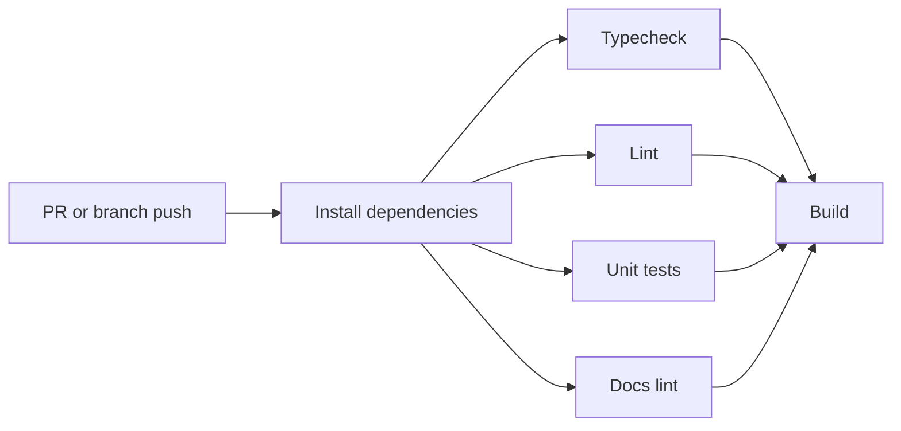
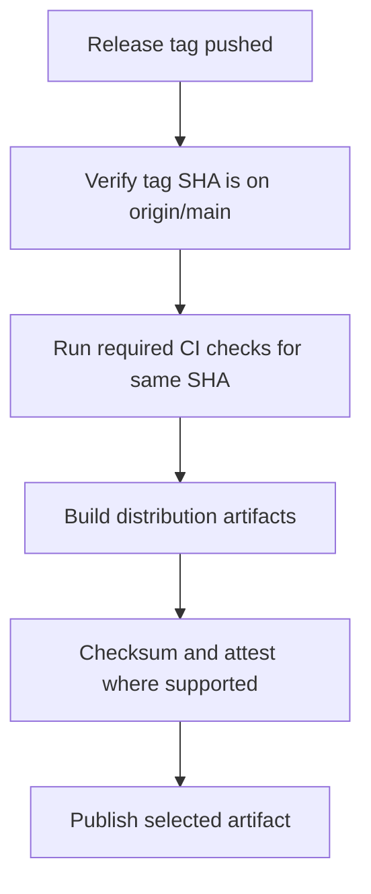

# CI/CD And Deployment Architecture

## Overview

The website participates in the repository CI/CD system but keeps production
deployment separate from branch pushes. Branch and pull request workflows prove
quality. Release tags on `main` produce public distribution artifacts.

This follows the repository git-flow model:

- feature and fix work merges into `develop`
- release work merges into `main`
- production publishing is tag triggered
- publish workflows verify the tag commit is contained in `main`

## CI Stages

Website CI must add website-specific checks once implementation exists:

- website dependency install
- strict TypeScript typecheck
- website lint with zero warnings
- website unit tests
- static build
- SEO and generated-file verification

## Release Stages

## Website Deployment

The future Pages workflow must:

- trigger from a production website release tag
- verify the tag commit is on `main`
- run website checks and build
- upload the static Pages artifact
- deploy to the protected GitHub Pages environment
- use minimal permissions: `contents: read`, `pages: write`, `id-token: write`
- use concurrency to prevent overlapping production Pages deployments

PR and `develop` runs may build artifacts for inspection, but they must not
update the production Pages site.

## Relationship To Existing Release Workflows

Existing repository workflows already publish several artifacts:

- root CI publishes npm from `v*.*.*` tags after checks
- release workflow creates binary GitHub Releases from `v*` tags
- extension workflow builds and publishes VSIX packages from `ext-v*` tags

The website workflow should reuse the same release posture:

- tag-triggered production publishing
- CI gates before publish
- test tags for dry runs
- protected environment for deployment
- explicit main-branch tag guard

## Release Evidence

Release runs should preserve:

- coverage artifacts
- website build artifact
- binary or VSIX checksums when relevant
- generated release notes when relevant
- clear logs distinguishing test tags from production tags

## Failure Modes

| Failure | Required Behavior |
| --- | --- |
| Tag commit is not on `main` | Fail before requesting publish credentials. |
| CI fails for the tag SHA | Do not publish or deploy. |
| Website build omits required metadata | Fail build verification. |
| Pages deploy overlaps a newer deploy | Cancel or serialize with workflow concurrency. |
| Test tag is used | Build and verify, but do not publish production artifacts. |
