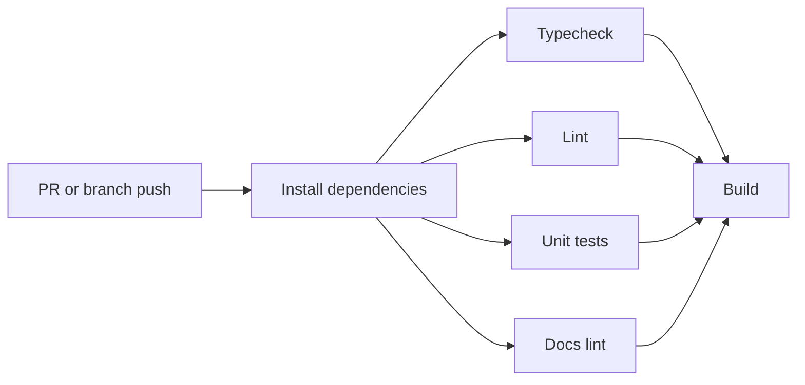
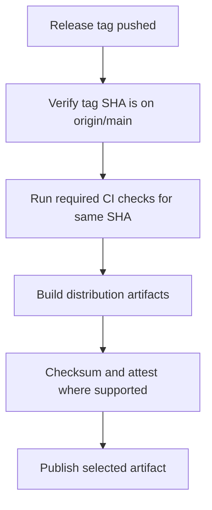

# CI/CD And Deployment Architecture

## Overview

The website participates in the repository CI/CD system but keeps production
deployment separate from branch pushes. Branch and pull request workflows prove
quality. Website release tags on `main` produce public website distribution
artifacts.

This follows the repository git-flow model:

- feature and fix work merges into `develop`
- release work merges into `main`
- production publishing is tag triggered
- publish workflows verify the tag commit is contained in `main`
- website publishing uses `site-vX.Y.Z` tags, separate from LSP server
  `vX.Y.Z` tags

## CI Stages

Website CI must add website-specific checks once implementation exists:

- website dependency install
- strict TypeScript typecheck
- website lint with zero warnings
- website unit tests
- static build
- SEO and generated-file verification
- documentation maturity checks for internal Markdown, changelog practice, and
  source docstrings where automation can verify them

## Release Stages

## Website Deployment

The website deployment workflow must:

- trigger only from `site-vX.Y.Z` and `site-vX.Y.Z-test.N` tags
- verify the tag commit is on `main`
- run website checks and build
- upload the static build artifact as workflow evidence
- publish `website/dist` to the protected production AWS S3 bucket for
  production tags
- use GitHub Actions OIDC to assume a narrowly scoped AWS IAM role where
  possible
- refresh CDN caches when a CDN fronts the bucket
- use concurrency to prevent overlapping production website deployments

PR and `develop` runs may build artifacts for inspection, but they must not
update the production S3 bucket.

Implementation planning lives in
[[website/docs/plans/aws-s3-oidc-publishing-plan]]. AWS and GitHub setup steps
live in [[website/docs/plans/aws-s3-oidc-aws-setup-guide]].

## Relationship To Existing Release Workflows

Existing repository workflows already publish several artifacts:

- root CI publishes npm from `v*.*.*` tags after checks
- release workflow creates binary GitHub Releases from `v*` tags
- extension workflow builds and publishes VSIX packages from `ext-v*` tags

The website workflow should reuse the same release posture:

- tag-triggered production publishing
- CI gates before publish
- test tags for dry runs
- protected environment for deployment
- explicit main-branch tag guard
- independent website tag namespace

## Release Evidence

Release runs should preserve:

- coverage artifacts
- website build artifact
- binary or VSIX checksums when relevant
- generated release notes when relevant
- clear logs distinguishing test tags from production tags

## Failure Modes

| Failure | Required Behavior |
| --- | --- |
| Tag commit is not on `main` | Fail before requesting publish credentials. |
| CI fails for the tag SHA | Do not publish or deploy. |
| Website build omits required metadata | Fail build verification. |
| S3 deploy overlaps a newer deploy | Cancel or serialize with workflow concurrency. |
| Test tag is used | Build and verify, but do not publish production artifacts. |
