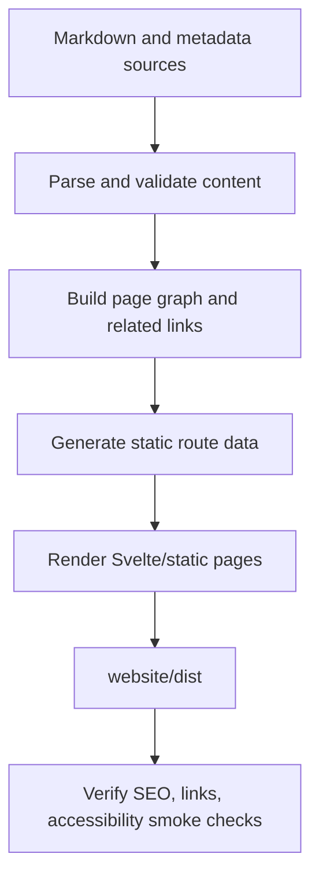

# Content Pipeline Architecture

## Overview

The content pipeline turns website source material into static pages with
stable routes, typed metadata, valid links, and SEO-ready output.

`website/docs` is the planning and source-documentation vault during design.
The eventual implementation may consume Markdown directly, convert it into
typed data, or move publishable content into `website/src/content`. Any move
must preserve traceability back to requirements and ADRs.

## Source Content Types

| Content Type | Purpose | Example Routes |
| --- | --- | --- |
| Homepage | Product overview and primary calls to action. | `/` |
| Quickstart | Install, verify, and complete first workflow. | `/quickstart/` |
| How-to | One task per page. | `/how-to/use-vscode-extension/` |
| Concepts | Karpathy-style LLM wiki pages. | `/concepts/wiki-link-resolution/` |
| Advanced usage | Deep configuration and integration behavior. | `/advanced-usage/` |
| FAQ | High-intent objections and support answers. | `/faq/` |
| Attribution | Inspiration, prior art, and creator credit. | Footer and concept pages. |

## Metadata Model

Every public page needs typed metadata:

- route path
- title
- description
- canonical URL
- Open Graph title and description
- social image when available
- page type
- related pages
- source file or generated source reference

FAQ and how-to pages should also declare structured data fields needed for
JSON-LD generation.

## Link Model

The source docs may use Obsidian wiki-links while planning. The public build
must output crawlable and accessible links:

- internal public links resolve to static route URLs
- public link text is descriptive
- inspiration and prior-art links use canonical outbound URLs
- broken public links fail CI
- non-public planning links are excluded from generated user-facing pages

## Build Flow

## SEO Output

The build must generate or maintain:

- one H1 per page
- unique title and description per public page
- canonical URLs
- `robots.txt`
- `sitemap.xml`
- Open Graph and Twitter metadata
- JSON-LD where useful:
  - `WebSite`
  - `SoftwareApplication`
  - `FAQPage`
  - `HowTo`
  - `BreadcrumbList`

## LLM Wiki Support

Concept pages should stay short, linked, and precise. Each concept page should
answer one question, show one realistic OFM example, and link to related
tasks. This keeps the public docs useful to humans and keeps LLM agents from
drifting into generic documentation.

## Validation Gates

Content validation should fail CI for:

- missing title or description
- duplicate H1
- missing canonical route
- broken public internal links
- invalid outbound inspiration links where they are required
- missing required structured data fields
- public pages that point to internal planning docs as user-facing content
