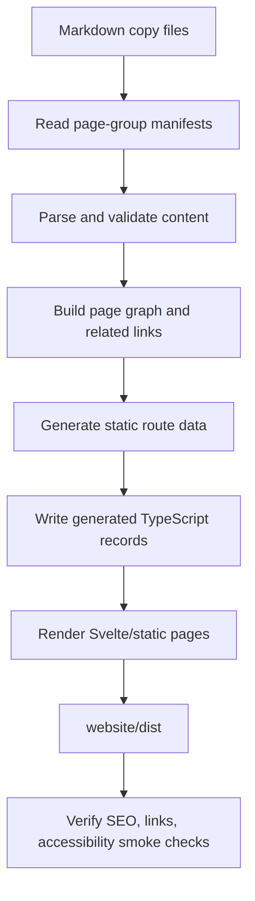

# Content Pipeline Architecture

## Overview

The content pipeline turns website source material into static pages with
stable routes, typed metadata, valid links, and SEO-ready output.

`website/docs` is the planning and source-documentation vault during design.
Publishable website copy is authored under `website/src/content/copy` as
Markdown. Markdown frontmatter is the default source for page-local metadata
such as title, description, H1, related routes, and structured data hints.
Page-group manifests under `website/src/content` map those Markdown files to
public routes, page groups, renderer records, and any group-level ordering or
explicit overrides. The build writes generated TypeScript records under
`website/src/content/generated`; that directory is build output and must not be
committed.

This keeps human and LLM authoring in Markdown while preserving typed route,
metadata, and content records for the Svelte renderer.

## Source Content Types

| Content Type | Purpose | Example Routes |
| --- | --- | --- |
| Homepage | Product overview and primary calls to action. | `/` |
| Quickstart | Install, verify, and complete first workflow. | `/quickstart/` |
| How-to | One task per page. | `/how-to/use-vscode-extension/` |
| Concepts | Karpathy-style LLM wiki pages. | `/concepts/wiki-link-resolution/` |
| Advanced usage | Deep configuration and integration behavior. | `/advanced-usage/` |
| FAQ | High-intent objections and support answers. | `/faq/` |
| Attribution | Inspiration, prior art, and creator credit. | Footer and concept pages. |

## Metadata Model

Every public page needs typed metadata:

- route path
- title
- description
- canonical URL
- Open Graph title and description
- social image when available
- page type
- related pages
- source file or generated source reference

FAQ and how-to pages should also declare structured data fields needed for
JSON-LD generation.

## Authoring Model

The W8 content authoring model has three layers:

| Layer | Path | Purpose | Git Status |
| --- | --- | --- | --- |
| Markdown copy | `website/src/content/copy` | Human-authored public page body copy. | Committed source |
| Content media | `website/src/content/media` | Images and other media referenced by public copy. | Committed source |
| Page-group manifests | `website/src/content/*.manifest.ts` | Mappings from copy files to routes, groups, ordering, and renderer records. | Committed source |
| Generated records | `website/src/content/generated` | Build-produced TypeScript consumed by the app. | Git-ignored output |

Manifests are split by page group rather than centralized in one large file.
Each manifest is a direct child of `website/src/content` and uses the
`*.manifest.ts` suffix. The generator must not discover manifests by scanning
inside `copy` or `generated`.

Expected groups include:

- homepage and quickstart
- how-to
- concepts
- advanced usage
- FAQ
- features or future page groups when they become public routes

Each manifest entry must identify:

- route id
- source Markdown file under `copy`
- page group
- page type
- output record name or generated TypeScript module target

Each page-group manifest must be authored as TypeScript and must export one
manifest object that satisfies a hand-authored `PageGroupManifest` interface.
Manifest files may import hand-authored route and manifest types, but they must
not import generated content.

Each copy file frontmatter may identify:

- title
- description
- H1
- summary
- hero, proof, or social image references
- related route ids
- structured data needs when the page produces JSON-LD
- page-specific SEO fields when they differ from the defaults

Frontmatter is the default source for page-local metadata. Manifests may only
override explicitly declared fields needed for routing, grouping, ordering,
output targets, or documented metadata exceptions.

Frontmatter schema:

| Field | Required | Notes |
| --- | --- | --- |
| `title` | yes | Unique document title. |
| `description` | yes | Unique SEO description. |
| `h1` | no | Defaults to the first Markdown H1 when omitted. |
| `summary` | no | Defaults to `description` when omitted. |
| `related` | no | Route ids validated against the route registry. |
| `seo` | no | Page-specific Open Graph or Twitter overrides. |
| `structuredData` | no | JSON-LD hints for FAQ, HowTo, breadcrumbs, or software data. |
| `images` | no | `hero`, `proof`, or `social` image references with alt/decorative metadata. |

The generated record shape must remain compatible with the renderer contracts
used by public pages. Manual edits belong in Markdown or manifests, not in
`generated`. Generated records must be disposable and reproducible from
Markdown copy plus page-group manifests.

## Reusable Library Boundary

The Markdown compilation and validation logic should be isolated as
**Commonloom**, a reusable TypeScript package published outside this repository.
The Flavor Grenade website should provide configuration, manifests, copy files,
media files, and renderer-specific output templates; the `commonloom` package
should provide the generic content pipeline.

Reusable library responsibilities:

- load and validate manifest objects through caller-provided schemas
- parse Markdown and frontmatter
- run CommonMark and GitHub Flavored Markdown transforms
- sanitize allowed inline HTML
- extract headings, links, images, and source trace data
- validate local media references and alt/decorative metadata
- expose a normalized content model that can be rendered or code-generated

Website adapter responsibilities:

- define Flavor Grenade route ids, page groups, and generated TypeScript
  interfaces
- provide the `PageGroupManifest` type and route registry
- resolve Obsidian wiki-links to public website routes
- choose generated module names and renderer record shapes
- write `*.generated.ts` files under `website/src/content/generated`
- wire package scripts, `.gitignore`, and CI checks

Commonloom must not import Svelte components, website route modules, or Flavor
Grenade product data. Its public API should accept configuration and callbacks
for project-specific route resolution, image root approval, and generated
output formatting.

The reusable Commonloom source is not maintained under
`website/src/content/pipeline/commonloom`. Website-specific glue lives under
`website/src/content/pipeline/website` and imports the published `commonloom`
package. Local source should contain only Flavor Grenade-specific adapter,
manifest, command, and generated-output code.

## Selected Tooling

The reusable pipeline should come from the published `commonloom` package,
which is built on mature open-source Markdown building blocks instead of a
Svelte or Vite Markdown component plugin.

The external package is expected to provide behavior backed by:

- `unified`
- `remark-parse`
- `remark-gfm`
- `remark-frontmatter`
- `vfile-matter`
- `remark-rehype`
- `rehype-raw`
- `rehype-sanitize`
- `rehype-stringify`
- `unist-util-visit`
- `hast-util-to-string`
- `zod`

Optional package-backed behavior:

- `rehype-slug` or `github-slugger` for heading ids
- `shiki` for syntax highlighting if W8 includes highlighted code blocks

Do not use MDsveX, MDSX, `vite-plugin-markdown`,
`@goodforyou/vite-plugin-markdown-import`, or `vite-plugin-svelte-md` as the
primary W8 pipeline. Those tools solve Markdown import or
Markdown-as-component workflows. W8 needs validated content compilation into
typed records.

## Generated TypeScript Model

Generated TypeScript is the canonical content output. The website renderer must
consume generated `.ts` modules, not generated JSON, for public page records.
This keeps the app contract typechecked and lets Vite process imported content
media through its asset graph.

Generated modules should be split by responsibility:

- `routes.generated.ts` for route metadata derived from manifests and
  frontmatter
- `pages.generated.ts` for rendered page body records
- `navigation.generated.ts` for hub, dropdown, and article group inventories
- `media.generated.ts` for content image records and imported asset URLs
- `index.generated.ts` for stable re-exports when useful

Generated TypeScript must:

- import hand-authored public interfaces from stable source modules
- export readonly records that use `satisfies` against those interfaces
- preserve literal route ids and page groups for typechecking
- import local media assets when Vite URL resolution is needed
- avoid business logic beyond constants, indexes, and simple lookup maps
- include a generated-file header that points authors back to Markdown copy and
  manifests

`pages.generated.ts` should expose sanitized static HTML as the canonical page
body, plus typed metadata that the renderer can inspect without reparsing
Markdown. A generated page record should include:

- route id
- source trace
- summary
- sanitized `bodyHtml`
- heading outline
- extracted links
- extracted media records
- structured data hints

Generated compatibility adapters may expose section arrays while existing
Svelte renderers still need them. New public copy must not be forced into
hand-authored section arrays.

Generated JSON is not a renderer input. The generator may emit JSON only as a
diagnostic or audit artifact, such as a content report used by tests or CI.
Such JSON is generated output and must not be committed unless a later ADR
changes that rule.

## Markdown Rendering Model

Public copy Markdown targets CommonMark plus GitHub Flavored Markdown.
Frontmatter is a website tooling contract, not portable Markdown.

The generator must support the full public-copy Markdown formatting set:

- heading levels H1 through H6
- paragraphs and hard or soft line breaks
- emphasis, strong emphasis, strikethrough, inline code, and code blocks
- ordered, unordered, and task lists
- blockquotes
- links, autolinks, and images
- tables
- thematic breaks
- escaped characters and HTML entities

Generated output must preserve semantic HTML for these constructs so public
pages remain readable, accessible, and crawlable without JavaScript.

Inline HTML is allowed in public copy when Markdown cannot express the needed
structure. Expected uses include:

- `<figure>` and `<figcaption>` for image captions
- `<picture>` and `<source>` for responsive images
- small semantic wrappers needed by the renderer

Allowed inline HTML tags are:

- `figure`
- `figcaption`
- `picture`
- `source`
- `img`
- `span`
- `div`
- `kbd`
- `abbr`

Allowed attributes are:

- `class`
- `id`
- `src`
- `srcset`
- `sizes`
- `alt`
- `width`
- `height`
- `loading`
- `decoding`
- `aria-*`
- `role`
- `title`

The generator must reject unsafe inline HTML such as scripts, style tags,
iframes, event handler attributes, JavaScript URLs, or embeds that create
runtime behavior outside the website component model. Inline HTML must still
produce accessible, crawlable static HTML.

## Image Authoring Model

Public copy may add images with standard Markdown image syntax or allowed
inline HTML image structures. Content-owned images live under
`website/src/content/media`; product identity images may continue to reuse the
existing product asset paths documented by the website asset requirements.

Image records produced by generation should preserve:

- source path
- resolved public URL or imported asset URL
- alt text, or an explicit decorative marker
- optional caption
- optional credit or source URL
- page role such as body image, hero image, proof image, or social image

Image references must be local to approved website asset roots unless a
specific external image source is documented and allowed.

## Link Authoring Model

Public copy should prefer standard Markdown links for public routes, external
URLs, and media. Obsidian wiki-links are allowed only when the generator can
resolve them to a public route and emit a standard crawlable URL. Unresolved
wiki-links fail validation.

Public copy must not link to internal planning docs under `website/docs` as
user-facing content. Local file links must resolve to public routes or approved
media assets. External links must be canonical URLs and must use descriptive
link text.

## Source Trace Model

Generated records must preserve enough source trace data for diagnostics and
review:

- source Markdown path
- source manifest path
- content hash for the Markdown file
- heading ids and approximate source lines
- link and image source lines when available

Validation messages should report source Markdown paths and line numbers when a
parser can provide them. Generated TypeScript modules should include a header
that states they are reproducible from Markdown copy, content media, and
page-group manifests.

## Link Model

Internal planning docs may use Obsidian wiki-links while planning. Public copy
may use Obsidian wiki-links only when they resolve to public routes. The public
build must output crawlable and accessible links:

- internal public links resolve to static route URLs
- public link text is descriptive
- inspiration and prior-art links use canonical outbound URLs
- broken public links fail CI
- non-public planning links are excluded from generated user-facing pages

## Build Flow

Generation must run before typecheck, tests, and production build because the
generated TypeScript modules are part of the app type graph.

Website package scripts must include:

- `content:generate` to write generated TypeScript records
- `content:check` to validate content without leaving stale generated output

The `build`, `typecheck`, and `test` scripts must run after content generation
or explicitly invoke it. CI must fail if `website/src/content/generated` is
missing, stale, committed, or not reproducible from source.

`website/src/content/generated/` must be listed in `.gitignore`.

Generated TypeScript should be checked by TypeScript. ESLint and Prettier may
exclude generated files, but that exclusion must be explicit in website tooling
configuration so generated code style does not become a hand-maintained burden.

## SEO Output

The build must generate or maintain:

- one H1 per page
- unique title and description per public page
- canonical URLs
- `robots.txt`
- `sitemap.xml`
- Open Graph and Twitter metadata
- JSON-LD where useful:
  - `WebSite`
  - `SoftwareApplication`
  - `FAQPage`
  - `HowTo`
  - `BreadcrumbList`

## LLM Wiki Support

Concept pages should stay short, linked, and precise. Each concept page should
answer one question, show one realistic OFM example, and link to related
tasks. This keeps the public docs useful to humans and keeps LLM agents from
drifting into generic documentation.

## Validation Gates

Content validation should fail CI for:

- missing title or description
- manifest entry whose source Markdown file is missing
- copy file that is not referenced by any page-group manifest
- duplicate route id across page-group manifests
- duplicate H1
- missing canonical route
- broken public internal links
- broken image references
- non-decorative images without useful alt text
- unsafe inline HTML in public copy
- invalid outbound inspiration links where they are required
- missing required structured data fields
- public pages that point to internal planning docs as user-facing content
- committed files under `website/src/content/generated`
