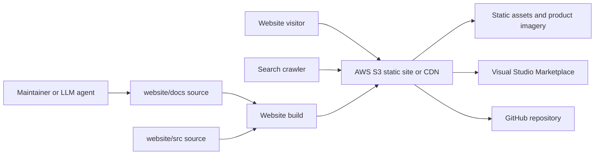

# Website Architecture

## Purpose

This architecture describes the planned public website for Flavor Grenade LSP.
The website is a static AWS S3-distributed site that explains the language
server, the VS Code extension, and the Obsidian Flavored Markdown workflow
through a search-friendly homepage and a linked LLM-wiki style documentation
system.

The architecture is intentionally separate from the LSP server runtime. The
website may read generated content, copied assets, and static metadata, but it
must not require the language server process at runtime.

## Architecture Goals

- Generate static HTML, CSS, JavaScript, and assets for AWS S3 distribution.
- Keep the first page useful without JavaScript.
- Use Svelte for the interactive page shell and documentation controls.
- Use strictly typechecked and linted TypeScript for all website scripting.
- Use SCSS for tokens, layout, and component styling.
- Preserve Obsidian-style source docs in `website/docs`.
- Produce SEO-ready pages for quickstart, how-to, advanced usage, FAQ, and
  linked concepts.
- Deploy public builds only from release tags whose commits are on `main`.

## System Context



## Major Building Blocks

| Block | Responsibility |
| --- | --- |
| `website/docs` | Canonical planning, requirements, architecture, ADR, and source documentation while the site is being designed. |
| `website/src` | Required location for Svelte, TypeScript, SCSS, route, metadata, and content-transform source. |
| `website/src/content/copy` | Public Markdown copy source for generated website pages. |
| `website/src/content/media` | Content-owned images and media referenced by public copy. |
| `website/src/content/*.manifest.ts` | Page-group manifest source for route mappings, ordering, and generated content targets. |
| `website/src/content/generated` | Generated TypeScript content records consumed by the website renderer; ignored build output. |
| `website/tests` | Required location for website unit, component, accessibility, routing, SEO, and build-output tests. |
| `website/public` | Future static passthrough assets such as `robots.txt`, favicons, and social images when needed. |
| `website/dist` | Generated static output for AWS S3 distribution. This directory is build output, not source of truth. |
| Root package | Existing LSP server package and shared repository checks. |
| `extension/` | Existing VS Code extension package, Marketplace assets, and extension checks. |
| `.github/workflows` | CI, release, distribution, and website deployment automation. |

## Architecture Views

- [[static-site-runtime]] describes the browser runtime and source layout.
- [[website/docs/architecture/content-pipeline]] describes Markdown, route, metadata, and SEO flow.
- [[ci-cd-and-deployment]] describes checks, release gates, and S3 deploy.
- [[website/docs/adr/0001-use-vite-svelte-typescript-scss-and-github-pages-for-the-website]]
  records the core technology decision.
- [[website/docs/adr/0002-use-page-group-markdown-manifests-for-website-copy]]
  records the W8 content authoring decision.

## Dependency Direction

Website implementation dependencies should flow inward:

```text
Svelte components
  -> typed route/content/metadata modules
  -> generated content records
  -> page-group manifests
  -> Markdown copy and frontmatter
```

The website may depend on static project metadata and product assets. The LSP
server and VS Code extension must not depend on website implementation code.

## Documentation Maintenance Boundary

The website documentation system is maintained at `standard` maturity. Internal
Markdown, architecture docs, ADRs, changelog entries, and source docstrings
must stay current with the implementation throughout development and
maintenance. Source code belongs in `website/src`; tests belong in
`website/tests`; requirements and architecture belong in `website/docs`.

## Runtime Boundary

The deployed website has no server runtime. All pages, assets, and metadata are
served statically from AWS S3 or a CDN backed by AWS S3. Browser JavaScript may
enhance navigation, theme selection, copy buttons, filters, and search, but core
page content must remain meaningful when JavaScript is unavailable.

## Open Questions

- Whether client-side search is needed for the first public release.
