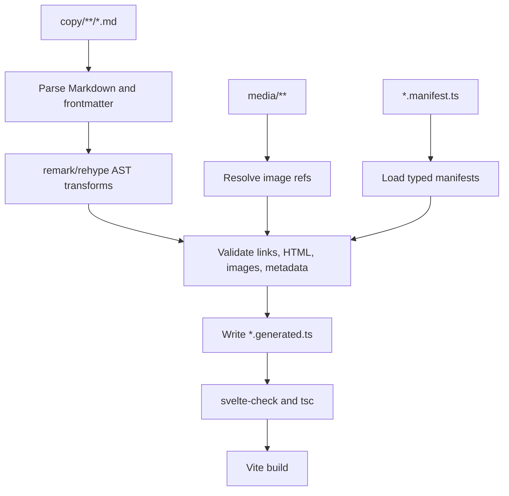

# W8 Content Pipeline Technology Research

Observed on 2026-05-10. Updated on 2026-05-11 after Commonloom was published
as an independent npm package.

## Research Question

W8 needs Markdown copy under `website/src/content/copy`, typed page-group
manifests under `website/src/content/*.manifest.ts`, generated TypeScript under
`website/src/content/generated`, inline HTML validation, image handling, public
link validation, and source traces. The question is whether existing Svelte,
Vite, Markdown, or content-processing tools can provide most of that workflow.

## Method

Sources used:

- Context7 for current MDsveX and unified documentation.
- Vite documentation for JSON imports, TypeScript behavior, and asset URL
  handling.
- Package metadata from npm for license, current version, and maintenance
  signals.
- Public package and project docs for Svelte/Vite Markdown alternatives.

## Requirements Fit

The W8 pipeline needs:

- CommonMark plus GitHub Flavored Markdown support.
- YAML frontmatter parsing and schema validation.
- Allowed inline HTML with an explicit safety allowlist.
- Markdown links, Obsidian-style wiki-links, image references, and source-line
  diagnostics.
- Generated TypeScript records, not generated JSON renderer input.
- Vite-compatible image URL imports for generated media records.
- Build scripts that run before typecheck, tests, and production build.

The core requirement is not "import Markdown as a Svelte component." The core
requirement is "compile many Markdown files plus typed manifests into validated
TypeScript records."

## Candidate Tools

### MDsveX

Package: `mdsvex`

Current npm metadata:

- Version: `0.12.7`
- License: MIT
- Description: Markdown preprocessor for Svelte
- Modified: 2026-03-08
- Repository: <https://github.com/pngwn/MDsveX>

Context7 findings:

- MDsveX integrates through Svelte preprocessing in `svelte.config.js`.
- It supports `.svx` files, frontmatter, layouts, and remark/rehype plugins.
- It can compile Markdown directly to Svelte component code.

Fit:

- Good for Svelte pages that are themselves Markdown/Svelte components.
- Good if W8 later wants Svelte components embedded inside authored copy.
- Poor as the primary pipeline because W8 needs generated typed records,
  source validation, image record extraction, and renderer-controlled sanitized
  HTML.

Risk:

- It moves the architecture toward Markdown-as-component files, which conflicts
  with the chosen generated TypeScript record contract.

Verdict:

- Do not use as the primary W8 pipeline.
- Keep as a future option if public copy needs Svelte components inside
  Markdown.

### MDSX

Package: `mdsx`

Current npm metadata:

- Version: `0.0.7`
- License: MIT
- Description: A Markdown processor for Svelte
- Modified: 2025-05-25
- Repository: <https://github.com/svecosystem/mdsx>

Project docs say MDSX is a Svelte Markdown preprocessor with YAML frontmatter,
blueprints, hot reload, and full access to remark/rehype plugins.

Fit:

- Similar to MDsveX, but newer and currently lower-version.
- Good directionally for Svelte component Markdown.
- Not a direct fit for generated TypeScript content records.

Risk:

- Young package surface for a core content pipeline.

Verdict:

- Do not use for W8.
- Revisit only if the website later chooses Markdown-as-Svelte-components.

### vite-plugin-markdown

Package: `vite-plugin-markdown`

Current npm metadata:

- Version: `2.2.0`
- License: MIT
- Description: Import markdown files in Vite
- Modified: 2024-11-04
- Repository: <https://github.com/hmsk/vite-plugin-markdown>

Public docs describe importing Markdown files in formats such as frontmatter,
HTML, table of contents, and framework component output.

Fit:

- Good for simple Vite Markdown imports.
- Not enough control for W8 validation, source tracing, wiki-link resolution,
  image record generation, generated TypeScript modules, and manifest-driven
  article inventories.

Risk:

- Encourages per-file imports rather than a deterministic generator over
  manifests and copy roots.

Verdict:

- Do not use as the primary W8 pipeline.

### @goodforyou/vite-plugin-markdown-import

Package: `@goodforyou/vite-plugin-markdown-import`

Current npm metadata:

- Version: `1.2.7`
- License: GPL-3.0-only
- Description: Vite plugin to import Markdown files with frontmatter
- Modified: 2025-02-24
- Repository: <https://github.com/good-for-you-web-services/vite-plugin-import-markdown>

Fit:

- Parses Markdown imports into body strings and frontmatter objects.
- Does not generate rendered HTML or TypeScript records by itself.

Risk:

- GPL-3.0-only is a poor fit for this repository unless the project
  intentionally accepts that license.

Verdict:

- Do not use.

### vite-plugin-svelte-md

Package: `vite-plugin-svelte-md`

Current npm metadata:

- Version: `0.6.0`
- License: MIT
- Description: Vite plugin to convert markdown to Svelte template
- Modified: 2026-04-06
- Repository: <https://github.com/ota-meshi/vite-plugin-svelte-md>

Fit:

- Useful for converting Markdown to Svelte templates.
- Not aligned with generated TypeScript records or custom validation.

Verdict:

- Do not use for W8.

### unified, remark, and rehype

Core package: `unified`

Current npm metadata:

- Version: `11.0.5`
- License: MIT
- Description: Parse, inspect, transform, and serialize content through syntax
  trees.
- Repository: <https://github.com/unifiedjs/unified>

Context7 findings:

- `unified()` creates processors with parsers, transformers, and compilers.
- A Markdown-to-HTML pipeline can use `remark-parse`, `remark-rehype`, and
  `rehype-stringify`.
- Plugins can inspect and transform syntax trees, collect data, and report
  messages through vfiles.

Useful packages:

| Package | Version | License | Role |
| --- | --- | --- | --- |
| `unified` | `11.0.5` | MIT | Pipeline core. |
| `remark-parse` | `11.0.0` | MIT | Markdown parser. |
| `remark-gfm` | `4.0.1` | MIT | Tables, task lists, autolinks, strikethrough. |
| `remark-frontmatter` | `5.0.0` | MIT | Frontmatter syntax support. |
| `vfile-matter` | `5.0.1` | MIT | YAML frontmatter data extraction. |
| `remark-rehype` | `11.1.2` | MIT | Markdown AST to HTML AST. |
| `rehype-raw` | `7.0.0` | MIT | Parse raw inline HTML into HAST. |
| `rehype-sanitize` | `6.0.0` | MIT | Enforce HTML allowlist. |
| `rehype-stringify` | `10.0.1` | MIT | Serialize HTML. |
| `rehype-slug` | `6.0.0` | MIT | Heading ids. |
| `unist-util-visit` | `5.1.0` | MIT | AST traversal for links, headings, images. |
| `hast-util-to-string` | `3.0.1` | MIT | Heading text extraction. |
| `github-slugger` | `2.0.0` | ISC | GitHub-compatible heading ids. |
| `zod` | `4.4.3` | MIT | Manifest and frontmatter schema validation. |
| `shiki` | `4.0.2` | MIT | Optional syntax highlighting. |

Fit:

- Best match for W8 because it is programmable rather than page-framework
  oriented.
- Supports AST inspection for headings, links, images, wiki-link transforms,
  source traces, and diagnostics.
- Supports sanitized inline HTML through `rehype-raw` plus `rehype-sanitize`.
- Lets the project generate TypeScript records exactly matching the website's
  renderer contracts.

Risk:

- Requires writing a generator script and a few custom AST transforms.
- More project-owned code than MDsveX or a simple Vite plugin.

Verdict:

- Recommended primary foundation.

### Vite Native Capabilities

Vite supports direct static asset imports. Imported image assets resolve to a
development URL during dev and hashed production assets during build. Vite also
supports JSON imports, but Vite itself does not typecheck TypeScript during
transform; typechecking belongs to `tsc`, `svelte-check`, or build scripts.

Fit:

- Use generated TypeScript modules to import content media so Vite owns dev and
  production asset URLs.
- Keep JSON out of renderer input. Vite can import JSON, but JSON does not
  express the typed renderer contract as well as generated TypeScript.

Verdict:

- Use Vite asset imports from generated `media.generated.ts`.
- Do not rely on a Vite Markdown plugin for the W8 pipeline.

## Recommendation

Use the external `commonloom` TypeScript package, built on unified, remark, and
rehype.

Recommended dependency set:

- `unified`
- `remark-parse`
- `remark-gfm`
- `remark-frontmatter`
- `vfile-matter`
- `remark-rehype`
- `rehype-raw`
- `rehype-sanitize`
- `rehype-stringify`
- `rehype-slug` or `github-slugger`
- `unist-util-visit`
- `hast-util-to-string`
- `zod`
- optional: `shiki` for syntax highlighting

Do not adopt MDsveX, MDSX, `vite-plugin-markdown`,
`@goodforyou/vite-plugin-markdown-import`, or `vite-plugin-svelte-md` as the
primary W8 pipeline. They solve Markdown import or Markdown-as-component
problems. W8 is a validated content compilation problem.

## Proposed Technology Selection

Chosen stack:

- External `commonloom` package for the reusable TypeScript generator core.
- Flavor Grenade adapter code for route resolution and generated TypeScript
  formatting.
- `*.manifest.ts` page-group manifests with `satisfies PageGroupManifest`.
- unified/remark/rehype for Markdown parsing, AST transforms, sanitization, and
  HTML serialization.
- zod for frontmatter and generated model validation.
- generated `.generated.ts` modules for renderer input.
- optional generated JSON report for diagnostics only.

Pipeline:

## Why This Is Better Than a Plugin

- It preserves the chosen generated TypeScript contract.
- It keeps route ids, page groups, metadata, images, and structured data under
  schema validation.
- It supports exact W8 validation rules rather than whatever a Markdown import
  plugin exposes.
- It keeps Svelte rendering simple: render generated records, not arbitrary
  Markdown modules.
- It uses mature open-source building blocks instead of custom Markdown parsing.

## Reusable Core Name

The reusable core is named **Commonloom**.

Commonloom now lives outside this repository as the published `commonloom` npm
package. The Flavor Grenade website should consume the package and keep only
adapter code locally. Maintaining Commonloom source, release automation, and
public API versioning is no longer a W8 requirement in this repository.

The name fits the selected direction:

- "Common" nods to CommonMark.
- "Loom" describes weaving Markdown, frontmatter, manifests, links, media, and
  metadata into typed records.
- The name does not couple the core to Svelte, Vite, or Flavor Grenade.

## Open Follow-up Decisions

- Whether code highlighting ships in W8 or waits for a later website phase.
- Whether generated source traces need exact line and column positions or
  source file plus approximate line is sufficient.
- Whether manifest loading should use direct TypeScript imports, `tsx`, or a
  build-time loader script.

## Sources

- MDsveX documentation via Context7 and <https://github.com/pngwn/MDsveX>
- unified documentation via Context7 and <https://github.com/unifiedjs/unified>
- Vite static asset handling: <https://vite.dev/guide/assets>
- Vite JSON and TypeScript features: <https://vite.dev/guide/features.html>
- MDSX docs: <https://mdsx.dev/docs>
- npm package metadata observed on 2026-05-10 for the packages listed above
